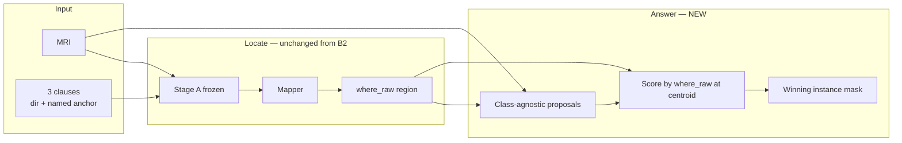
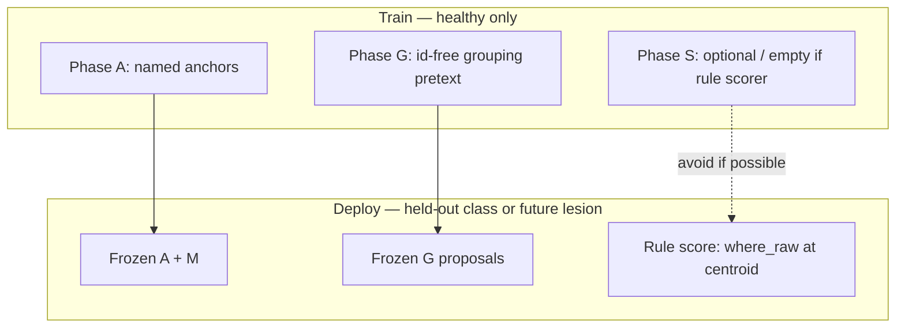

---
tags:
  - spatialvox
  - flowchart
  - class-agnostic
aliases:
  - Instance selection flowchart
---
# Class-agnostic instance — how the visuals connect

Companion to [[ClassAgnosticInstance]]. One figure story for slides and paper drafts. Contrast with [[Flowchart]] (B2 dense carver).

## Figure A — System (paper teaser)

**Caption draft.** Relations compile to a soft region; the image only proposes bodies; the body whose centre best satisfies the region is the answer. No target class is ever supervised into the answer path.

## Figure B — Panel strip (results / failure analysis)

Ordered left → right; every panel is one tensor the code already (will) expose:

| panel | tensor | fail mode it shows |
|---|---|---|
| 1 MRI | `I` | — |
| 2 Anchors | `A_i` | Stage A miss |
| 3 Region | `where_raw` | bad clauses / midline |
| 4 Proposals | `{P_k}` | merge / miss / oversegment |
| 5 Scores | `score_k` | wrong winner |
| 6 Pred vs GT | `P*`, GT | residual error |
| 7 Twin | geometry-only winner | appearance unused or harmful |

## Figure C — Training vs deploy

## Figure D — What we refuse to draw as “the model”

- Dense carver logit maps as the primary answer (B2).  
- Class colour legends on proposals (proposals have **no** class).  
- A path labelled “target name → …” anywhere after Stage A.

## Depth callouts (for architecture slides)

| block | depth proposal | trainable under mask loss? |
|---|---|---|
| Stage A | 5-scale U-Net | no (frozen) |
| Mapper | 0 | no |
| B + proposals | 3–4 scale encoder | **no** |
| Scorer | 0–1 linear layer on geometric scalars | prefer **no** (rule) |
