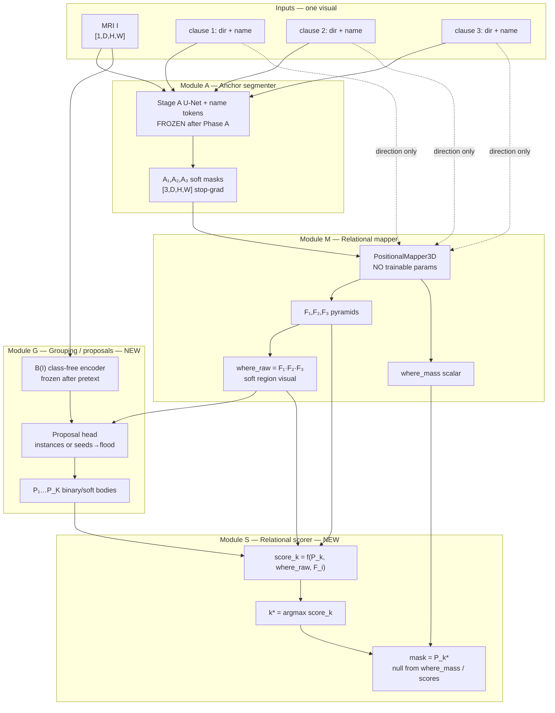

---
tags:
  - spatialvox
  - design
  - class-agnostic
  - instance-selection
aliases:
  - Class-agnostic instance architecture
  - Region then instance
---
# Class-agnostic instance selection — design for discussion

**Status:** design only. **No training code, config, or corpus change in this branch.**  
**Base:** `dev-SpatialVox-V1` / Phase B baseline method **B2** (`mask_on: valid`, dense carver).  
**Date:** 2026-09-24.  
**Branch:** `cursor/class-agnostic-instance-design-f966`.

This note is the discussion document for replacing the dense carver with **region → class-agnostic instance**. It exists so every module depth, parameter, visual, assumption, and check can be argued before implementation.

| Companion | role |
|---|---|
| [[SpatialVox]] | current B2 architecture (dense carver) — the baseline we compare against |
| [[Flowchart]] | current model drawing |
| [[Result_tracker]] | B2 and parents |
| `_update_ideas/2026-09-24-deep-analysis-class-agnostic-transfer.md` | evidence that dense image paths class-gate on MRI |
| This note §8 | publishability |

---

## 0. One-page summary

**Task.** Input: MRI + three relational clauses (direction + named anchor each). Output: a binary mask of the structure the conjunction describes — **without the target ever being named**.

**Clinical purpose.** Train on **healthy** subjects. At test, locate a **never-seen structure** (eventually a tumour) by its relations to known landmarks, and segment it because the segmenter is **class-agnostic**, not because that class was supervised.

**Current B2 failure.** A dense carver trained with “target = 1, everything else = 0” learns to paint the eight supervised shapes and to suppress neighbours. Held-out Dice collapses while trained Dice rises. Rewiring fusion (geometry-query attention) does not by itself fix that.

**Proposed architecture.** Keep the relational **compiler** (Stage A + mapper → `where_raw`). Replace the dense carver with:

1. **Propose** class-agnostic instances in / near the region.  
2. **Score** each instance by how well it satisfies the clauses.  
3. **Emit** the winning mask.

Measured ceilings on the current corpus (label oracles, not a method): per-voxel paint of the region ≈ 0.11–0.19 Dice; **pick the labelled instance whose centroid maximises `where_raw` ≈ 0.97**. The gap is the design signal.

```text
MRI + 3 clauses
    │
    ├─► Stage A (frozen)     names → soft anchor masks A_i
    ├─► Mapper (no params)   A_i + directions → where_raw
    │
    └─► Instance module (NEW)
            MRI (+ frozen class-free B) → proposals {P_k}
            score(P_k | where_raw) → k*
            mask = P_{k*}
```

---

## 1. Problem, claim, and what B2 already taught us

### 1.1 The claim we must be able to defend

> **Class-agnostic relational segmentation.**  
> The mask is the instance in the image that best satisfies a target-free relation program over named anchors. No target class id enters the model. Structures never supervised as relational targets — and, in the limit, lesions absent from training — remain segmentable if they form a coherent body inside the relational region and contrast enough to be proposed.

### 1.2 What we are *not* claiming (yet)

| claim | status on healthy HCP |
|---|---|
| Never supervised as relational **target** | testable now (held-out classes) |
| Zero-shot on a **name** Stage A never saw | **not** tested: held-out names are still anchors |
| Tumour / pathology transfer | **not** tested on this corpus; needs a lesion protocol later |
| Open vocabulary / free text | later (parser outside Stage B) |

### 1.3 Why not “just fix the carver”

Evidence (deep analysis): both coarse and fine image paths class-gate; an oracle region does not restore held-out Dice; linear heads on **frozen class-free** features do not gate; nonlinear contextual heads do. Instance selection attacks the failure at its root: the corpus defines a relation at a **point** (centroid), while a dense carver must invent a **body** and therefore falls back on class templates.

---

## 2. Architecture — modules, depths, parameters, visuals

### 2.1 End-to-end data flow (how every visual connects)



**Visuals the UI / paper figures should show (one story):**

| # | visual | comes from | purpose |
|---|---|---|---|
| V1 | MRI slice | `I` | context |
| V2 | three anchor overlays | `A_i` | “names stop here” |
| V3 | three fields + product | `F_i`, `where_raw` | relational region |
| V4 | proposal overlay (K colours) | `{P_k}` | class-agnostic candidates |
| V5 | scores bar / ranked list | `score_k` | why this body won |
| V6 | final mask ± GT | `P_{k*}` | result |
| V7 | twin / ablate: region only, or random proposals | controls | image vs geometry |

B2’s carver logits heatmap is **replaced** by V4–V5. That is the main figure change.

### 2.2 Module catalogue (depths and knobs)

Depths below are **proposals for discussion**, not shipped defaults. Each must be frozen in config before a run and recorded in the tracker.

#### Module A — Stage A (unchanged role)

| item | proposal | notes |
|---|---|---|
| Role | names → soft masks; **frozen** in Stage B | same as B2 |
| Encoder | `[32,64,128,256,256]` → bottleneck 8³ | current `phase-a/current` |
| Token dim / heads | 256 / 4 | |
| Output | detached sigmoid probs, no threshold for mapper | |
| Trained on | **all** names that may be anchors (23 on HCP) | see assumptions A8–A10 |
| Not responsible for | painting the target | lesion must not need Stage A to know the tumour name |

#### Module M — Mapper (unchanged role, optional graded fields later)

| item | proposal | notes |
|---|---|---|
| Params | **zero** | compiler, not a net |
| `tau` | 0.5 (world mm) | B2 measured; gate ~0.97 |
| `min_mass` | 1e-6 | |
| Product | unnormalised `Π F_i` | never renormalise |
| Optional later | multi-τ graded fields (0.5 / 2 / 8) | only if instance scores need softer interiors |
| Midline | volume centre today; ACPC constant later | validity, not transfer |

#### Module G — Grouping / proposals (**new**; replaces carver trunk+refine)

Two implementation tiers (pick one for v1; other is ablation):

**G1 — Seed flood (minimal, elegant)**  
1. Seed = argmax / soft-argmax of `where_raw` (or of image-free heatmap if we keep a tiny geometry head).  
2. Grow a body by affinity in a frozen `B` (or intensity) within `dilate(where_raw, r)`.  
3. Optionally multiple seeds (local maxima) → multiple `P_k`.

**G2 — Instance head (stronger)**  
1. Class-free encoder `B` (widths discussable: keep B2’s `[16,32,32]` or deepen one coarse level).  
2. Pretext: id-free affinity + discriminative loss over **all** labelled regions and label-0 components (no class ids).  
3. At inference: connected components / offset clusters → `{P_k}` inside the region.

| knob | candidate values | decision needed |
|---|---|---|
| `B` widths | `[16,32,32]` (B2) vs `[16,32,32,64]` | capacity vs MRI FOV |
| Pretext | affinity only vs +offset/objectness | offset needed for vote |
| Region restrict | hard crop vs soft weight by `where_raw` | hard crop is simpler |
| `r` dilate | 0 / 2 / 4 / 8 voxels | coverage vs neighbour invasion |
| Max proposals `K` | 8 / 16 / 32 | |
| Appearance remap | non-monotone required in pretext | breaks intensity class code |

**Critical training rule:** Module G must **not** be trained by the relational mask loss on named targets. That is how B2 class-gates. G is trained only by class-free pretexts (+ optional synthetic blobs).

#### Module S — Relational scorer (**new**; replaces dense logits)

For each proposal `P_k`:

```text
c_k     = centroid_world(P_k)
s_cent  = where_raw(c_k)                         # clauses satisfied at the body centre
s_mass  = mean(where_raw | P_k)  or  mass(P_k ∩ where>τ) / mass(P_k)
s_size  = optional prior on volume (weak)
score_k = s_cent  or  s_cent × s_mass            # exact form is a registered choice
mask    = P_{argmax score_k}
```

| knob | candidates | comment |
|---|---|---|
| Score | `where(c_k)` only (matches corpus generation) | **default proposal** — matches how truth is defined |
| | × mass overlap | if centroids ambiguous |
| Softmax vs hard argmax | hard for eval; soft for training if needed | v1 can be hard + hinge |
| Null | `where_mass` threshold and/or `max score < ε` | keep B2 null head or replace |

No target name, no Stage A features of the target, no class embedding in S.

#### What we **remove** relative to B2

| B2 piece | fate |
|---|---|
| Carver stem on `cat[B, A, F, where, …]` | removed |
| Full-res skip / channel-attention `refine` | removed as answer path |
| Per-voxel Dice on eight classes as the main objective | removed for the instance module |
| Prompt-only twin as “zero B in carver” | replaced by **geometry-only rank** twin: score proposals with `where_raw` alone vs with appearance |

### 2.3 Parameter budget (order of magnitude)

| module | trainable at Stage B time | ballpark |
|---|---|---|
| Stage A | no | ~17M frozen |
| Mapper | no | 0 |
| `B` + proposal head | no at deploy if frozen; yes during pretext | ~0.2–0.5M |
| Scorer | few scalars / tiny MLP on geometric features only | ≪0.01M |
| **vs B2 Stage B** | carver+B ~0.27M through mask loss | mask loss must not train G |

The elegance is not “fewer total weights.” It is **fewer weights allowed to see class-supervised mask gradients**.

### 2.4 Training curriculum (healthy only)

```text
Phase A   train Stage A on all anchor-capable names
Phase G   class-free pretext on B (+ proposal head)   # no target ids
Phase S   optional: learn score weights on TRAIN targets only,
          with proposals from frozen G; held-out never positive
Eval      held-out targets: G frozen, S frozen or rule-based
```

If scorer is pure `where_raw(centroid)` (**recommended v1**), Phase S is empty — maximum elegance, minimum cheat surface.

---

## 3. Held-out classes (healthy patients)

We only have healthy HCP labels. “Never-seen structure” is **proxied** by structures never supervised as relational targets / never used as positive instances for the scorer.

### 3.1 Recommended split for this design (F0)

Keep B2’s vocabulary and Stage A coverage so numbers remain comparable to B2, but **reinterpret** roles:

| pool | structures | role in instance design |
|---|---|---|
| **S — supervised targets** | L/R Thalamus, Pallidum, Amygdala, Accumbens | may be winning instances during any scorer training; **not** needed if scorer is rule-based |
| **V — validation transfer** | L/R **VentralDC** only | selection / early stopping for any learned piece; **never** choose on R |
| **R — report transfer** | L/R Caudate, Putamen, Hippocampus | reported, never selected on; label **post-design** if they drove modelling choices |
| **L — landmarks / anchors only** | ventricles, Brain-Stem, … | anchors and pretext bodies; never Stage B targets |

**Default proposal for discussion:**  

- Keep B2’s `targets.train` as S for **comparability of prompts and floors**.  
- Add **V = L/R VentralDC** as the gate metric (analysis protocol).  
- R = current `targets.val ∪ targets.test` for reporting.  
- Do **not** drip-feed classes; every S target remains available every epoch if S is trained at all.

### 3.2 Why not share one prompt per structure?

Forbidden for transfer. Shared prompts across subjects strengthen the clause-set → class lookup. Keep **per-scene** anchor-first prompts (B2 generator).

### 3.3 Folds (before claiming generality)

When leaving F0, use the analysis rotation (each fold × ≥2 seeds), gate on V, report R:

- F1: Pallidum + Amygdala + Caudate held-ish assignments as in the deep analysis  
- F2: Thalamus + Putamen  
- F3: Accumbens + Hippocampus  

Recompute floors on the rebuilt corpus for each fold.

### 3.4 What “success” means on healthy data

| metric | bar |
|---|---|
| R Dice vs B2 | **above B2** by more than seed noise (~0.05), and preferably above prompt-blind floor |
| R vs geometry twin | instance model − `argmax where` on proposals **or** paint-`where` baseline |
| Paint-on-neighbour rate | down vs B2 (~40–50% of painted voxels on another structure) |
| Oracle instance ceiling | method should approach ~0.9 on unique prompts if proposals are good |
| Trained S Dice | **may fall** vs B2 — expected cost of dropping class lookup |

---

## 4. Complete assumptions catalogue

Each assumption is either **enforced**, **measured**, or **accepted risk**. Implementation must not silently violate an enforced one.

### 4.1 Task and language

| ID | assumption | status |
|---|---|---|
| T1 | Exactly **3** clauses per prompt | enforced (v1); set-pooling later |
| T2 | Directions from a closed set of 6; clause = target relative to anchor | enforced |
| T3 | Target is **never** an input (name, mask, centroid, class id) | enforced + tests |
| T4 | Anchors are pairwise distinct; directions pairwise distinct | enforced in generator |
| T5 | Conjunction is the only identifier; one clause never suffices | design intent |
| T6 | Language is a closed compiler (23 names), not a VLM | accepted v1 |
| T7 | Free-text / open vocab out of scope for this design | accepted |

### 4.2 Corpus and prompts

| ID | assumption | status |
|---|---|---|
| C1 | Subjects are **healthy** (HCP); no tumours in train | enforced by corpus |
| C2 | Labels are FreeSurfer-derived aseg/wmparc subset (23 names) | enforced |
| C3 | Prompts are **anchor-first**, not target-first | enforced |
| C4 | **Per-scene** prompts; not one shared template per class across subjects | enforced |
| C5 | Many prompts per structure per scene are allowed (and preferred over 1–2 shared) | design choice |
| C6 | Per-scene uniqueness: solutions_for length 1 | enforced |
| C7 | Triple stability: define on **train** subjects; keep val/test exposure stratum | recommended |
| C8 | Truth = structure whose **centroid** satisfies the conjunction | corpus definition |
| C9 | Midline / medial-lateral semantics are approximate | measured risk |
| C10 | Under full wmparc, many prompts are multi-structure; we score within vocab-23 | accepted + report scopes |

### 4.3 Anchors and Stage A

| ID | assumption | status |
|---|---|---|
| A1 | Stage A is frozen inside the relational model | enforced |
| A2 | Anchor masks are soft probabilities, not hard thresholds | enforced |
| A3 | Names never reach mapper/scorer/proposal scorer as embeddings | enforced |
| A4 | Predicted anchors ≈ oracle on HCP (median ~0.84 mm) | measured; re-check |
| A5 | Held-out **names** may still appear as anchors | accepted; not lesion-complete |
| A6 | Failed anchors rejected by `min_mass` | enforced |
| A7 | Tumour must **not** need to be a Stage A class | design intent |
| A8 | Stage A trained on all 23 | current; revisit if anchor set shrinks |

### 4.4 Region (mapper)

| ID | assumption | status |
|---|---|---|
| R1 | `where_raw` is a soft spatial prior, not the mask | design |
| R2 | Target centroid lies in high `where_raw` for well-posed prompts | measured gate ~0.97 at τ=0.5 |
| R3 | Large fraction of target **body** may lie outside high `where_raw` | measured ~30% coverage; instance method must extend |
| R4 | Region may contain 5–7 structures | measured; scorer must disambiguate |
| R5 | Fields saturate; geometry alone is weak inside the region | measured; appearance/grouping needed for body |

### 4.5 Instance proposals

| ID | assumption | status |
|---|---|---|
| P1 | The answer is **one connected body** (instance), not a sparse voxel set | design |
| P2 | Proposals are class-agnostic (no class ids in G) | enforced |
| P3 | Target forms a separable component under the proposal feature | **risk** for putamen/pallidum, hippocampus/amygdala |
| P4 | Invisible borders cannot be recovered by appearance alone | measured; geometry must cut |
| P5 | Restricting proposals to dilate(region) does not delete the true body | must measure coverage |
| P6 | Synthetic / composited blobs may be needed before tumours | later protocol |
| P7 | `K` proposals suffice to include the target | must measure recall@K |

### 4.6 Scoring and output

| ID | assumption | status |
|---|---|---|
| S1 | Best default score is geometric: `where_raw(centroid(P_k))` | matches C8 |
| S2 | Hard argmax over proposals is enough for v1 | proposal |
| S3 | Null / empty prompts handled by mass / score threshold | need parity with B2 null tests |
| S4 | No dense Dice on held-out voxels as negatives that teach “never paint X” | enforced for G |
| S5 | Selecting `best.pt` on S (or V) must not use R | enforced |

### 4.7 Evaluation and reporting

| ID | assumption | status |
|---|---|---|
| E1 | Parent baseline for deltas is **B2** on the **same corpus version** | enforced |
| E2 | Floors recomputed per corpus version / fold | enforced |
| E3 | Geometry twin mandatory (rank by `where` only / paint region) | enforced |
| E4 | ≥2 seeds before reading small deltas | protocol |
| E5 | Image replacement / proposal shuffle / permute clauses still required | protocol |
| E6 | Single-seed runs are provisional | reporting rule |
| E7 | Hippocampus reported on its own row | protocol |

### 4.8 Deployment leap (tumour) — explicit non-assumptions today

| ID | assumption | status |
|---|---|---|
| L1 | Tumour appears as a proposal under healthy-trained G | **untested** |
| L2 | Anchors remain findable near pathology | **untested** |
| L3 | Clauses uniquely name the lesion under clinical wording | **untested** |
| L4 | Healthy held-out transfer ⇒ lesion transfer | **false as implication**; need lesion sim |

---

## 5. Checks (must pass / must report)

### 5.1 Offline (before any Stage B instance training)

| check | pass bar |
|---|---|
| Mapper gate on S and R | ≥ B2 (~0.97) at chosen τ |
| Body coverage: fraction of GT inside dilate(where, r) | report; choose r so recall high |
| Oracle instance pick: argmax_k where(centroid of GT component) | ~0.97 on unique prompts |
| Proposal recall@K: GT body matches some P_k (IoU≥0.5) | ≥0.9 on S before claiming R |
| Affinity / flood on held-out visible borders | ≥ intensity baseline |
| Invisible-border canary (e.g. hippo–amygdala) | do not claim appearance solves it |
| Clause-set → target majority rate | report; stability policy recorded |

### 5.2 Training-time invariants (tests)

| check | pins |
|---|---|
| Stage B forward signature has no label/target/name for target | T3 |
| G parameters receive no grad from relational Dice on targets | P2, S4 |
| Names stop at Stage A | A3 |
| Shared-prompt generator absent | C4 |
| Scorer inputs ⊆ {P_k geometry, where_raw, F_i, masses} | S1 |

### 5.3 Run report (every seed)

| column | required |
|---|---|
| S / V / R Dice ± subject bootstrap | yes |
| Geometry twin delta on V and R | yes |
| Neighbour paint share / spill | yes |
| Empty rate null-gated | yes |
| Proposal recall@K on R | yes |
| Per-class R, hippocampus separate | yes |
| Corpus id + triple_stability mode + git + dirty | yes |
| Parent B2 comparable row | yes |

### 5.4 Decision gates (when to stop / pivot)

```text
Oracle instance ceiling << 0.9 on R
  → region or uniqueness broken; do not train G yet

Proposal recall@K low on S
  → fix G/pretext before relational scoring

Rule scorer (where∘centroid) ≥ B2 on R, twin gap small
  → geometry already enough; appearance optional

Rule scorer ≥ twin but << oracle
  → proposals miss or merge bodies; invest in G

Learned scorer >> rule scorer on S but not on R
  → scorer class-gated; revert to rule scorer

Healthy R works, lesion sim fails
  → add class-free unusual blobs / pathology pretext; do not claim L1
```

---

## 6. Comparison to B2 (baseline)

| | B2 (baseline) | This design |
|---|---|---|
| Locate | mapper `where_raw` | **same** |
| Segment | dense carver + B via mask loss | **instance propose + relational score** |
| Held-out | collapses (neighbour paint) | should approach instance ceiling if P* works |
| Twin | prompt-only / no B | geometry-only ranking / region paint |
| Params under mask loss | ~0.27M image+carver | **≈0** on G if rule scorer |
| Lesion story | hoped | **aligned** (instance ≠ class) |

Implementation order once approved: offline ceilings → G pretext → rule scorer eval vs B2 → only then learned scorer.

---

## 7. Open parameter decisions (need agreement before code)

1. **Scorer v1:** pure `where_raw(centroid)` vs learned geometric MLP.  
2. **Proposals v1:** seed-flood in region vs full instance head.  
3. **`B` widths:** keep `[16,32,32]` or add coarse level.  
4. **Region dilate `r`.**  
5. **V set:** VentralDC only for gating — confirm.  
6. **Whether S mask loss exists at all** (prefer no).  
7. **Corpus:** train-only triple stability + exposure stratum — confirm.  
8. **Null head:** keep B2 head vs score-threshold.  
9. **Multi-τ graded fields:** v1 or v2.  
10. **Lesion simulation** timeline (composites) — after healthy R clears bars.

---

## 8. Publishability and how ground-breaking this is

### 8.1 Honest positioning

| aspect | assessment |
|---|---|
| **Clinical story** (locate unseen pathology by relations to landmarks) | Strong narrative; rare as a *clean* ML claim with healthy-only train |
| **Core technical move** (relation compiler + class-agnostic instance pick) | **Principled**; ceilings already show ~0.97 vs ~0.15 dense |
| **Novelty vs dense referring segmentation** | Medium–high if framed as *target-free relation programs* + *no class-supervised paint* |
| **Novelty vs SAM / MedSAM + spatial prompt** | Lower if we only wrap a foundation model; higher if compiler+checks+healthy→lesion protocol are the contribution |
| **Novelty vs atlas / ontology localization** | Higher if appearance-agnostic instance works beyond atlas priors |
| **Risk of “incremental engineering”** | Real, unless transfer evidence is strong and ablations kill shortcuts |

### 8.2 What would make a paper

**Minimum publishable unit (healthy proxy):**  
- B2 baseline on same corpus.  
- Instance method with **rule scorer**, frozen class-free G.  
- Clear held-out protocol (S/V/R), twin, neighbour-paint, floors.  
- Shows R Dice ≫ B2 and approaches oracle instance ceiling.  
- Assumptions table (this doc §4) in the supplement.

**Stronger paper:**  
- + folds × 2 seeds.  
- + lesion simulation (composites / held-out generative family) with pretrained G never seeing that family as a class.  
- + failure analysis on invisible borders (hippocampus).  
- + comparison to MedSAM prompted by `where_raw` soft mask.

**Venue fit (indicative):** mid-tier medical imaging (MICCAI/IPMI workshop → full) if healthy-only; top ML/med if lesion transfer is real and shortcuts controlled. Not “new backbone” news — **problem formulation + protocol + negative result on dense class-gated carving** is the scientific payload.

### 8.3 What is *not* enough for a strong claim

- Architecture diagram without beating B2 on R.  
- Single seed.  
- Selecting checkpoints on R.  
- Shared prompts or global triple filter that deletes hard exposure.  
- Calling held-out names “unseen” while they remain anchors.  
- Claiming tumour readiness from healthy caudate/putamen alone.

### 8.4 Verdict

**Ground-breaking as a product vision:** yes (relational localization of never-named pathology).  
**Ground-breaking as a method today:** **conditionally** — the elegant instance formulation is the right scientific bet; impact hinges on execution and protocol discipline, not on another fusion block.  
**Publishable:** **yes**, as a careful methods paper with B2 as parent, if transfer numbers and ablations land; **not** as a foundation-model splash without lesion evidence.

---

## 9. Relation to the Phase 0 / B4 line

| line | role |
|---|---|
| B2 | dense carver baseline (**parent**) |
| Phase 0 + B4 | diagnostic: new fusion, still dense + trainable B |
| **This design** | replace dense answer with instance selection |

B4 can still run as a negative control. It must not delay agreeing parameters in §7.

---

## 10. Next steps after this document is approved

1. Freeze §7 decisions in a short ADR / tracker note.  
2. Implement offline check suite (§5.1) on `data/mri` — **no training**.  
3. Implement G pretext + rule scorer inference.  
4. One comparable run vs B2 (same corpus version, 2 seeds).  
5. Only then: learned scorer / graded fields / lesion sim.

---

## 11. Document history

| date | change |
|---|---|
| 2026-09-24 | Initial design on `cursor/class-agnostic-instance-design-f966`, base `dev-SpatialVox-V1` / B2 |
