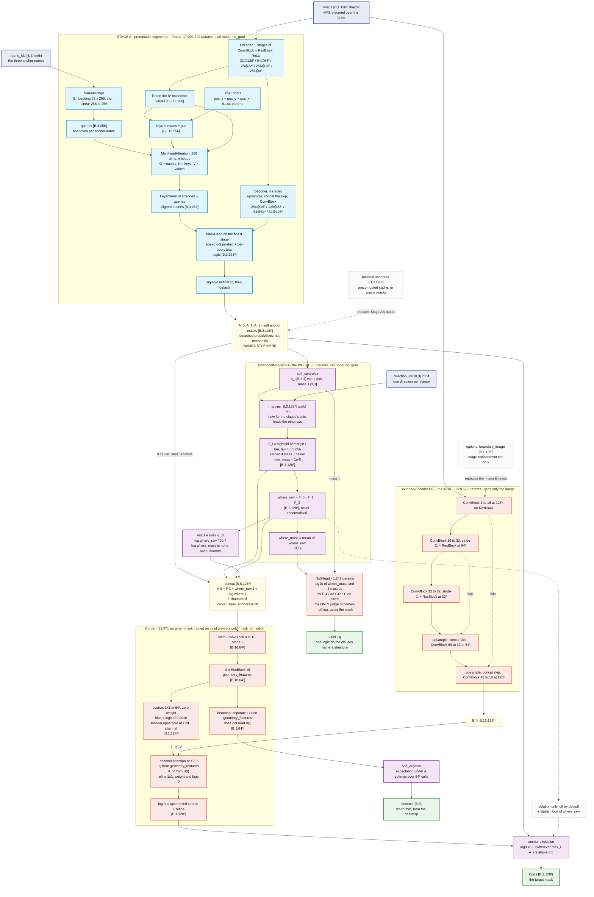

---
tags:
  - spatialvox
  - flowchart
---
# SpatialVox — model flowchart

One relational forward, `StageB.forward(image, direction_ids, name_ids)`. The frozen Stage A is drawn open, as a subgraph of the Stage B forward it lives inside. Shapes are for the MRI corpus (128³ at 1.25 mm, 23 structures) with batch size `B`. The prose behind every box is in [[SpatialVox]]. An editable version of the same chart is `Flowchart.drawio`, which opens in diagrams.net or the draw.io extension for VS Code and Cursor. One note per module is in `Model Info/` ([[MODEL PHASE A]], [[MODEL PHASE B]]).

**Baseline:** [[B0 mask-valid-seed1]], commit `d14f201`, on `data/synthetic-mri`. Trained classes 0.962; held-out 0.724 / 0.775 against floors of 0.247 / 0.162; one seed.

**Legend.** Blue boxes are frozen: Stage A never trains here. Purple boxes are parameter-free and carry no gradient: the mapper, the rescaling, the exclusion, the soft-argmax. Orange boxes are the 261,748 trainable parameters: `B(I)`, the carver and the null head. Yellow boxes are tensors that cross a module boundary. Dashed boxes are optional inputs or ablations.

**What the picture enforces**
- `name_ids` has exactly one exit, into Stage A. Downstream of `A_i` no name exists.
- `direction_ids` has exactly one exit, into the mapper. The carver receives the direction only as the *shape* of `F_i`.
- `B(I)` has one input, the image, so it knows nothing of the prompt.
- The null head reads four numbers and no pixels.
- Stage A's feature pyramid (`ENC`, `DEC`) never leaves its box. Only the detached probabilities do.
