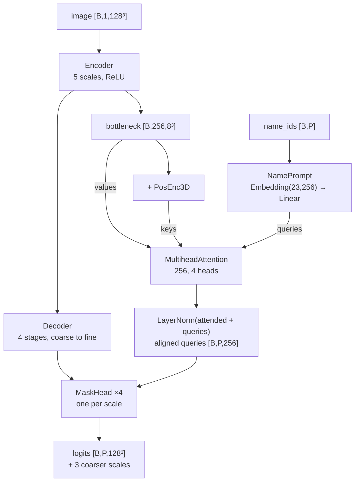

---
tags:
  - phase-a
---

### Relations
- [[Encoder]] — `self.encoder`; the image, one feature map per scale
- [[Decoder]] — `self.decoder`; skips back up, every stage returned
- [[NamePrompt]] — `self.prompt`; **the only name embedding in the project**
- [[PosEnc3D]] — `self.pos`; added to the attention *keys*
- becomes a **frozen submodule** of [[MODEL PHASE B]]
- documented step by step in [[SpatialVox#8. Step 4 — Stage A, the frozen segmenter]], and drawn open in [[Flowchart]]
- runs: [[A01 phase-a-current]] (shipped), [[A02 phase-a-new-model]], and the synthetic Stage A runs in [[Result_tracker]]

A promptable segmenter: an intensity volume and a set of structure names in, **one mask per name** out. Trained beforehand on every name that may be an anchor, then frozen. Nothing in Stage B trains it.



**The query says *what*, the keys say *where*** — they alone carry the positional encoding — **and the values carry unmodified visual content.**

---

### 01 / params

`StageA(vocab_size, resolution, *, encoder_channels=(32,64,128,256), token_dim=256, num_heads=4, bottleneck=None, prior_foreground=0.0016, deep_supervision=(0.1,0.3,0.6))`

| param | source | shipped (MRI) | note |
| --- | --- | --- | --- |
| `vocab_size` | `len(corpus.vocab)` | `23` | the whole vocabulary, every split |
| `resolution` | `min(corpus.shape)` | `128` | |
| `encoder_channels` | `model.stage_a.encoder_channels` | `[32,64,128,256,256]` | five widths → 8³ bottleneck |
| `token_dim` | `model.stage_a.token_dim` | `256` | **must equal the last width** — the prompt decoder attends over the bottleneck directly |
| `num_heads` | `model.stage_a.num_heads` | `4` | |
| `bottleneck` | `model.stage_a.bottleneck` | `8` | *checked*, not assumed |
| `prior_foreground` | `model.stage_a.prior_foreground` | `0.0016` | `MaskHead` bias |
| `deep_supervision` | `model.stage_a.deep_supervision` | `[0.05,0.1,0.25,0.6]` | one per decoder scale, coarse to fine |

**17,004,292 parameters.** At 64³ with four widths `[32,64,128,256]` it is 8.02M, same 8³ bottleneck.

---

### 02 / `MaskHead` — why one name's mask is independent of the others

```python
projected = F.layer_norm(self.project(queries), (self.visual_channels,))
logits = torch.bmm(projected, visual.flatten(2)) / math.sqrt(self.visual_channels)
return (logits + self.bias(projected)).reshape(B, -1, *visual.shape[2:])
```

A scaled dot product between each aligned query and every voxel embedding, plus a per-query bias. Visual features are only **read**, never modulated by the prompt set, and queries never interact with each other.

That is the property Stage B depends on: **the logits for one name do not depend on which other names were requested.** Stage A can be trained on the whole vocabulary and then queried for just the three anchors a clause names, and get the same answer. `tests/test_models.py::test_stage_a_masks_do_not_depend_on_which_other_names_were_asked_for` pins it.

The head bias starts at `log(p/(1−p))` with `p = 0.0016` so an untrained model outputs the base rate rather than 0.5 — one structure covers well under 1% of a volume.

---

### 03 / training

`scripts/train.py a`. `SceneDataset` returns one scene and a set of names; the masks are built as `labels == id` **on the accelerator**, never stored.

- **Every structure in every split.** The target-class split restricts what Stage B may be *supervised on*, not what anatomy exists. Stage A sees all 23 classes in train, val and test — deliberately, and it is the reason the project may not claim "zero-shot on an unseen structure".
- **Augmentation is one octahedral rotation per item.** Stage B has none; that asymmetry is what lets Stage A's output be cached.
- **Deep supervision** at all four decoder scales, weighted coarse-to-fine.

| corpus | val Dice | note |
| --- | --- | --- |
| `data/mri`, 23 structures | **0.8158** | the shipped `runs/phase-a/current` |
| synthetic, easy appearance | **0.9976** | foreground trivially separable — one threshold gives IoU 0.994 |
| synthetic, hard appearance | **0.8831** | threshold IoU 0.27; cube and cuboid confuse each other, [[A04 hard-stage-a]] |
| `synthetic-mri`, 16 classes, MRI-measured appearance | **0.9233** | threshold IoU 0.21; the Stage A of the current synthetic series, [[A09 mri-stage-a]] |

---

### 04 / frozen inside Stage B

`StageB` holds Stage A as a submodule, so a Stage B checkpoint is self-contained and `StageB.forward` can admit nothing but the image and two id tensors. Three mechanisms keep it frozen:

```python
self.segmenter = StageA(**segmenter)
self.segmenter.requires_grad_(False).eval()

def train(self, mode=True):          # .train() must not wake it up
    super().train(mode)
    self.segmenter.eval()
    return self

def trainable_parameters(self):      # what the optimiser is given
    frozen = {id(p) for p in self.segmenter.parameters()}
    return [p for p in self.parameters() if id(p) not in frozen]
```

Its 17.0M parameters are **98.4% of the checkpoint and 0% of what is learned**.

#### What crosses the boundary

```python
A_i = stop_gradient(sigmoid(anchor_logits_i))
```

The **probability**, not a threshold. A cut at 0.5 makes the centroid [[PositionalMapper3D]] reads jump, and can delete a dim but real anchor in one step. Stage A's feature pyramid is **discarded** — those features were trained to light up *named* structures, which is the property [[BoundaryEncoder]] must not have.

#### It is a constant, so it is cached

Frozen, and Stage B does not rotate, so Stage A's output for a scene cannot change. `scripts/cache_anchors.py` writes it once — bounding-box crops in float16, 0.7 GB for 200 subjects against 19 GB dense — keyed by the SHA-256 of the checkpoint so a stale cache can never be picked up silently. Worth about a fifth of a training step and 7 GB of peak memory.

Computed in **float32** even though training runs bf16: measured, bf16 moves a probability by up to 0.04 and flips ~40 voxels per batch across the 0.5 the anchor exclusion uses, *purely by changing the batch size*. The cache stores the exact value rather than one sample of that noise.

---

### 05 / how good the anchors are

The mapper consumes the **centroid**, not the mask, so anchor Dice is the wrong summary — a systematically under-segmented structure can still have an exact centroid, and a split one cannot. `scripts/gate_mapper.py --segmenter` measures the right thing:

| corpus | anchor Dice | centroid error: median / p95 / worst |
| --- | --- | --- |
| `data/mri` | 0.813 | **0.84 mm** / 2.13 / 8.14 (voxel = 1.25 mm) |
| synthetic, easy | 0.998 | 0.10 / 0.28 / 2.67 voxels |
| synthetic, hard | 0.889 | 0.67 / **25.6** / 36.2 voxels |

On `data/mri` the median error is **sub-voxel**, which is why `anchor_source: oracle` and `predicted` are currently non-discriminating there — an oracle-anchor arm differed by −0.007 ± 0.054 over 33 matched epochs. On the hard synthetic corpus the tail is long enough that the distinction becomes real.

---

### Invariants

1. **One mask per name, independent of the other names asked for.** Everything downstream assumes it.
2. **`token_dim` equals the last encoder width.** Checked in `__init__`.
3. **Trained on the whole vocabulary**, every split.
4. **Frozen inside Stage B** — no gradient, no train mode, not in the optimiser.
5. **What leaves is a detached probability**, never a threshold and never a feature map.
