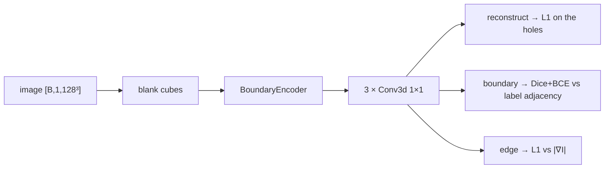

---
tags:
  - phase-b
---

### Relations
- owns a [[BoundaryEncoder]] as `self.encoder`, plus three 1×1 heads
- its trained `encoder` weights are loaded into `StageB.boundary` and given 0.1× the carver's learning rate
- trained by `scripts/train.py boundary`; **not** part of the relational forward
- documented in [[SpatialVox#11. Step 7 — Boundary encoder B(I), the WHAT]]; runs `P01 boundary-seed1` (archived) and `B05 pretrained-b-seed1` (archived)

> §N in this note is a section of the original proposal; [[SpatialVox#20. Deviations from the original proposal]] maps each one to the document.

`B` on its own, with the three class-agnostic objectives §4 specifies. A **separate model** rather than a mode of [[MODEL PHASE B]], so the heads that read the label volume are not reachable from the relational forward at all.



---

### Params (`__init__`)

`BoundaryPretrainer(widths=(16, 32, 32), mask_fraction=0.5, patch=16)`

| param | source | shipped (MRI / synthetic) | role |
| --- | --- | --- | --- |
| `widths` | `model.stage_b.boundary_widths` | `[16, 32, 32]` | passed straight to [[BoundaryEncoder]] |
| `mask_fraction` | `train.boundary.mask_fraction` | `0.5` | fraction of cubes blanked |
| `patch` | `train.boundary.patch` | `16` / `8` | cube side, in voxels — halved with the cube side |

| attribute | what | # params |
| --- | --- | --- |
| `encoder` | [[BoundaryEncoder]] | 228,528 |
| `reconstruct` | `Conv3d(16 → 1, 1×1)` | 17 |
| `boundary` | `Conv3d(16 → 1, 1×1)` | 17 |
| `edge` | `Conv3d(16 → 1, 1×1)` | 17 |
| **total** | | **228,579** |

The heads are 51 parameters of 228,579. Everything being learned lives in the encoder, which is the point — the heads exist only to give it a gradient.

---

### The three objectives

None carries a class id. That is the requirement, not a detail: a structure Stage A has never been given a mask for must still be a boundary to `B`.

| head | target | loss |
| --- | --- | --- |
| `reconstruct` | the **original** `I`, where cubes were blanked | L1, **on the holes only** — elsewhere it is a copy and teaches nothing |
| `boundary` | 1 where a 6-neighbour has a different label | Dice + BCE |
| `edge` | `\|∇I\|` by central differences | L1 |

#### The boundary map carries no class

```python
def label_boundary(labels: Tensor) -> Tensor:
    volume = labels.unsqueeze(1).float()
    different = torch.zeros_like(volume)
    for axis in range(2, 5):
        for shift in (1, -1):
            rolled = volume.roll(shift, dims=axis).clone()
            index = [slice(None)] * 5
            index[axis] = 0 if shift == 1 else -1
            rolled[tuple(index)] = volume[tuple(index)]      # replicate at the border
            different = torch.maximum(different, (rolled != volume).float())
    return different
```

It says *there is an edge here*, never *whose*. `tests/test_engine.py` pins that relabelling the same shapes gives the identical target. It is a **pretraining target and never an inference input**, which is why it lives here and not in `StageB`.

#### Blanking is by cubes, not voxels

```python
def blank(self, image):
    grid = [max(s // self.patch, 1) for s in image.shape[2:]]
    coarse = (torch.rand(image.shape[0], 1, *grid, device=image.device) < self.mask_fraction).float()
    holes = F.interpolate(coarse, size=image.shape[2:], mode="nearest")
    return image * (1 - holes), holes
```

A voxel-wise mask is filled in by its own neighbours and teaches nothing about structure.

---

### Measured

`runs/boundary-seed1`, 30 epochs, ~10 minutes on one GPU:

| epoch | loss | boundary-map Dice (train) | (val) |
| --- | --- | --- | --- |
| 0 | 3.514 | 0.0041 | 0.0163 |
| 6 | 2.047 | 0.5313 | 0.5516 |
| 18 | 1.278 | 0.6067 | 0.6138 |
| 29 | 1.206 | 0.6290 | **0.6258** |

Train and val land on the same number, so `B` is not memorising subjects — it has learned where edges are.

---

### What it does **not** fix — a hypothesis, falsified

On `data/mri` the carver transfers to a class it was never supervised on at Dice 0.005, against a 0.110 floor, by falling silent 75% of the time. The obvious explanation was that `B` had been trained from scratch alongside the carver (a sequencing deviation, [[SpatialVox#20.5 Sequencing]]) and so had no class-agnostic prior at all.

That predicted: pretrain `B`, and the empty rate should fall. **It does not.** Epoch-matched against `B` from scratch:

| epoch | supervised, pretrained | scratch | held-out, pretrained | scratch |
| --- | --- | --- | --- | --- |
| 0 | 0.4647 | 0.4368 | 0.1123 | 0.1375 |
| 3 | 0.5870 | 0.6002 | 0.0089 | 0.0099 |
| 5 | 0.6886 | 0.6411 | 0.0173 | 0.0132 |

Same within noise on both curves; the held-out one collapses identically. So the cause is the carver's **objective**, not `B`'s features. Running it was still right — it was the proposal's own prescription, and it is now measured rather than assumed.

---

### Invariants

1. **Not reachable from the relational forward.** The heads read the label volume; `StageB` must not be able to.
2. **No class id in any objective.**
3. **Only `encoder` transfers.** The heads are discarded after pretraining.
4. **Lower learning rate afterwards** (`boundary_lr_scale: 0.1`) — §4, and `StageB.parameter_groups` implements it: 228,528 parameters at 3e-5 against the carver's 39,747 at 3e-4.
