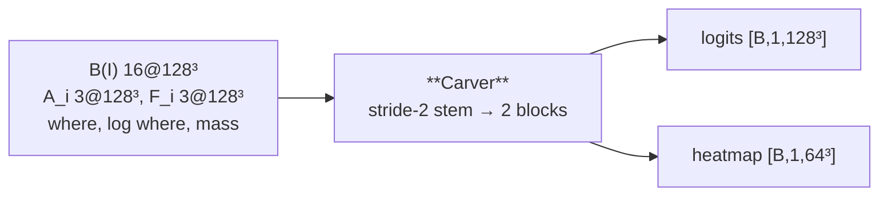

---
tags:
  - phase-b
---

### Relations
- `StageB.carver`; the only module that produces the mask
- reads [[BoundaryEncoder]] (twice) and [[PositionalMapper3D]] (six channels plus three scalars-as-planes)
- reads the detached anchor masks from [[MODEL PHASE A]]
- owns the heatmap 1×1 whose soft-argmax is the reported centroid
- documented in [[SpatialVox#12. Step 8 — Carver]]

> §N in this note is a section of the original proposal; [[SpatialVox#20. Deviations from the original proposal]] maps each one to the document.

The WHAT. Ten channels in, target logits and a heatmap out. It never receives a name, a direction id, a token or a coordinate grid — everything it knows about the prompt arrives as geometry that [[PositionalMapper3D]] already computed.



---

### Params (`__init__`)

`Carver(in_channels, boundary_channels, *, width=16, blocks=2, act="leaky_relu", full_resolution_skip=True, prior_foreground=0.0016)`

| param | source | shipped | role |
| --- | --- | --- | --- |
| `in_channels` | derived | `25` | `boundary_channels + (2 if carver_sees_anchors else 1)·n_anchors + 3`: 22 without the anchor masks, 9 in the prompt-only ablation |
| `boundary_channels` | `B.out_channels` | `16` | 0 when `use_image=False` |
| `width` | `model.stage_b.carver.width` | `16` | §4's "two 16-channel blocks" |
| `blocks` | `model.stage_b.carver.blocks` | `2` | residual blocks after the stem |
| `full_resolution_skip` | `model.stage_b.carver.full_resolution_skip` | `True` | carry `B(I)` past the stem |
| `prior_foreground` | `model.stage_b.prior_foreground` | `0.0016` | head bias |

| attribute | what | # params |
| --- | --- | --- |
| `stem` | `ConvBlock(25 → 16, stride 2)` | 10,800 |
| `blocks` | `2 × ResBlock(16)` | 27,648 |
| `head` | `Conv3d(16+16 → 1, 1×1)` — zero weight, bias `logit(0.0016)` | 33 |
| `heatmap` | `Conv3d(16 → 1, 1×1)` | 17 |
| **total** | | **38,498** |

**38.5k parameters** — 14% of Stage B's trainable weight, against [[BoundaryEncoder]]'s 228.5k. The carver is the small half.

`head` weight is zeroed and its bias is `log(p/(1−p))` with `p = 0.0016`, so an untrained model outputs the base rate rather than 0.5. One structure covers well under 1% of a volume; without this, training begins by pushing two million background logits down before Dice carries usable gradient.

#### The ten channels, counted

`25 = 16 + 3 + 3 + 1 + 1 + 1`

| channels | what | from |
| --- | --- | --- |
| 16 | `B(I)` | [[BoundaryEncoder]] |
| 3 | `A_0..2` — detached soft anchor masks | [[MODEL PHASE A]], `stop_gradient(sigmoid(·))` |
| 3 | `F_0..2` — the three pyramids | [[PositionalMapper3D]] |
| 1 | `where_raw` | ” |
| 1 | `log(where_raw)`, clamped and normalised | ” |
| 1 | `log(where_mass)`, broadcast across space | ” |

With `carver_sees_anchors: false` the three `A_i` rows drop out: 22 channels, a 9,504-parameter stem, 37,202 parameters in all. The anchor exclusion is unchanged. That arm has not yet run with the flag actually off ([[B11 arm-noanchor]]).

`tests/test_models.py::test_the_carver_takes_exactly_the_ten_declared_channels` counts this off `stem[0].in_channels`, so a smuggled coordinate grid changes the number and fails.

Both logs are clamped at `LOG_FLOOR = 1e-9` and divided by `−log(LOG_FLOOR)`, mapping them onto `[-1, 0]`. Measured, `where_mass` spans **1e-21 to 2e-2**: the raw number is indistinguishable from zero after one convolution whose other nine channels live in `[0,1]`. Monotone reparameterisation, same information ([[SpatialVox#20.2 Quantities rescaled to be usable (monotone, no new information)]]).

---

### Source Code

```python
class Carver(nn.Module):
    def __init__(self, in_channels, boundary_channels, *, width=16, blocks=2,
                 act="leaky_relu", full_resolution_skip=True, prior_foreground=0.0016):
        super().__init__()
        self.full_resolution_skip = bool(full_resolution_skip) and boundary_channels > 0
        self.stem = ConvBlock(in_channels, width, act, stride=2)
        self.blocks = nn.Sequential(*[ResBlock(width, act) for _ in range(int(blocks))])
        self.head = nn.Conv3d(width + (boundary_channels if self.full_resolution_skip else 0), 1, 1)
        nn.init.zeros_(self.head.weight)
        nn.init.constant_(self.head.bias, prior_bias(prior_foreground))
        self.heatmap = nn.Conv3d(width, 1, 1)

    def forward(self, x: Tensor, boundary: Tensor | None) -> tuple[Tensor, Tensor]:
        features = self.blocks(self.stem(x))
        full = F.interpolate(features, size=x.shape[2:], mode="trilinear", align_corners=True)
        if self.full_resolution_skip and boundary is not None:
            full = torch.cat([full, boundary], dim=1)
        return self.head(full), self.heatmap(features)
```

---

### Forward

| step | shape | note |
| --- | --- | --- |
| `x` | `[B,25,128³]` | concatenated in the *boundary features'* dtype, so the 25-channel tensor stays off the float32 path under autocast |
| `stem` | `[B,16,64³]` | stride 2; what keeps 3×3×3 affordable on a 128³ volume |
| `blocks` | `[B,16,64³]` | two residual blocks — §4's "two 16-channel blocks" |
| `interpolate` | `[B,16,128³]` | trilinear, back to full |
| `cat` w/ `B(I)` | `[B,32,128³]` | only when `full_resolution_skip` |
| `head` | `[B,1,128³]` | logits |
| `heatmap` | `[B,1,64³]` | from the **pre-upsample** features |

#### `full_resolution_skip` — an addition, recorded

§4 reads literally as *"stride-2 stem, then 1×1 up to 128³"*, which makes the stem the only path from `B(I)` to the output — every full-resolution boundary detail destroyed before the first convolution, leaving a trilinear upsample of a 2.5 mm grid. That defeats §4's own claim that the mask is drawn where `B(I)` carries a boundary, on a corpus whose targets are 300–4000 voxel nuclei.

With the flag on, the final 1×1 reads `concat(upsample(residual), B(I))`: still one 1×1, still at 128³, but it sees boundaries at their own resolution. It is a **flag, not a silent change**, so the literal form stays runnable as an ablation ([[SpatialVox#20.4 Architectural additions]]).

#### The heatmap is a separate head

Not a reading of the mask. §4 asks for *"a separate 1×1, soft-argmax → centroid"*, and §5 keeps the heatmap trained when the mask target is empty — which only works if it is independent of the mask. Taken from the 64³ working grid; soft-argmax is an **expectation**, so the coordinate is continuous and is not quantised to that grid ([[SpatialVox#20.3 Where the specification was ambiguous]]).

#### Anchor exclusion happens *after* the carver

In [[MODEL PHASE B]], not here:

```python
logits = logits.masked_fill(anchors.amax(dim=1, keepdim=True) > 0.5, self.background_logit)
```

The anchors are the given, not the answer. It uses the **predicted soft mask**, never the label volume, and it is not dilated. `background_logit = −10.0`, finite rather than `−inf`: a `−inf` makes `BCEWithLogits` produce `nan` whenever the target disagrees, which happens when Stage A paints part of the target as an anchor — a real event that deserves a finite gradient, not a crashed run.

---

### Invariants

1. **No name, no direction id, no token, no coordinate grid.** Everything prompt-derived arrives as geometry.
2. **Exactly ten channel groups**, counted off the first convolution.
3. **The head starts at the foreground prior**, not at 0.5.
4. **The heatmap is separate** and survives an empty mask.
5. **Anchor voxels become background**, from the predicted mask, undilated.

---

### What limits it — measured

Not capacity, as an earlier reading of the overfit suggested. Memorising a *single scene* reached 0.7877, but by epoch 11 of the real run the same 38.5k-parameter carver passes that on **training** Dice (0.8048) with 160 subjects. The overfit is a wiring check — it says the channel order, the world coordinates and the prompt indices are right — and nothing more.

What does limit it is what the image gives it. On a class it was never supervised to draw, the carver **falls silent**: 75% empty masks, and 93 predicted voxels where 2219 belong, while the anchors are as good as ever (0.8046) and the field points at the target slightly *more* often (gate 0.857 vs 0.827). Nothing upstream failed; the carver simply does not answer. Since 16% of its training examples are supervised to be empty (a flip that names nothing), "when in doubt, say nothing" costs it nothing on the training distribution. On the synthetic series, where the image carries more class-agnostic contrast, the same carver stays above its held-out floor ([[B09 mri-stage-b]]).
