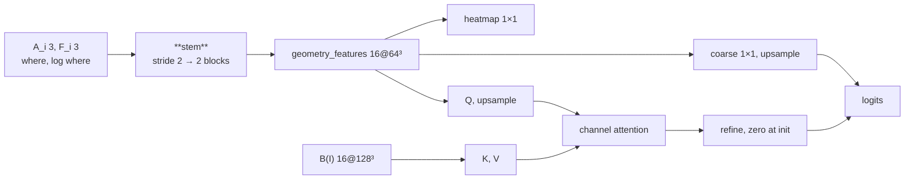

---
tags:
  - phase-b
---

### Relations
- `StageB.carver`; the only module that produces the mask
- stem reads geometry from [[PositionalMapper3D]] and, when `carver_sees_anchors`, the detached anchor masks from [[MODEL PHASE A]]
- reads [[BoundaryEncoder]] only as keys and values
- owns the heatmap 1×1 whose soft-argmax is the reported centroid
- documented in [[SpatialVox#12. Step 8 — Carver]]

> §N in this note is a section of the original proposal; [[SpatialVox#20. Deviations from the original proposal]] maps each one to the document.

The mask head. Eight geometry channels in, target logits and a heatmap out. It never receives a name, a direction id, a token or a coordinate grid — everything it knows about the prompt arrives as geometry that [[PositionalMapper3D]] already computed. `boundary` is not a stem channel.



---

### Params (`__init__`)

`Carver(in_channels, boundary_channels, *, width=16, blocks=2, act="leaky_relu", prior_foreground=0.0016)`

| param | source | shipped | role |
| --- | --- | --- | --- |
| `in_channels` | derived | `8` | `(2 if carver_sees_anchors else 1)·n_anchors + 2`: 5 without the anchor masks. Not `boundary` |
| `boundary_channels` | `B.out_channels` | `16` | width of Q, K, V, and `refine`. Required |
| `width` | `model.stage_b.carver.width` | `16` | §4's "two 16-channel blocks" |
| `blocks` | `model.stage_b.carver.blocks` | `2` | residual blocks after the stem |
| `prior_foreground` | `model.stage_b.prior_foreground` | `0.0016` | `coarse` bias |

| attribute | what | # params |
| --- | --- | --- |
| `stem` | `ConvBlock(8 → 16, stride 2)` | 3,456 |
| `blocks` | `2 × ResBlock(16)` → `geometry_features` | 27,648 |
| `coarse` | `Conv3d(16 → 1, 1×1)` — zero weight, bias `logit(0.0016)` | 17 |
| `heatmap` | `Conv3d(16 → 1, 1×1)`, separate, default init | 17 |
| `query` | `Conv3d(16 → 16, 1×1)` on `geometry_features`. Default init | 272 |
| `key`, `value` | `Conv3d(16 → 16, 1×1)` on `boundary`. Default init | 544 |
| `refine` | `Conv3d(16 → 1, 1×1)` — weight and bias **zero** | 17 |
| **total** | | **31,971** |

**32.0k parameters** — 12.2% of Stage B's trainable weight, against [[BoundaryEncoder]]'s 228.5k.

`coarse` weight is zeroed and its bias is `log(p/(1−p))` with `p = 0.0016`, so an untrained model outputs the base rate rather than 0.5. `query`, `key`, and `value` are **not** zeroed: a zero projection makes `retrieved` zero, and a zero `refine` then gets no gradient. `refine` itself is zero, so at step 0 the logits equal the upsampled coarse and do not depend on `boundary`.

#### The eight channels, counted

`8 = 3 + 3 + 1 + 1`

| channels | what | from |
| --- | --- | --- |
| 3 | `A_0..2` — detached soft anchor masks | [[MODEL PHASE A]], `stop_gradient(sigmoid(·))` |
| 3 | `F_0..2` — the three pyramids | [[PositionalMapper3D]] |
| 1 | `where_raw` | ” |
| 1 | `log(where_raw)`, clamped and normalised | ” |

`log(where_mass)` is not here. It is one scalar broadcast over the volume, and `InstanceNorm3d(affine=False)` subtracts the spatial mean, so that channel would be identically zero. [[NullHead]] still reads the scalar.

With `carver_sees_anchors: false` the three `A_i` rows drop out: 5 channels, a 2,160-parameter stem, 30,675 parameters in all. The anchor exclusion is unchanged. That arm has not yet run with the flag actually off (`B11 arm-noanchor` (archived)).

`tests/test_models.py::test_the_stem_reads_eight_geometry_channels_and_not_the_boundary` counts this off `stem[0].in_channels` and checks that swapping the volume `B` reads leaves the stem input bit-identical.

`log(where_raw)` is clamped at `LOG_FLOOR = 1e-9` and divided by `−log(LOG_FLOOR)`, mapping it onto `[-1, 0]`.

---

### Source Code

```python
def forward(self, geometry: Tensor, boundary: Tensor) -> tuple[Tensor, Tensor]:
    geometry_features = self.blocks(self.stem(geometry))
    coarse = F.interpolate(
        self.coarse(geometry_features), size=geometry.shape[2:],
        mode="trilinear", align_corners=True,
    )
    query = F.interpolate(
        self.query(geometry_features), size=boundary.shape[2:],
        mode="trilinear", align_corners=True,
    )
    retrieved = channel_attention(query, self.key(boundary), self.value(boundary))
    logits = coarse + self.refine(retrieved)
    return logits, self.heatmap(geometry_features)
```

`channel_attention` chunks the voxel axis (4096). Softmax is over the key channel: `score_ij = Q_i K_j / sqrt(C)`, `retrieved_i = Σ_j α_ij V_j`. It does not build `[B, 16, 16, 128³]`.

---

### Forward

| step | shape | note |
| --- | --- | --- |
| `geometry` | `[B,8,128³]` | stem input. `boundary` is not in it |
| `geometry_features` | `[B,16,64³]` | stem, stride 2, then two residual blocks |
| `coarse` | `[B,1,64³]` then `[B,1,128³]` | zero weight, prior bias, one channel upsampled |
| `heatmap` | `[B,1,64³]` | separate 1×1 on `geometry_features`. Independent of `boundary` |
| `query` | `[B,16,128³]` | 1×1 on `geometry_features`, then trilinear |
| `key`, `value` | `[B,16,128³]` | 1×1s on `boundary` |
| `logits` | `[B,1,128³]` | upsampled coarse + `refine(retrieved)`. `refine` is zero at init |

Checkpoints of the previous carver do not load. There is no weight translator.

#### The heatmap is a separate head

Not a reading of the mask, and not a function of `boundary`. §4 asks for *"a separate 1×1, soft-argmax → centroid"*. Taken from the 64³ working grid; soft-argmax is an **expectation**, so the coordinate is continuous ([[SpatialVox#20.3 Where the specification was ambiguous]]).

#### Anchor exclusion happens *after* the carver

In [[MODEL PHASE B]], not here:

```python
logits = logits.masked_fill(anchors.amax(dim=1, keepdim=True) > 0.5, self.background_logit)
```

The anchors are the given, not the answer. It uses the **predicted soft mask**, never the label volume, and it is not dilated. `background_logit = −10.0`, finite rather than `−inf`.

---

### Invariants

1. **No name, no direction id, no token, no coordinate grid.** Everything prompt-derived arrives as geometry.
2. **Eight stem channels with anchors, five without.** `boundary` is not one of them.
3. **`coarse` starts at the foreground prior**, not at 0.5. **`refine` starts at zero**, so the initial logits ignore `boundary`.
4. **`query`, `key`, and `value` are not zero** at init.
5. **The heatmap is separate** and does not read `boundary`.
6. **Anchor voxels become background**, from the predicted mask, undilated, after the head.

---

### What limits it — measured

The numbers below are the previous carver (25-channel stem, split 1×1). They are not a measurement of this module.

Not capacity, as an earlier reading of the overfit suggested. Memorising a *single scene* reached 0.7877, but by epoch 11 of the real run the same 38.5k-parameter carver passes that on **training** Dice (0.8048) with 160 subjects. The overfit is a wiring check — it says the channel order, the world coordinates and the prompt indices are right — and nothing more.

What does limit it is what the image gives it. On a class it was never supervised to draw, the carver **falls silent**: 75% empty masks, and 93 predicted voxels where 2219 belong, while the anchors are as good as ever (0.8046) and the field points at the target slightly *more* often (gate 0.857 vs 0.827). Nothing upstream failed; the carver simply does not answer. Since 16% of its training examples are supervised to be empty (a flip that names nothing), "when in doubt, say nothing" costs it nothing on the training distribution. On the synthetic series, where the image carries more class-agnostic contrast, the same carver stays above its held-out floor (`B09 mri-stage-b` (archived)).
