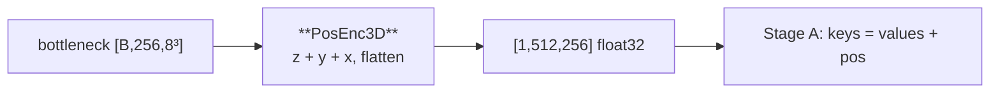

---
tags:
  - phase-a
---

### Relations
none — basic block
- documented in [[SpatialVox#8. Step 4 — Stage A, the frozen segmenter]] (8.3)

Tells attention *where in the volume* each of the 512 bottleneck tokens sits. Without it the bottleneck is an unordered bag and no relation word can be grounded. Factorised over axes: `(D+H+W)·C` params, not `D·H·W·C`. Free for axis-aligned relations — which is all six of `DIRECTIONS`.

One instance now, in Stage A. A second one lived in the deleted attention Stage B, with **no shared weights**.



---

### Params (`__init__`)

`PosEnc3D(grid, channels)`

| param | source | runtime | role |
| --- | --- | --- | --- |
| `grid` | `(bottleneck_for(...),) * 3` | `(8, 8, 8)` | stored as `self.grid`; **not** interpolated at runtime |
| `channels` `C` | `token_dim` | `256` | token width |

| parameter | code shape | runtime | init | # params |
| --- | --- | --- | --- | --- |
| `pos_z` | `[1, D, 1, 1, C]` | `(1, 8, 1, 1, 256)` | `trunc_normal_(std=0.02)` | 2,048 |
| `pos_y` | `[1, 1, H, 1, C]` | `(1, 1, 8, 1, 256)` | same | 2,048 |
| `pos_x` | `[1, 1, 1, W, C]` | `(1, 1, 1, 8, 256)` | same | 2,048 |
| **total** | `(D+H+W)·C` | | | **6,144** |

Dense `D·H·W·C` at 8³×256 would be **131,072** (21×). At 16³ the gap is 170×.

Broadcast shapes are load-bearing: summing the three tables yields `[1, D, H, W, C]` with no `expand`.

---

### Source Code

```python
class PosEnc3D(nn.Module):
    """Learned positional encoding factorised over the three spatial axes.

    Holds ``pos_z``, ``pos_y`` and ``pos_x`` and returns their sum flattened to
    ``[1, D*H*W, C]``, so the parameter count is ``(D + H + W) * C`` rather than
    ``D*H*W*C``. The grid is fixed at construction; a mismatch is an error rather
    than a silent interpolation.
    """

    def __init__(self, grid: Sequence[int], channels: int) -> None:
        super().__init__()
        depth, height, width = (int(v) for v in grid)
        self.grid, self.channels = (depth, height, width), int(channels)
        self.pos_z = nn.Parameter(torch.zeros(1, depth, 1, 1, channels))
        self.pos_y = nn.Parameter(torch.zeros(1, 1, height, 1, channels))
        self.pos_x = nn.Parameter(torch.zeros(1, 1, 1, width, channels))
        for parameter in (self.pos_z, self.pos_y, self.pos_x):
            nn.init.trunc_normal_(parameter, std=0.02)

    def forward(self, grid: Sequence[int] | None = None) -> Tensor:
        if grid is not None and tuple(int(v) for v in grid) != self.grid:
            raise ValueError(f"positional encoding is built for {self.grid}, got {tuple(grid)}")
        return (self.pos_z + self.pos_y + self.pos_x).reshape(1, -1, self.channels)
```

---

### Forward

`grid: Sequence[int] | None` → `[1, D·H·W, C]`

Callers always pass the feature map's spatial size — **as a check**, not as an argument the tables use.

| caller | construction | call | added onto |
| --- | --- | --- | --- |
| Stage A | `PosEnc3D((8,8,8), 256)` | `self.pos(features[-1].shape[2:])` | **keys** = `values + pos` |

Stage A:

```python
values = features[-1].flatten(2).transpose(1, 2)     # [B, 512, 256]  — unmodified
keys   = values + self.pos(features[-1].shape[2:])   # [B, 512, 256] + [1, 512, 256]
queries = self.prompt(name_ids)                      # no pos — names are not locations
```

Match a name against *where*; retrieve *what*. Queries carry no spatial information.

Under the attention architecture a second instance lived in Stage B's `Evidence` block, where the roles were inverted — locations queried the clause tokens, so the encoding went on the *queries*. That block is gone: Stage B has no attention over space at all, and its only spatial prior is the parameter-free [[PositionalMapper3D]]. What follows is Stage A's use, the only one left.

Historical, for contrast:

```python
queries = self.to_query(visual.flatten(2).transpose(1, 2)) + self.pos(visual.shape[2:])
```

Locations are the queries; clause tokens are keys/values.

#### 0. Input

| variable | meaning |
| --- | --- |
| `grid` | caller’s `(D,H,W)`, or `None` to skip the guard |

The tables do not read `grid`. A mismatch **raises**. Silent interpolation would let a resolution change pass unnoticed and make every learned position mean something else.

#### 1. Broadcast sum

```python
self.pos_z + self.pos_y + self.pos_x
# [1,D,1,1,C] + [1,1,H,1,C] + [1,1,1,W,C]  →  [1,D,H,W,C]
```

$$
P[d,h,w,:] = z_d + y_h + x_w
$$

Axis names match array order `(z, y, x)`, **not** RAS `(x, y, z)`. World coordinates everywhere else are ordered `(x, y, z)`, for example inside [[PositionalMapper3D]].

#### 2. Flatten

```python
.reshape(1, -1, self.channels)     # [1, D, H, W, C] → [1, D·H·W, C]
```

`(z, y, x)` row-major — the same order as `Tensor.flatten(2)` on `[B, C, D, H, W]`. Token `i` of `pos` **is** token `i` of the flattened bottleneck, and both flattens must stay in step.

#### 3. Output

| variable | code shape | runtime | dtype | meaning |
| --- | --- | --- | --- | --- |
| return | `[1, D·H·W, C]` | `(1, 512, 256)` | **`float32`** | batch axis added by the caller via broadcast |

`float32` even under bf16 autocast — a bare parameter add is not an autocast-listed op. Added to `bfloat16` keys/queries; the sum follows autocast.

`B=1` on purpose: one table, shared across the batch.

---

### Invariants

1. **Grid is construction-time.** Changing `model.bottleneck` without rebuilding this module is a `ValueError`, not a resize.
2. **Flatten order `(z,y,x)`** must match `features[-1].flatten(2)`. Do not `permute` one without the other.
3. **Pos on keys, not values, not queries.** The keys say *where*, the values carry unmodified visual content. Swapping them inverts "where" and "what".
4. **Not world coordinates.** No millimetres, no RAS, no `[-1,1]`. Learned offsets. `medial`/`lateral` against the volume centre plane live in [[PositionalMapper3D]], not here.

---

### Gradient

`pos_z[d]` accumulates from all `H·W = 64` tokens in that slice — 64× more signal per entry than a dense `D·H·W·C` table. Factorisation is both a parameter saving and a gradient pooling along the other two axes.
