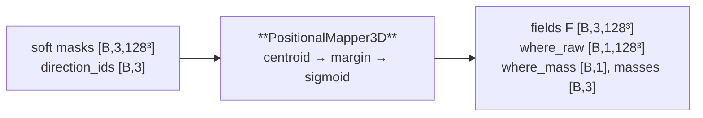

---
tags:
  - phase-b
---

### Relations
- consumes the detached soft masks [[MODEL PHASE A]] produced, and the three `direction_ids`
- feeds [[Carver]] (the fields and their product) and [[NullHead]] (two scalars)
- it is the **only** consumer of `direction_ids` anywhere in Stage B
- documented in [[SpatialVox#9. Step 5 — PositionalMapper3D, the WHERE]]; the tau sweep is `D02 mapper gate and tau sweep` (archived)

> §N in this note is a section of the original proposal; [[SpatialVox#20. Deviations from the original proposal]] maps each one to the document.

The WHERE. `classify` — the rule that wrote the prompt — turned into a differentiable map. `classify` answers *"which single word describes this target relative to this anchor"*; the mapper answers the inverse, *"for every point in the volume, how well would a structure centred there satisfy this clause"*, and answers it with the same predicate: **one axis of the centroid offset dominates, inside a square pyramid of 45°**.

It has **no parameters**. It never sees the image and never sees a name. A learned field that could move itself onto a blob is exactly the shortcut a fixed pyramid closes.



---

### Params (`__init__`)

`PositionalMapper3D(tau=2.0, min_mass=1e-5)`: these are the constructor's own defaults. `StageB` always passes the configured `tau = 0.5` and `min_mass = 1e-6`.

| param | source | shipped | role |
| --- | --- | --- | --- |
| `tau` | `model.stage_b.mapper.tau` | `0.5` | softness of the pyramid wall, in **world units** |
| `min_mass` | `model.stage_b.mapper.min_mass` | `1e-6` | below this an anchor is treated as not found |

**Zero parameters.** `sum(p.numel() for p in mapper.parameters()) == 0`, and `tests/test_mapper.py` pins it.

Both values depart from the proposal's starting points, and both were measured rather than chosen (`scripts/gate_mapper.py`):

| | proposal | shipped | why |
| --- | --- | --- | --- |
| `tau` | 2.0 | **0.5** | at 2.0 only **65%** of target centroids clear `where_raw > 0.5`, the fraction §2 makes the precondition for training the carver. At 0.5 it is **97.4%** |
| `min_mass` | 1e-3 | **1e-6** | 1e-3 sits above **every structure in the vocabulary** except the brainstem and the thalami. The smallest mass a real structure gets is 3.2e-6 |

`tau` is in world units, so on `data/mri` (1.25 mm/voxel) it is millimetres and on the synthetic corpora (1.0) it is voxels. Re-run the gate after changing corpus.

---

### The predicate

For `d = p − c`, where `c` is the anchor's confidence-weighted centroid and `p` a voxel's world position, the margin is **how far the dominant axis leads the other two** — positive exactly inside the pyramid, zero on its surface:

| direction | margin |
| --- | --- |
| superior / inferior | `±d_z − max(\|d_x\|, \|d_y\|)` |
| anterior / posterior | `±d_y − max(\|d_x\|, \|d_z\|)` |
| lateral / medial | `min( \|d_x\| − max(\|d_y\|,\|d_z\|),  ±(\|p_x − m\| − \|c_x − m\|) )` |

Lateral and medial are **distances to the mid-sagittal plane** `m`, not the half-spaces `+x` and `−x`; the second term is that comparison and the `min` makes the clause true only where both hold. This is `classify` voxel by voxel: there the axis wins by being the largest of three, which is the same inequality written as a difference.

$$F_i(p) = \sigma\!\left(\frac{\text{margin}_i(p)}{\tau}\right)\cdot\big[\,\text{mass}_i \ge \text{min\_mass}\,\big]$$

There is **no axial fade and no learned gain**. A direction is a relation, not a distance, so a point twice as far superior is not twice as superior.

---

### Source Code

```python
class PositionalMapper3D(torch.nn.Module):
    def __init__(self, tau: float = 2.0, min_mass: float = 1e-5) -> None:
        super().__init__()
        if float(tau) <= 0:
            raise ValueError(f"mapper.tau must be positive, got {tau!r}")
        self.tau = float(tau)
        self.min_mass = float(min_mass)

    def forward(self, masks, direction_ids, spacing, center) -> MapperOutput:
        masks = masks.float()
        centroids, masses = soft_centroids(masks, spacing)
        margin = margins(centroids, direction_ids, masks.shape[2:], spacing, center)
        gate = (masses >= self.min_mass).to(margin.dtype).reshape(*masses.shape, 1, 1, 1)
        fields = torch.sigmoid(margin / self.tau) * gate
        where_raw = fields.prod(dim=1, keepdim=True)
        return MapperOutput(
            fields=fields, where_raw=where_raw,
            where_mass=where_raw.flatten(1).mean(-1, keepdim=True),
            masses=masses, centroids=centroids,
        )
```

---

### Forward

#### 1. Confidence-weighted centroid, not a threshold

```python
centroids, masses = soft_centroids(masks, spacing)   # [B,3,3] world (x,y,z), [B,3]
```

`c_i = Σ A_i·p / (Σ A_i + ε)` — the first moment of the **soft** mask. A cut at 0.5 makes the centroid jump and can delete a dim but real anchor in one step. `mass_i = mean(A_i)`, a fraction of the volume, which is what `min_mass` is expressed in and why it is comparable across corpora.

Computed from the three axis **marginals**, not a dense coordinate grid: `Σ A·p_x` is `Σ_x p_x · (Σ_{D,H} A)`, exact and one pass per axis.

#### 2. Margins, kept separable

`dx`, `dy`, `dz` stay `[B,3,1,1,W]` / `[B,3,1,H,1]` / `[B,3,D,1,1]` until the `max` and the sum. Only two full `[B,3,D,H,W]` tensors are ever materialised. Exactly one of `is_x/is_y/is_z` is 1 per slot, so each expression is a broadcast **selection**, not six margins of which five are discarded.

#### 3. The product is **not renormalised**

```python
where_raw = fields.prod(dim=1, keepdim=True)
```

A sigmoid is never exactly zero, so an impossible conjunction still has a tiny peak. Dividing by that peak would turn it into 1.0 and manufacture a confident answer out of nothing. [[NullHead]] reads `where_mass` instead, and a meaningless spike stays small.

#### 4. Outputs

| field | shape | consumed by |
| --- | --- | --- |
| `fields` | `[B,3,D,H,W]` | [[Carver]], three channels |
| `where_raw` | `[B,1,D,H,W]` | [[Carver]] (raw + log), and `L_far` |
| `where_mass` | `[B,1]` | [[NullHead]], and a broadcast carver channel |
| `masses` | `[B,3]` | [[NullHead]] |
| `centroids` | `[B,3,3]` | diagnostics |

The whole call runs under `torch.no_grad()` in [[MODEL PHASE B]]: the masks are detached and there are no parameters, so nothing here is on the graph, and saying so keeps three full-volume intermediates from being held for a backward that would never read them.

---

### Invariants

1. **No parameters, ever.** A learned gain is the shortcut the fixed pyramid exists to close.
2. **`where_raw` is never divided by its maximum.** Pinned by `test_an_impossible_conjunction_keeps_a_tiny_peak_and_is_not_renormalised`.
3. **The centroid is soft.** Thresholding it is a different, jumpier function.
4. **A rejected anchor writes `F_i = 0`**, so `where_raw ≡ 0` and [[NullHead]] — not a threshold inside the mapper — declares the prompt empty.
5. **`direction_ids` stop here.** Nothing downstream sees them.

---

### What it is *not* — measured

The gate says the target's centroid is **inside** the high region 97.4% of the time. It does **not** say the region points at it: the distance from `where_raw`'s own centre of mass to the target's centroid is **20.2 mm**, nearly independent of `tau`.

The conjunction of three 45° cones is an **elongated wedge** and the target sits near its *apex*, so the region contains the target without indicating it. Two consequences, both in [[SpatialVox#20.3 Where the specification was ambiguous]]:

- §7's metric *"the field located the structure"* does not follow from the gate passing;
- §5's heatmap-against-the-field term pulls ~20 mm off-target on every valid prompt — visible as `loss_field_centroid` plateauing at 0.32, about 23% of the total.

`where_raw` is a channel and a weak bias. It is **not a crop, not a mask**, and `logit(where)` is not added to the logits unless the scalar-`alpha` ablation is on. Measured on `data/mri`, only **36%** of a target's voxels lie inside `where_raw > 0.05` (94% inside its 8-voxel dilation), which is why `L_far` polices the dilation and not the field.
