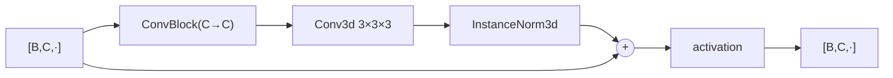

---
tags:
  - phase-a
  - phase-b
---

### Relations
- [[ConvBlock]] — the first of its two convolutions
- used by [[Encoder]], [[BoundaryEncoder]], [[Carver]]
- documented in [[SpatialVox#8. Step 4 — Stage A, the frozen segmenter]] (8.1, the shared blocks)

Two convolutions plus an identity shortcut. **Width and size are unchanged** — that is what makes the shortcut an addition rather than a projection.



---

### Params (`__init__`)

`ResBlock(channels, act)`

```python
class ResBlock(nn.Module):
    def __init__(self, channels: int, act: str) -> None:
        super().__init__()
        self.body = nn.Sequential(
            ConvBlock(channels, channels, act),
            conv(channels, channels),
            nn.InstanceNorm3d(channels, affine=False),
        )
        self.act = activation(act)

    def forward(self, x: Tensor) -> Tensor:
        return self.act(self.body(x) + x)
```

`2 · C² · 27` parameters. The **activation is after the sum**, not inside `body` — pre-activation would make the shortcut non-linear and defeat the point.

| used in | width | count |
| --- | --- | --- |
| [[Encoder]] (Stage A) | 32 … 256 | one per stage, all five |
| [[BoundaryEncoder]] | 32 | one per stride-2 stage — **not** at full resolution |
| [[Carver]] | 16 | `carver.blocks` of them, shipped 2 |

#### Why `BoundaryEncoder` omits it at 128³

A 16→16 3×3×3 convolution on a 128³ volume is the most expensive operation in Stage B. Measured, the residual pair at the finest scale cost **350 ms of a 530 ms** training step — two thirds of `B` — for 6% more parameters. Depth is cheaper one octave down. Recorded in [[SpatialVox#20.4 Architectural additions]].

---

### Invariants

1. **Width in equals width out.** No projection shortcut exists; changing one changes the other.
2. **Stride 1 only.** A strided body could not be added to its input.
3. **Activation after the sum.**
