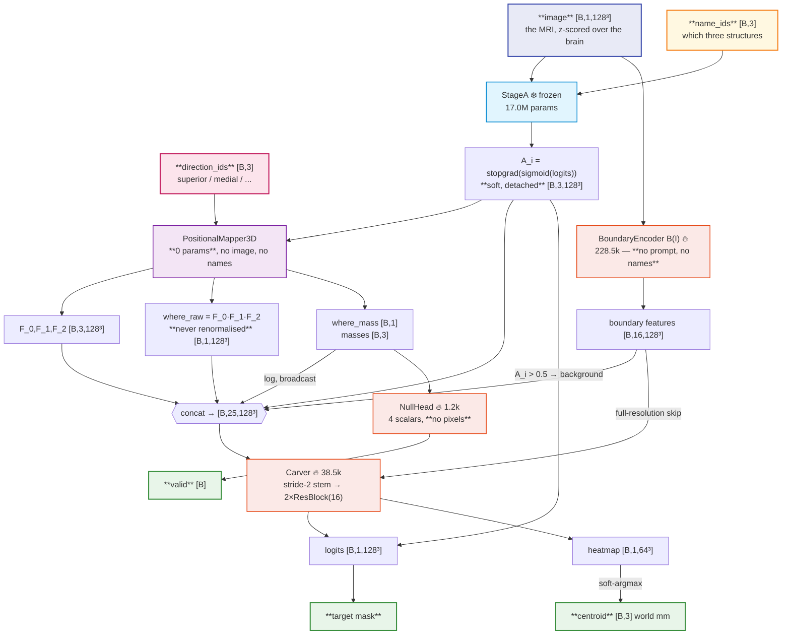

---
tags:
  - phase-b
---
}
### Relations
- [[MODEL PHASE A]] — `self.segmenter`, a **frozen submodule**; the only thing that ever sees a name
- [[PositionalMapper3D]] — `self.mapper`; no parameters, the only consumer of `direction_ids`
- [[BoundaryEncoder]] — `self.boundary`; the image, and nothing else
- [[Carver]] — `self.carver`; the mask and the heatmap
- [[NullHead]] — `self.null`; four scalars, no pixels
- [[BoundaryPretrainer]] — trains `B` beforehand, outside this forward

Segment a structure the prompt **never names** — it only locates it, by its relations to three structures that *are* named. The mask is **painted from the image**, not chosen from a list of proposals, so the output need not be a structure the segmenter already knows how to draw.

```
image   [B, 1, 128³]                z-scored over the brain
clauses [B, 3] × {direction, name}
        →  target logits [B, 1, 128³]
        →  null logit                one number: the clauses name nothing
        →  centroid [B, 3]           from a heatmap, not from the mask
```

**Names stop at Stage A.** They buy three soft masks and are then gone: there is no name embedding, no pair embedding and no slot embedding anywhere downstream. `direction_ids` are consumed by the mapper and by nothing else — the direction is already the *shape* of `F_i`, and a token would let the triple of anchor names stand in for the target.

---

### 00 / the flowchart



❄️ frozen · 🔥 trained · purple = no parameters at all

---

### 01 / how the data arrives

A batch is one row of a manifest plus the two volumes its scene owns. `ExampleDataset` hands over:

| key | shape | what it is | who reads it |
| --- | --- | --- | --- |
| `image` | `[B,1,128³]` | the MRI, normalised by `data.normalize` | the model |
| `anchors` | `[B,3]` | label ids of the three named structures | the **task**, for scoring |
| `name_ids` | `[B,3]` | `anchors − 1`, vocabulary indices | the model → Stage A |
| `direction_ids` | `[B,3]` | index into `DIRECTIONS` | the model → mapper |
| `labels` | `[B,128³]` | the label volume | **the task only**, never the model |
| `target` | `[B]` | the target's label id, or `0` for an empty prompt | the task |
| `valid`, `keep` | `[B]` | did the clauses name one structure / is this example scored at all | the task |
| `anchor_probability` | `[B,3,128³]` | *optional*: the precomputed Stage A masks | the model, in place of running Stage A |

The prompt is rendered text in the manifest, but **no language model is on the inference path** — `Vocabulary.clause_ids` compiles it to the two id tensors and that is the whole of it.

#### Slot `i` is one structure, everywhere

The anchor order is randomised once, when the manifest is written, and then used by *everything*: `anchors`, `directions`, the rendered clauses, `name_ids`, the mask channels, `F_i`. Storing a distance ranking instead made the slot index a perfect proxy for proximity — readable without parsing a single direction word. `roll_anchors` in `src/engine.py` exists so a counterfactual cannot move one without the others.

#### The flip, applied in the dataset

With probability `train.stage_b.flip_probability` (0.25) one clause is replaced by its opposite and the result is **re-scored against the corpus's own rule**, never assumed:

| the new clauses name… | measured | what the item carries |
| --- | --- | --- |
| exactly one structure | 1.2% | that target, `valid = 1`, `keep = 1` |
| none | 65.5% | `target = 0`, `valid = 0`, `keep = 1` |
| two or more | 33.2% | `keep = 0` — in no loss and no metric |

Training only. A validation curve mixing retargeted and empty prompts would move `best.pt` for reasons unrelated to the model, and an empty prediction against an empty target scores Dice 1.0.

---

### 02 / what may enter

**Three tensors reach `forward`.** Everything else is derived inside it.

| input | shape | read by |
| --- | --- | --- |
| the MRI | `[B,1,D,H,W]` | frozen Stage A, and `B(I)` |
| `name_ids` | `[B,3]` | **Stage A only** |
| `direction_ids` | `[B,3]` | **the mapper only** |

Two further keyword arguments exist and neither can identify the target:

- `anchors=` substitutes exactly the three detached soft masks Stage A would have produced — the precomputed cache, and the ground-truth diagnostic. Which source a run used is recorded in its checkpoint.
- `boundary_image=` is §7's image-replacement test: the volume `B` reads when it is not the one the anchors came from.

**Never:** the label volume, the target mask, the target's name, its centroid, its size, an occupancy map built from labels, any mask other than the three anchor probabilities, or a candidate list. `tests/test_models.py::test_stage_b_signature_admits_nothing_that_identifies_the_target` asserts the parameter set structurally, because the failure it guards against is somebody *adding* an argument.

The label volume is read **in the task**, to build a training target and to score. It is never an argument to the model.

---

### 03 / params

`StageB(segmenter, *, spacing, n_anchors=3, tau=0.5, min_mass=1e-6, boundary_widths=(16,32,32), carver_width=16, carver_blocks=2, full_resolution_skip=True, use_image=True, additive_prior=False, alpha=0.35, background_logit=-10.0, prior_foreground=0.0016)`

| param | source | shipped | note |
| --- | --- | --- | --- |
| `segmenter` | `StageA.config` | — | the **whole** Stage A config, so a checkpoint is self-contained |
| `spacing` | `corpus.spacing` | `(1.25,)*3` | `corpus.spacing`, **not** `data.spacing` |
| `tau` | `…mapper.tau` | `0.5` | world units; measured, not chosen |
| `min_mass` | `…mapper.min_mass` | `1e-6` | ” |
| `boundary_widths` | `…boundary_widths` | `[16,32,32]` | |
| `carver_width` / `_blocks` | `…carver.*` | `16` / `2` | |
| `full_resolution_skip` | `…carver.*` | `True` | an addition, `deviations.md` §4.1 |
| `use_image` | `…use_image` | `True` | `False` is §7's prompt-only ablation |
| `additive_prior`, `alpha` | `…` | `False`, `0.35` | §4's ablation; one scalar, no other input |
| `background_logit` | `…` | `-10.0` | finite on purpose |

| component      | params      | share of trainable  |
| -------------- | ----------- | ------------------- |
| `segmenter` ❄️ | 17,004,292  | — (frozen)          |
| `mapper`       | **0**       | —                   |
| `boundary` 🔥  | 228,528     | 85.2%               |
| `carver` 🔥    | 38,498      | 14.3%               |
| `null` 🔥      | 1,249       | 0.5%                |
| **trainable**  | **268,275** | of 17,272,567 total |

Every *architectural* parameter lives in `self.config`, because `load_model` rebuilds from the checkpoint dict and never from the YAML. `flip_probability` and the loss weights are training-schedule values and live in the checkpoint's `meta`, mirrored to a `.json` sidecar (`deviations.md` §3.6).

---

### 04 / `forward`, step by step

```python
def forward(self, image, direction_ids, name_ids, *, anchors=None, boundary_image=None) -> StageBOutput:
```

#### 1. Names → masks, then names are gone

```python
if anchors is None:
    anchors = self.anchor_probability(image, name_ids)   # @torch.no_grad on StageA
anchors = anchors.detach().float()
```

`A_i = stop_gradient(sigmoid(anchor_logits_i))` — the **probability**, not a threshold. A cut at 0.5 makes the centroid the mapper reads jump and can delete a dim but real anchor in one step. Stage A is queried for those three names only; no other mask is offered to the carver, and its feature pyramid is discarded.

#### 2. Geometry, with no parameters and no gradient

```python
with torch.no_grad():
    field = self.mapper(anchors, direction_ids, self.spacing, self.center)
```

The mapper has no parameters and its inputs are detached, so nothing here is on the graph. Saying so keeps three full-volume intermediates from being held for a backward that would never read them.

#### 3. Rescale the two quantities that span decades

```python
log_where = where.clamp_min(LOG_FLOOR).log() / -math.log(LOG_FLOOR)
log_mass  = (field.where_mass.clamp_min(LOG_FLOOR).log() / -math.log(LOG_FLOOR)).reshape(-1,1,1,1,1).expand_as(where)
```

Both map onto `[-1, 0]`. The other nine channels are probabilities in `[0,1]`, and a raw `where_mass` of 1e-3 is indistinguishable from zero after one convolution.

#### 4. The image, read blind

```python
source = image if boundary_image is None else boundary_image
boundary = self.boundary(source.to(torch.float32))
```

`B` knows nothing of steps 1–3.

#### 5. Concatenate and carve

```python
dtype = boundary.dtype if boundary is not None else torch.float32
logits, heatmap = self.carver(
    torch.cat(([boundary] if boundary is not None else []) + [p.to(dtype) for p in parts], dim=1),
    boundary,
)
```

Cast to the boundary features' dtype: under autocast they come back in low precision while the geometry is float32, and matching them is what keeps a 25-channel 128³ tensor off the float32 path.

#### 6. Anchors become background

```python
logits = logits.masked_fill(anchors.amax(dim=1, keepdim=True) > 0.5, self.background_logit)
```

From the **predicted** soft mask, never the label volume, and not dilated.

#### 7. Three answers

| field | shape | from |
| --- | --- | --- |
| `logits` | `[B,1,D,H,W]` | the carver's 1×1 |
| `valid` | `[B]` | [[NullHead]] |
| `centroid` | `[B,3]` | soft-argmax of the heatmap, world `(x,y,z)` |

plus `where_raw`, `where_mass`, `fields`, `anchors`, `masses`, `anchor_centroids` — carried rather than recomputed, because each is a pure function of inputs the caller no longer holds.

---

### 05 / the losses

§5's table, and its one structural consequence: **every term is per-sample**, because a dropped example must reach no loss *and* no metric. That is the `keep` weight, and `weighted_mean` carries it through all five.

| term | weight | applies to |
| --- | --- | --- |
| Dice + BCE on the mask | 1.0 / 1.0 | every kept example |
| null BCE | 0.2 | every kept example |
| heatmap vs the **structure's** centroid | 0.02 | kept **and** valid |
| heatmap vs the **field's** centre | 0.01 | kept and the field has mass |
| `L_far` | 0.2 | kept and valid |

Weights are in millimetres summed over three axes for the two offsets, so they are per-mm; at 0.1 the centroid term would be four times the Dice and the carver's trunk would be trained mostly to localise. Per-term losses are logged every epoch (`loss_*` in `metrics.jsonl`) because six terms on four scales cannot be balanced by reading the total.

`L_far` is the **only** spatial penalty on a valid prompt: the mean predicted probability outside `dilate(where_raw > 0.05)`. A coverage term on the whole exterior would fight a structure that legitimately extends past the pyramid — measured, only 36% of a target's voxels sit inside the field and 94% inside its dilation.

---

### Invariants

1. **Names stop at Stage A.** With the masks fixed, every output is bit-identical under an arbitrary renaming — `test_names_reach_stage_a_and_stop_there`.
2. **`direction_ids` reach the mapper and nothing else.**
3. **No coordinate grid** in `B` or the carver. World coordinates exist only inside the mapper.
4. **Stage A is frozen**: excluded from `trainable_parameters`, kept in `eval` by `.train()`, and receives no gradient.
5. **`where_raw` is never renormalised.**
6. **Slot `i` is clause `i`** everywhere; move them together or not at all.
7. **May claim:** "never supervised as a relational target." **May not:** "zero-shot on an unseen structure" — every held-out class still appears as an anchor, and Stage A sees all 23.

---

### Reading a result

A bare Dice is not interpretable here. Two numbers must travel with it — the population's **prompt-blind floor** and its **anchor-set shortcut ceiling** — and `scripts/evaluate.py` prints both beside it.

Measured on `data/mri`, 20 epochs, one seed:

| | supervised 8 | held-out 4 |
| --- | --- | --- |
| Dice | **0.7943** | 0.0052 |
| its floor | 0.3067 | 0.1097 |
| centroid error | 1.72 mm | 24.86 mm |
| **emitted an empty mask** | **0.0%** | **75.0%** |
| predicted / true voxels | 1597 / 1631 | 93 / 2219 |
| anchor Dice | 0.8127 | 0.8046 |
| gate (predicted centroids) | 0.8275 | 0.8571 |

| counterfactual | Dice | drop |
| --- | --- | --- |
| `permute_channels` | **0.0000** | 0.7943 |
| `permute_clauses` | **0.0000** | 0.7943 |
| `flip_direction` | 0.0631 | 0.7312 |
| `permute_both` *(control)* | 0.7934 | **0.0009** |

And the two mandatory §7 tests: swapping in another subject's MRI costs 40% of the Dice (0.7922 → 0.4747) while the centroid holds (1.72 → 5.47 mm); removing `B(I)` entirely costs 0.258.

So the model does the relational task and does it **from the image**. What it does not do is transfer to a class it was never supervised to draw — and the failure is *silence*, not error: the anchors and the field are as good there as anywhere, and the carver simply does not answer. `docs/proposal/results.md` has the arms that narrow the cause, including the two that went against the hypothesis.

> `permute_both` is a **weaker control than it looks**. `where_raw` is a product and therefore exactly permutation-invariant, so the only order dependence left anywhere is the carver's `cat`. A flat control no longer means what it meant under the attention architecture.

> `flip_direction` is **not comparable across corpora**. A single clause is worth much more where the conjunction is tight: two clauses already pin the target 32.1% of the time on `data/mri` but 58.3% on a 10-structure synthetic corpus, and the flip-drop tracks that (0.70 vs 0.27 of base) rather than tracking how well the model reads directions.
