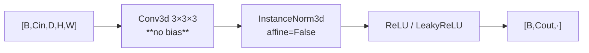

---
tags:
  - phase-a
  - phase-b
---

### Relations
none — basic block. Used by [[Encoder]], [[Decoder]], [[ResBlock]], [[BoundaryEncoder]], [[Carver]]

`Conv → InstanceNorm → activation`. The project's only convolutional unit; everything else composes it.



---

### Params (`__init__`)

`ConvBlock(in_channels, out_channels, act, stride=1)`

```python
class ConvBlock(nn.Sequential):
    def __init__(self, in_channels: int, out_channels: int, act: str, stride: int = 1) -> None:
        super().__init__(conv(in_channels, out_channels, stride=stride), *norm_act(out_channels, act))
```

with

```python
def conv(in_channels, out_channels, kernel=3, stride=1):
    return nn.Conv3d(in_channels, out_channels, kernel, stride, kernel // 2, bias=False)

def norm_act(channels, act):
    return nn.Sequential(nn.InstanceNorm3d(channels, affine=False), activation(act))
```

| choice | why |
| --- | --- |
| **no bias** on the conv | the normalisation immediately removes any constant, so a bias is a free parameter with no gradient signal |
| `padding = kernel // 2` | size-preserving at stride 1; at stride 2 it halves exactly |
| `InstanceNorm3d(affine=False)` | **no learnable scale or shift** — normalisation per sample per channel, which is what lets batch size vary without changing the function. Not BatchNorm: batches here are 4–16 volumes and the running statistics would be noise |
| `act` is a string | `"relu"` for Stage A (it sees an *image*), `"leaky_relu"` for Stage B |

Parameter count is exactly `Cin · Cout · 27` — no bias, no affine.

---

### Invariants

1. **No bias, ever.** Paired with a normalisation that would cancel it.
2. **`affine=False`.** A learnable scale here would duplicate the next conv's.
3. **Stride 2 only at the start of a stage**, never inside a [[ResBlock]] — the identity path could not follow.
