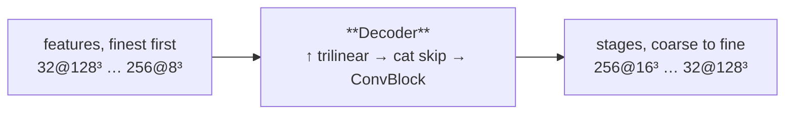

---
tags:
  - phase-a
---

### Relations
- [[ConvBlock]] — one `fuse` per scale
- consumes [[Encoder]]'s features; feeds Stage A's `MaskHead`s
- used by [[MODEL PHASE A]] only

Upsample, concatenate the skip, fuse. Once per scale, coarse to fine, returning **every** stage so deep supervision can score all of them.

> **Stage A only, and much smaller than it was.** Under the attention architecture this same class carried five switches for Stage B — world coordinates at every scale, a `refine` block, FiLM conditioning on the clause tokens, an occupancy guidance plane and an image guidance plane. All five are gone with that architecture: Stage B no longer has a decoder at all. Its image path is [[BoundaryEncoder]] and its output head is [[Carver]]. See [[MODEL PHASE B]].



---

### Params (`__init__`)

`Decoder(widths, act)`

| param | source | shipped | role |
| --- | --- | --- | --- |
| `widths` | `model.stage_a.encoder_channels` | `[32, 64, 128, 256, 256]` | the same list the encoder was built from |
| `act` | fixed | `"relu"` | matches Stage A's encoder |

```python
outputs = widths[-2::-1]   # [256, 128, 64, 32]  — coarse to fine
inputs  = widths[:0:-1]    # [256, 256, 128, 64] — what arrives from below
self.fuse = nn.ModuleList(ConvBlock(i + s, s, act) for i, s in zip(inputs, outputs))
```

| level | fuse | in → out | at |
| --- | --- | --- | --- |
| 0 | `ConvBlock(256+256 → 256)` | 512 → 256 | 16³ |
| 1 | `ConvBlock(256+128 → 128)` | 384 → 128 | 32³ |
| 2 | `ConvBlock(128+64 → 64)` | 192 → 64 | 64³ |
| 3 | `ConvBlock(64+32 → 32)` | 96 → 32 | 128³ |

One `ConvBlock` per level and nothing else — no residual block, no conditioning, no guidance plane.

---

### Source Code

```python
class Decoder(nn.Module):
    """Upsample and concatenate the skip, once per scale.

    Returns every stage's features, coarse to fine, so Stage A can supervise all
    of them.
    """

    def __init__(self, widths: Sequence[int], act: str) -> None:
        super().__init__()
        widths = list(widths)
        outputs = widths[-2::-1]   # coarse to fine: w_{D-1} ... w_0
        inputs = widths[:0:-1]     # w_D ... w_1
        self.fuse = nn.ModuleList(ConvBlock(i + s, s, act) for i, s in zip(inputs, outputs))

    def forward(self, features: Sequence[Tensor]) -> list[Tensor]:
        x, stages = features[-1], []
        for level, skip in enumerate(features[-2::-1]):
            x = F.interpolate(x, size=skip.shape[2:], mode="trilinear", align_corners=True)
            x = self.fuse[level](torch.cat([x, skip], dim=1))
            stages.append(x)
        return stages
```

---

### Forward

`list of 5 (finest first) → list of 4 (coarse to fine)`

| step | operation | shape |
| --- | --- | --- |
| start | `x = features[-1]` | `[B,256,8³]` |
| level 0 | ↑ to 16³, `cat` `features[3]`, fuse | `[B,256,16³]` |
| level 1 | ↑ to 32³, `cat` `features[2]`, fuse | `[B,128,32³]` |
| level 2 | ↑ to 64³, `cat` `features[1]`, fuse | `[B,64,64³]` |
| level 3 | ↑ to 128³, `cat` `features[0]`, fuse | `[B,32,128³]` |

Upsampling is **trilinear with `align_corners=True`**, sized from the skip rather than by a factor, so an odd resolution cannot silently drift.

Every stage is returned because Stage A supervises all of them: `MaskHead` is applied per scale and `deep_supervision` weights them coarse-to-fine (`[0.05, 0.1, 0.25, 0.6]`). Inference uses `stages[-1]` only.

---

### Invariants

1. **Coarse to fine, and every stage returned.** `deep_supervision_weights` pairs them positionally.
2. **The skip is concatenated, not added** — the encoder's unconditioned geometry stays available to the fuse.
3. **Sized from the skip**, never from a scale factor.
4. **No conditioning of any kind.** Stage A's decoder sees features and nothing else; the prompt enters through `MaskHead`'s dot product, not here.
