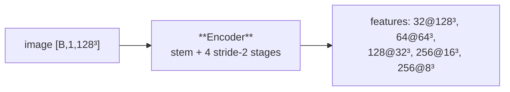

---
tags:
  - phase-a
---

### Relations
- [[ConvBlock]] — one per stage (`stages.L.0`)
- [[ResBlock]] — one per stage (`stages.L.1`)
- used by [[MODEL PHASE A]] only

Stem plus one stride-2 stage per further width, returning **every** scale finest-first so [[Decoder]] has skips and the prompt decoder has a bottleneck to attend over.

> **Stage A only now.** Under the attention architecture Stage B had its own `Encoder` over the anchor masks, with world-coordinate channels appended at every scale. That encoder is gone with it: Stage B reads the image through [[BoundaryEncoder]] and the anchors arrive as detached masks, so the `coords` switch and the three-channel stem no longer exist. See [[MODEL PHASE B]].



---

### Params (`__init__`)

`Encoder(in_channels, widths, act)`

| param | source | shipped | role |
| --- | --- | --- | --- |
| `in_channels` | fixed | `1` | the image |
| `widths` | `model.stage_a.encoder_channels` | `[32, 64, 128, 256, 256]` | one per scale; the stem is `widths[0]` |
| `act` | fixed | `"relu"` | Stage A sees an *image* |

```python
inputs = [in_channels] + widths[:-1]     # [1, 32, 64, 128, 256]
# stride 1 at level 0, stride 2 thereafter
```

| stage | block | shape out (128³ corpus) | stride |
| --- | --- | --- | --- |
| `stages.0` | `ConvBlock(1 → 32)` + `ResBlock(32)` | `[B,32,128³]` | 1 |
| `stages.1` | `ConvBlock(32 → 64, s2)` + `ResBlock(64)` | `[B,64,64³]` | 2 |
| `stages.2` | `ConvBlock(64 → 128, s2)` + `ResBlock(128)` | `[B,128,32³]` | 2 |
| `stages.3` | `ConvBlock(128 → 256, s2)` + `ResBlock(256)` | `[B,256,16³]` | 2 |
| `stages.4` | `ConvBlock(256 → 256, s2)` + `ResBlock(256)` | `[B,256,8³]` | 2 |

Five widths → four halvings → **8³ = 512 tokens** at the bottleneck, which is what makes the prompt decoder's global cross-attention affordable. `bottleneck_for(resolution, widths, expected)` derives it and raises with the value to write if it disagrees with `model.stage_a.bottleneck`; above `MAX_ATTENTION_TOKENS = 4096` it refuses outright.

At 64³ (the synthetic corpora) four widths `[32,64,128,256]` give the same 8³.

---

### Source Code

```python
class Encoder(nn.Module):
    """Stem plus one stride-2 stage per further width."""

    def __init__(self, in_channels: int, widths: Sequence[int], act: str) -> None:
        super().__init__()
        self.widths = list(widths)
        inputs = [in_channels] + self.widths[:-1]
        self.stages = nn.ModuleList(
            nn.Sequential(
                ConvBlock(channels, width, act, stride=1 if level == 0 else 2),
                ResBlock(width, act),
            )
            for level, (channels, width) in enumerate(zip(inputs, self.widths))
        )

    def forward(self, x: Tensor) -> list[Tensor]:
        """``[B, C, D, H, W]`` -> one feature map per scale, finest first."""
        features = []
        for stage in self.stages:
            x = stage(x)
            features.append(x)
        return features
```

---

### Forward

`[B, 1, D, H, W] → list of 5 tensors, finest first`

| index | shape | consumed by |
| --- | --- | --- |
| `features[0..3]` | 32@128³ … 256@16³ | [[Decoder]] skips |
| `features[-1]` | 256@8³ | the prompt decoder's keys/values, **and** the coarsest decoder input |

`features[-1]` carries the positional encoding added on top of it by [[PosEnc3D]] — the keys say *where*, the values carry unmodified visual content.

---

### Invariants

1. **Every scale is returned**, finest first. `Decoder` consumes `features[-2::-1]` and would silently mis-skip on any other order.
2. **No coordinate channels.** Removed with the Stage B encoder; nothing appends `(x,y,z)` here any more.
3. **`ResBlock` at every stage**, including the finest — unlike [[BoundaryEncoder]], which drops it at full resolution because a 16→16 3×3×3 convolution on a 128³ volume is the most expensive operation in Stage B. Stage A pays that cost once and is then frozen.

---

### Inside Stage B

Stage A — encoder included — is a **frozen submodule** of `StageB`. It runs under `torch.no_grad()`, its parameters are excluded from `trainable_parameters()`, and `StageB.train()` keeps it in `eval`. Its 17.0M parameters are 98.4% of the checkpoint and 0% of what is learned.

Because it is frozen and Stage B does not rotate, its output for a scene is a **constant**: `scripts/cache_anchors.py` precomputes it, which removes about a fifth of a training step and 7 GB of the peak.
