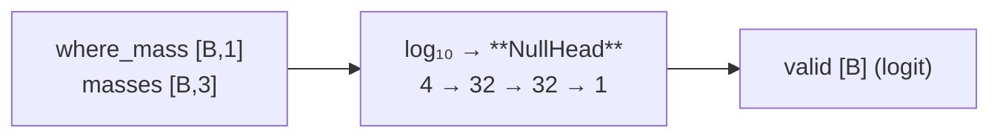

---
tags:
  - phase-b
---

### Relations
- `StageB.null`; reads four scalars from [[PositionalMapper3D]] and nothing else
- its output is `StageBOutput.valid`, one logit per example

Does the prompt name anything at all? A three-layer MLP over **four numbers**: the field's mass and the three anchor masses. It cannot see the MRI, so it cannot decide "empty" by looking at tissue — the feasible field's mass is the only reason an impossible prompt loses.



---

### Params (`__init__`)

`NullHead(n_anchors=3, hidden=32)`

| attribute | what | # params |
| --- | --- | --- |
| `mlp.0` | `Linear(4, 32)` | 160 |
| `mlp.2` | `Linear(32, 32)` | 1,056 |
| `mlp.4` | `Linear(32, 1)` | 33 |
| **total** | | **1,249** |

0.5% of Stage B's trainable weight. `mlp[0].in_features == 1 + n_anchors`, and `tests/test_models.py::test_the_null_head_reads_four_scalars_and_no_image` asserts both that and that the `forward` signature is exactly `{where_mass, masses}`.

---

### Source Code

```python
class NullHead(nn.Module):
    def __init__(self, n_anchors: int = 3, hidden: int = 32) -> None:
        super().__init__()
        self.mlp = nn.Sequential(
            nn.Linear(1 + n_anchors, hidden), nn.ReLU(inplace=True),
            nn.Linear(hidden, hidden), nn.ReLU(inplace=True),
            nn.Linear(hidden, 1),
        )

    def forward(self, where_mass: Tensor, masses: Tensor) -> Tensor:
        features = torch.cat([where_mass, masses], dim=-1).clamp_min(1e-24).log10()
        return self.mlp(features.float()).squeeze(-1)
```

#### Why `log10`

§3 writes `valid = MLP(where_mass, mass_0, mass_1, mass_2)`. Measured, `where_mass` spans **1e-21 to 2e-2** across the two populations the head has to separate. A linear layer cannot resolve nineteen decades — its first-layer weights would have to differ by that factor between the ends. `log10` of the clamped value is the same number in the same order, not extra information (`deviations.md` §2.1).

---

### Training and inference

| §5 column | null target |
| --- | --- |
| the clauses name one structure | `valid` |
| they name none | `invalid` |
| they name two or more | example dropped (`keep = 0`) |

Trained by BCE at weight `null_bce: 0.2`, per-sample and `keep`-weighted like every other term. The negatives come from the **direction flip**: measured, a flip names two or more structures 33.2% of the time, names none 65.5%, and retargets 1.2%.

At inference §3 says invalid empties the mask. Because the head's threshold matters, `scripts/evaluate.py` reports Dice both gated and ungated rather than absorbing the cost.

---

### Invariants

1. **Four scalars, no pixels.** The signature is the guarantee.
2. **No name, no direction, no image.**
3. **`where_mass` arrives un-renormalised** — that is what makes a meaningless spike stay small ([[PositionalMapper3D]]).

---

### Its ceiling is a property of its inputs — measured

This is the important number, and it is knowable *before* the head is trained. `scripts/gate_mapper.py` reports the AUC of `where_mass` alone separating "names one structure" from "names none":

| corpus | ceiling |
| --- | --- |
| `data/mri` | **0.848** |
| synthetic (easy / hard) | 0.923 / 0.919 |

The mapper cannot see which regions hold tissue, so a **roomy conjunction that happens to be empty looks exactly like a valid one**. That ceiling follows from the four inputs §3 allows, not from the MLP's width — widening it is not the fix, and a trained head at ~0.85 is working as well as its inputs permit.

Measured on `data/mri` at the end of training, the head reaches **0.626** on the empty-prompt population — below its own ceiling.

#### It is also not what produces the empty output

Of 382 prompts that name nothing, the model emits **any** mask only **5.5%** of the time. That behaviour comes from the **carver** and its empty-mask loss, not from this head. The null head is mandated by §3 and kept, but it is measurably close to redundant on `data/mri`: removing it would be a specification deviation, not a functional loss.
