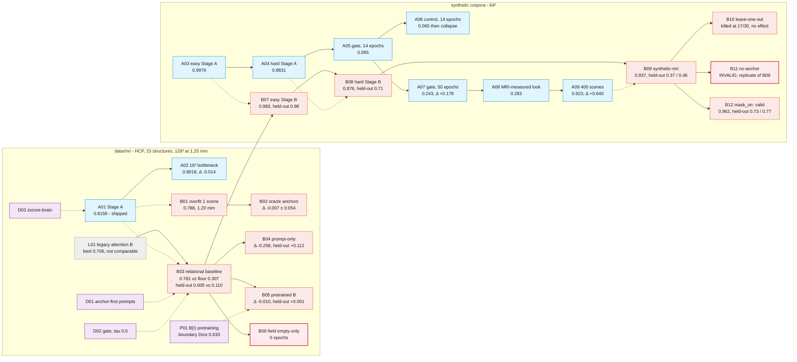

---
tags:
  - spatialvox
  - result-tracker
---
# Result tracker

Every experiment gets one note in `Result_tracker/Experiments/`. Its properties record what was run and what was assumed, and above all its **`parent`** (the experiment it is compared against) and its **`delta`** (the change in score against that parent, on the metric named in `delta_on`). **`benefit`** records whether the change helped. The method and architecture are documented in [[SpatialVox]], and the model is drawn in [[Flowchart]].

> [!warning] Needs attention (2026-09-23 00:10)
> - [[B12 mask-valid-seed1]] **finished** (30 epochs), with `mask_on: valid`. Held-out empty rate 0%, and held-out Dice 0.727 / 0.774 at `best.pt` against B09's 0.368 / 0.460 (+0.15 / +0.18 at matched epochs). One seed: still to do are `scripts/evaluate.py` on its `best.pt` (per-class Dice, image replacement, impossible-prompt leak with and without the null gate) and a second seed.
> - [[B10 arm-loo]] and [[B11 arm-noanchor]] were **killed at 17 of 30 epochs** on 2026-09-22, and their run folders were later deleted by another session's relaunch. Their notes still show epoch-10 snapshots. Leave-one-out showed no effect beyond the replicate noise. B11 was invalid (the flag never applied) and serves as B09's replicate. `carver_sees_anchors: False` has still never been run.
> - [[B06 field-empty-only-seed1]] **produced no epoch**. Still to run.

## All experiments

![[Result_tracker.base]]

The table has four views: *All experiments*, *Stage B*, *Stage A and pretraining*, *Needs attention*. Numbers are bare floats so the columns sort. An empty `delta` means **not comparable**, and `delta_on` says why.

## Lineage

A solid arrow means *parent → child* (the comparison). A dotted arrow means *uses* (the frozen Stage A, or a pretrained `B`, that a run is built on).

Keep this graph in step with the `parent` properties when you add a note. Obsidian's graph view draws the same edges from the `parent` and `stage_a` links.

## How to read a row

| property | meaning |
|---|---|
| `parent` | the run this one is compared against, which is normally the same config minus one change. Empty for a root |
| `change` | the **one** thing that differs from the parent. If several things changed, say so, because the Δ is then confounded |
| `assumption` | the hypothesis, written *before* the run, as a prediction that can fail |
| `score` | the value of `metric` at the epoch the note states. Stage B: val Dice on `targets.train` (the selection curve) |
| `floor` | the prompt-blind Dice of that population (Stage B only). **Read `score` against `floor`, never against 0** |
| `heldout_val`, `heldout_test` | Dice on `val:targets.val` and `val:targets.test`. **Both are val-split subjects**; the test split is untouched |
| `delta` | `child − parent` on the `delta_on` metric. Given **only** when both share the corpus *and* the population, compared at **matched epochs** (or best vs best when both ran their full schedule) |
| `benefit` | `yes` / `no` / `mixed` / `not yet` (inside the noise) / `n/a` / `invalid` (the change did not apply) |
| `status` | `done` / `running` / `stopped` / `killed` / `failed` / `invalid` / `adopted` / `superseded` |

**A Dice is not a result by itself.** Before calling a Δ a benefit, check it against the four counterfactuals, the prompt-only and image-replacement tests, and the replicate noise below ([[SpatialVox#16.6 Before a Dice is quoted]]).

## Floors and ceilings

The prompt-blind floor is "take the non-anchor structure nearest the anchors' centroid". The ceiling is how often the anchor identities alone recover the target. Both come from `scripts/corpus_report.py --split val --scenes 600`. On the synthetic corpora structures never overlap, so the floor there is the accuracy of the nearest-centroid rule. A single-class population has a 100% ceiling and tells you nothing.

| corpus | `targets.train` floor / ceiling | `targets.val` | `targets.test` |
|---|---|---|---|
| `data/mri` | 0.3067 / 67.8% | 0.1097 / 83.9% | 0.0630 / 99.2% |
| `data/synthetic-mri` | 0.1383 / 30.6% | 0.2467 / 68.3% | 0.1617 / 66.1% |
| `data/synthetic-hard` | 0.2133 / 29.9% | 0.1500 / 71.5% | 0.2729 / 100% |
| `data/synthetic` | 0.2500 / 29.8% | 0.2167 / 72.5% | 0.1847 / 100% |

## Noise

Nothing sets `cudnn.deterministic`, so the same config and seed do not reproduce a curve. **Every run here is single-seed.**

| estimate | supervised | held-out val | held-out test |
|---|---|---|---|
| `synthetic-mri` replicate ([[B11 arm-noanchor]] vs [[B09 mri-stage-b]], epochs 0–10): mean \|Δ\| per epoch | 0.022 | 0.091 | 0.065 |
| the same, max \|Δ\| | 0.134 | 0.223 | 0.200 |
| within one run: mean \|Δ\| between consecutive epochs ([[B09 mri-stage-b]]) | — | 0.144 | — |
| earlier MRI runs (non-determinism alone) | ~0.01 typical, ~0.03 worst | — | — |

These are **lower bounds** on seed spread. A held-out Δ smaller than about 0.1 at a single epoch is not evidence on `synthetic-mri`.

## Adding an experiment

1. Copy [[Experiment template]] into `Experiments/` as `<ID> <run-name>.md`. The ID prefix is the kind: `A` Stage A, `B` Stage B, `P` pretraining, `D` diagnostic or decision, `L` legacy. Zero-pad: `B12`.
2. Set `parent` to the run it should be compared against, and write down the single `change` and the `assumption` **before** launching.
3. Launch with `True`/`False` for booleans, then open `runs/<name>/best.json` and confirm that the changed key reads what you intended (in `model` for architecture, in `meta.config.stage` for the schedule).
4. When it ends, fill in `score`, `floor`, `heldout_*`, `delta` (only if comparable) and `delta_on`, and set `benefit` against the noise table. Then write the verdict.
5. Add the node and its edge to the lineage graph above.
