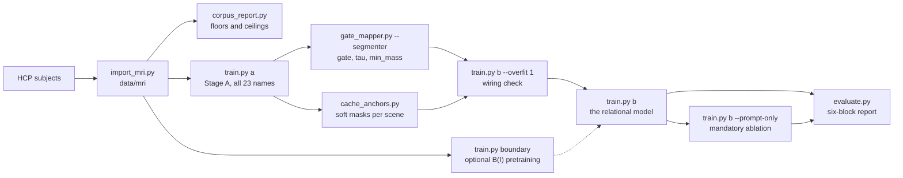
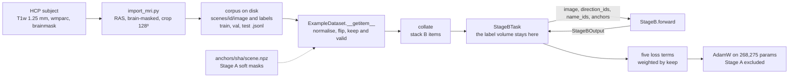

---
tags:
  - spatialvox
  - documentation
aliases:
  - SpatialVox documentation
---
# SpatialVox — strategy, method and architecture

The one document for this project: what the model is for, why it is built this way, and what happens to the data at each step from an HCP scan to a reported number. It describes the code at commit `f11b02f` (branch `dev-SpatialVox-V1`, 2026-09-22). Companion notes sit beside it: [[Flowchart]] (the model on one page, with an editable `Flowchart.drawio`), [[Result_tracker]] (every experiment, its parent and what it changed), and `Model Info/`, one note per module ([[MODEL PHASE A]], [[MODEL PHASE B]], and a note for each block below). `CLAUDE.md` at the repository root is the short list of constraints; this note explains them.

> [!summary] 0. Overview
> SpatialVox segments a brain structure that the prompt never names. The prompt is three clauses, each a direction and a named anchor, for example *"superior to the Left-Thalamus, medial to the Right-Putamen, and anterior to the Brain-Stem"*, and only their conjunction picks out one structure. A frozen promptable segmenter (**Stage A**) turns the three anchor names into three soft masks, and the names go no further than that. A parameter-free mapper turns those masks and the three direction words into three 45° pyramid fields and their product, `where_raw`. A boundary encoder `B(I)` reads the MRI without seeing the prompt. A small **carver** combines `B(I)` with the geometry to produce the target mask and a centroid, and a null head that reads four scalars says whether the clauses name anything. The mask is painted from the image rather than picked from Stage A's proposals, so in principle the target does not have to be a structure Stage A can draw. That is the lesion claim, and the evaluation machinery (prompt-blind floors, counterfactuals, image replacement, the prompt-only carver) exists to test whether the model lives up to it. On the MRI-like synthetic corpus the baseline, [[B0 mask-valid-seed1]] (commit `d14f201`), reaches 0.962 on trained classes. It also reaches **0.724 / 0.775 on target classes never supervised as targets**, against floors of 0.247 / 0.162, with one seed. What unlocked it was `mask_on: valid`: the mask is no longer trained to be empty, and the null head alone decides "names nothing". On real MRI the only reference is still the older `mask_on: all` model: 0.794 on supervised classes, and 0.005 held out against a 0.110 floor.

**Contents**
[[#1. The task]]
[[#2. Strategy]]
[[#3. Repository map]] 
[[#4. End-to-end data flow]]
[[#5. Step 1 — Data arrives from HCP to a corpus]]
[[#6. Step 2 — Prompts, anchor-first generation]]
[[#7. Step 3 — From a manifest row to a batch]]
[[#8. Step 4 — Stage A, the frozen segmenter]]
[[#9. Step 5 — PositionalMapper3D, the WHERE]]
[[#10. Step 6 — Null head]]
[[#11. Step 7 — Boundary encoder B(I), the WHAT]]
[[#12. Step 8 — Carver]]
[[#13. Step 9 — StageB.forward end to end]]
[[#14. Step 10 — Losses]]
[[#15. Step 11 — Backward, optimiser and the training loop]]
[[#16. Step 12 — Evaluation and reporting rules]]
[[#17. Master tensor shape table]]
[[#18. Parameter table]]
[[#19. Invariants and the tests that pin them]]
[[#20. Deviations from the original proposal]]
[[#21. Configuration reference]]
[[#22. Where the evidence stands]]
[[#23. Conventions]]

---

## 1. The task

### 1.1 Input and output

```text
image   [B, 1, 128, 128, 128]     MRI, z-scored over the brain
clauses [B, 3] × {direction, name}
        →  target logits [B, 1, 128, 128, 128]
        →  null logit    [B]          one number: "the clauses name nothing"
        →  centroid      [B, 3]       world millimetres, from a heatmap, not from the mask
```

```text
segment the structure that is superior to the Left-Thalamus,
medial to the Right-Putamen, and anterior to the Brain-Stem.
```

- **Directions** come from a closed set of six: `anterior, posterior, superior, inferior, medial, lateral`. A clause always describes the **target relative to the anchor**.
- Each prompt has **three clauses**. The anchors are pairwise distinct, and so are the directions, since two clauses naming the same side would not narrow the conjunction.
- **No single clause identifies anything.** Only the conjunction of all three picks out one structure, and the corpus is built so that it always picks out exactly one (§6).
- The **target is never an input**, in any form: not its name, mask, centroid, size, or any occupancy derived from labels.

### 1.2 The claim, and what may not be claimed

> [!important] The lesion claim
> The mask is **painted from the MRI**, not chosen from a list of proposals. `B(I)` is trained without class ids, so a structure Stage A has never been given a mask for is still a boundary in the image. The output therefore need not be a structure Stage A already knows how to draw. A lesion lying between known anchors is the case this is meant for.

That claim is **not what the current corpus tests**. On `data/mri`:

- Stage B is supervised only on `targets.train` (8 classes: L/R thalamus, pallidum, amygdala, accumbens). `targets.val` (L/R caudate and putamen) and `targets.test` (L/R hippocampus) are scored every epoch and **never used to choose a checkpoint**.
- Every class, the held-out ones included, still appears as an **anchor** during training, so Stage A's name embedding for it is trained.
- Stage A sees all 23 classes in every split, on purpose: the target-class split restricts what Stage B may be *supervised on*, not what anatomy exists.

So the correct description is **"never supervised as a relational target"**, never "zero-shot on unseen structures". The 8/4/2 split tests *relational transfer*. Nothing on this corpus tests the lesion claim. The carver is what the lesion claim rests on, and the two mandatory tests of §16 are what can support it.

**What the carver can resolve, even in principle.** A structure that contrasts with its surroundings and lies inside the conjunction of three known anchors: yes. Two nuclei that share an intensity: no. The carver must not paper over that case with a memorised training shape. "Centroid right, Dice wrong" is exactly that failure, and it is not a reason to bolt on a proposal list.

---

## 2. Strategy

### 2.1 Seven decisions, each with the shortcut it closes

| # | decision | what it rules out | why | enforced by |
|---|---|---|---|---|
| 1 | **Names stop at Stage A.** They buy three soft masks and nothing else. | any name, pair or slot embedding downstream | a token would let the anchor-name triple stand in for the target | `test_names_reach_stage_a_and_stop_there` |
| 2 | **The WHERE is fixed geometry.** `classify`, the rule that wrote the prompts, is recast as a soft 45° pyramid. It has no parameters and sees neither the image nor any name. | a learned field, learned gains, a direction token in the carver | a learned field could slide itself onto a blob | `test_the_mapper_has_no_parameters` |
| 3 | **The WHAT is read blind.** `B(I)` takes the image as its only input. Stage A's feature pyramid never leaves Stage A. | prompt-conditioned image features, Stage A features | Stage A's features were trained to light up *named* structures, the opposite of what an unseen structure needs | `test_the_boundary_encoder_sees_the_image_and_nothing_else` |
| 4 | **Carve, don't select.** The mask is painted by a small convolutional carver. | candidate lists, selection heads, refine-inside-a-band | a selector can only return a structure Stage A has already drawn | `test_stage_b_signature_admits_nothing_that_identifies_the_target` |
| 5 | **The corpus is unreadable without the prompt.** Prompts are generated anchor-first, the conjunction must be unique, clause order is shuffled, and flipped clauses are re-scored. | reading the target off the anchor identities or the slot order | target-first generation let the anchor set alone recover the target 98.9% of the time, more often than solving the conjunction did (94.5%) | `test_anchor_first_*`, `test_a_manifest_anchor_order_is_not_sorted_by_distance` |
| 6 | **Constants are measured, not chosen.** `tau` and `min_mass` were set from sweeps on the corpus. | the proposal's starting values | at the proposal's `tau = 2 mm` only 65% of target centroids clear the gate; `min_mass = 1e-3` rejects almost every anchor | `test_the_shipped_constants_are_the_measured_ones` |
| 7 | **A Dice is never reported alone.** Every Dice travels with its population's prompt-blind floor and shortcut ceiling, the four counterfactuals, the two mandatory tests, the gate, and the number of seeds. | reading a high Dice as evidence | "take the nearest non-anchor structure" already scores 0.307 on the supervised population without reading a word of the prompt | `scripts/evaluate.py`, §16 |

### 2.2 What this is not

**Not an entity selector.** An alternative design (the "blueprint") learns `K` anonymous entity queries with Hungarian matching, selects one with the prompt, and then refines only inside `dilate(selected) ∩ dilate(fields)`. A structure that was never proposed has no route to the output, so a lesion cannot be drawn. Both designs could appear in one paper, but they cannot be one network. From the blueprint this project keeps only its **gates and reports**:
1. `best.pt` is chosen on held-out *subjects* with *trained* classes.
2. A direction flip is re-scored, never assumed empty.
3. The report is broken into parts, never a single Dice.
4. A geometry-only selector remains an optional ablation. It would have to beat the carver on switch rate and on the held-out targets before replacing it.

The blueprint's language is also a different one. It uses `left/right` unit vectors where this project uses *medial/lateral as distances to the mid-sagittal plane*, it has six independent predicates where this project has one dominant axis per clause, and it allows repeated anchors. It also registers scans to canonical template coordinates, and on fixed anatomy a template centroid is close to a class name. None of it is carried over: no anonymous queries, no geometry MLP scoring candidates, no learned residual on the field, no selector softmax or null class, no dense pairwise relation loss, and no SSL, surface or SDF heads.

**Not the attention Stage B it replaced.** The previous Stage B had `RelationPrompt`, `StructureEncoder`, `Evidence`, `Intersection`, a FiLM decoder, `SelectionHead`, world-coordinate grids and an `occupancy_mode`. That last one fed the decoder the target's own outline. All of it was deleted (it is recoverable from git), together with target-first prompt generation. Its runs are summarised, as not comparable, in `L01 legacy attention Stage B` (archived).

**Not a query head through Stage A.** A `QueryHead` sketch that pooled the relational evidence into one query token and pushed it back through Stage A's attention and `MaskHead` was dropped for the same reason as the selector: whatever comes out of `MaskHead` is a structure Stage A already knows how to draw.

### 2.3 The order things are built and trained



```bash
# 1. the corpus, and the floor every Dice will be read against
.venv/bin/python scripts/import_mri.py
.venv/bin/python scripts/corpus_report.py --split val --scenes 600
# 2. Stage A, then frozen; the gate is a precondition, not a diagnostic
.venv/bin/python scripts/train.py a
.venv/bin/python scripts/gate_mapper.py --segmenter runs/phase-a/current/best.pt
.venv/bin/python scripts/cache_anchors.py --segmenter runs/phase-a/current/best.pt
# 3. the relational model
.venv/bin/python scripts/train.py b --overfit 1 --set train.stage_b.epochs=120   # wiring test
.venv/bin/python scripts/train.py boundary                                       # optional: pretrain B(I)
.venv/bin/python scripts/train.py b --out runs/<name>
.venv/bin/python scripts/train.py b --prompt-only --out runs/<name>-prompt-only
# 4. the report
.venv/bin/python scripts/evaluate.py runs/<name>/best.pt --split val --classes train
.venv/bin/python scripts/evaluate.py runs/<name>/best.pt --split val --classes val
```

---

## 3. Repository map

| path | role |
|---|---|
| `configs/config.yaml` | **the MRI configuration.** Every tunable: `data`, `targets`, `mri` (import), `model`, `train`, `logging`, `evaluation` |
| `configs/synthetic.yaml` | the easy synthetic corpus `data/synthetic` (10 primitives, 7/2/1 target split) |
| `configs/synthetic-hard.yaml` | despite its name, it now points at **`data/synthetic-mri`**: 16 classes in 12 families, MRI-measured appearance. The name is historical |
| `src/config.py` | loads YAML into a dotted `Config` and applies `--set a.b.c=value` overrides |
| `src/geometry.py` | centroids, `classify` (the direction rule), `solutions_for`, `anchor_first_examples` |
| `src/vocab.py` | `Vocabulary`: name ↔ label id, `render`/`parse` of prompts, `clause_ids` |
| `src/mri.py` | HCP/FreeSurfer volumes → RAS `(z, y, x)` 128³ cube |
| `src/synthetic.py` | 16 primitives, scene packing, appearance painting |
| `src/data.py` | NIfTI I/O, normalisation, corpus writing, `AnchorCache`, `Corpus`, `SceneDataset`, `ExampleDataset`, `collate`, `loader` |
| `src/mapper.py` | `PositionalMapper3D`, the WHERE |
| `src/models.py` | shared blocks, `StageA`, `BoundaryEncoder`, `BoundaryPretrainer`, `NullHead`, `Carver`, `soft_argmax`, `StageB` |
| `src/engine.py` | losses, `Metrics`, the three tasks, optimiser and schedule, `Trainer`, checkpoint I/O |
| `scripts/import_mri.py` | builds `data/mri` from HCP |
| `scripts/generate_data.py` | builds a synthetic corpus. `--report` prints its threshold IoU and stops |
| `scripts/rebuild_manifests.py` | rewrites the manifests from existing label volumes after a prompt knob changes (seconds, no NIfTI rewritten) |
| `scripts/corpus_report.py` | shortcut ceilings and prompt-blind floors per population. No checkpoint, no GPU |
| `scripts/gate_mapper.py` | the gate, the `tau` sweep, `min_mass`, the null-head ceiling, Stage A's centroid errors |
| `scripts/cache_anchors.py` | precomputes Stage A's soft masks, once per scene |
| `scripts/train.py` | `a` \| `boundary` \| `b`, with `--prompt-only`, `--overfit N`, `--segmenter`, `--out`, `--config`, `--set` |
| `scripts/evaluate.py` | the six-block report of a Stage B checkpoint |
| `tests/` | the contract (§19): what must hold for a number to mean what it says |
| `vizualization/` | `inspect_stage_b.py` (`A_i`, the fields, the feature maps), `single_forward.ipynb`. They write self-contained HTML files into `vizualization/out/` |
| `documentation/` | this Obsidian vault: this note, [[Flowchart]] (and `Flowchart.drawio`), [[Result_tracker]], and `Model Info/` (one note per module) |
| `runs/`, `data/` | symlinks to `SpatialVox-MRI/runs` and to the shared corpus directory. Both are untracked |

---

## 4. End-to-end data flow

The model's forward, with Stage A drawn open inside it. An editable diagrams.net version is `Flowchart.drawio`:

![[Flowchart]]

What moves between disk, dataset, task and model during one training step:



The single rule running through the whole pipeline: **the label volume goes to the task and never to the model.** The task uses it to build the training target and to score. `StageB.forward` accepts the image, the two id tensors, and two optional arguments, neither of which can identify the target (§13).

---

## 5. Step 1 — Data arrives from HCP to a corpus

### 5.1 One subject → one scene, `prepare_volume`

**Purpose.** Turn one HCP subject's T1 and FreeSurfer labels into a `(z, y, x)` RAS cube at native spacing, masked to the brain. Nothing is interpolated except the labels, which are resampled nearest-neighbour onto the T1 grid.

```python
def prepare_volume(
    image_path: PathLike,
    labels_path: PathLike,
    *,
    resolution: int,
    brainmask_path: PathLike | None = None,
    apply_brainmask: bool = True,
) -> tuple[np.ndarray, np.ndarray, tuple[float, float, float]]:
    """T1 + labels on disk -> RAS ``(z, y, x)`` cube and ``(x, y, z)`` spacing."""
    t1 = _canonical(Path(image_path))
    labels_img = _resample_to(_canonical(Path(labels_path)), t1, order=0)
    image = np.asanyarray(t1.dataobj).astype(np.float32, copy=False)
    labels = np.rint(np.asanyarray(labels_img.dataobj)).astype(np.int32, copy=False)
    if image.shape != labels.shape:
        raise ValueError(f"image {image.shape} and labels {labels.shape} differ after resampling")

    if apply_brainmask and brainmask_path is not None:
        mask_img = _resample_to(_canonical(Path(brainmask_path)), t1, order=0)
        brain = np.asanyarray(mask_img.dataobj) > 0
        if brain.shape == image.shape:
            image = image.copy()
            labels = labels.copy()
            image[~brain] = 0.0
            labels[~brain] = 0

    image = crop_or_pad(image, resolution)
    labels = crop_or_pad(labels, resolution)
    spacing = tuple(float(v) for v in t1.header.get_zooms()[:3])
    return (
        np.ascontiguousarray(image.transpose(2, 1, 0)),
        np.ascontiguousarray(labels.transpose(2, 1, 0)),
        spacing,
    )
```

| step | operation | shape (HCP) |
|---|---|---|
| read | `T1w_acpc_dc_restore_1.25.nii.gz`, stored LAS | `(x, y, z) = (145, 174, 145)` at 1.25 mm |
| reorient | `nib.as_closest_canonical` → RAS | `(145, 174, 145)` |
| labels | `wmparc.nii.gz` (finer grid) resampled nearest-neighbour onto the T1 | `(145, 174, 145)` int32 |
| brain mask | `brainmask_fs.nii.gz`: image and labels set to 0 outside the brain | same |
| crop | `crop_or_pad` to 128 per axis, **centred**, native voxels, no zoom | `(128, 128, 128)` |
| transpose | `(x, y, z)` → `(z, y, x)` | `(128, 128, 128)` |

The crop is centred so the mid-sagittal plane stays at the volume centre, which the medial/lateral rule depends on. At 1.25 mm a 128³ cube is 160 mm on a side. The brain reaches the A–P and S–I faces of the crop but not the left–right faces, so cortical poles are trimmed while the 23 subcortical structures stay well inside. In a prepared scene about 60% of voxels are exact zero (outside the brain), and the 23 structures together cover about 2.6% of the volume.

`scripts/import_mri.py` also accepts an already-collapsed layout (`t1.nii.gz` + `mask.nii.gz` with dense ids) and can `--download` subjects from `s3://hcp-openaccess/HCP_1200`. A subject is kept only if at least one relational example can be built from it (`subject_has_examples`).

### 5.2 Labels → the vocabulary

`remap_source_labels` keeps only the ids listed in `mri.structures` and maps each to **vocabulary index + 1**. Everything else (cortex, white matter, CSF outside the ventricles) becomes background 0. `name_ids` inside the model are vocabulary indices, `label − 1`.

| label id | structure | Stage B role on `data/mri` |
|---|---|---|
| 1, 14 | Left/Right-Lateral-Ventricle | landmark: anchor only |
| 2, 15 | Left/Right-Inf-Lat-Vent | landmark: anchor only |
| 3, 16 | Left/Right-Thalamus | `targets.train` |
| 4, 17 | Left/Right-Caudate | `targets.val` (held out as target) |
| 5, 18 | Left/Right-Putamen | `targets.val` (held out as target) |
| 6, 19 | Left/Right-Pallidum | `targets.train` |
| 7, 8 | 3rd-Ventricle, 4th-Ventricle | landmark |
| 9 | Brain-Stem | landmark |
| 10, 20 | Left/Right-Hippocampus | `targets.test` (held out further) |
| 11, 21 | Left/Right-Amygdala | `targets.train` |
| 12, 22 | Left/Right-Accumbens | `targets.train` |
| 13, 23 | Left/Right-VentralDC | landmark |

All 23 may be anchors in every split.

### 5.3 Subjects → splits

`split_subjects` shuffles with `mri.split_seed = 20260919` and cuts at `{train: 0.8, val: 0.1, test: 0.1}`, giving **160 / 20 / 20 subjects**. The splits are by *subject*. The target-class split is a separate axis (§6.4).

### 5.4 The corpus on disk

```text
data/mri/
  meta.json        shape [128,128,128], spacing [1.25,1.25,1.25], n_anchors 3,
                   selection "anchor-first", shuffle_clauses, targets {train,val,test}, examples
  vocab.json       the 23 names in label order
  scenes/<subject>/image.nii.gz    float32 intensity, RAS
  scenes/<subject>/labels.nii.gz   uint16, vocabulary index + 1, 0 = background
  train.jsonl val.jsonl test.jsonl one relational example per line
  anchors/<sha256[:12]>/           Stage A's cached soft masks (§7.5)
```

A manifest row:

```json
{"scene": "134627", "id": "134627__Left-Putamen__0", "target": 5, "anchors": [20, 21, 9],
 "directions": ["medial", "lateral", "anterior"],
 "prompt": "segment the structure that is medial to the Right-Hippocampus, lateral to the Right-Amygdala, and anterior to the Brain-Stem."}
```

`data/mri` has **14,965 / 1,983 / 1,886** examples (train/val/test) over 160/20/20 scenes, which is about 90 prompts per scene. Its rows also carry `confidence`, `impossible` and `status` keys, written by an earlier version of the generator. Nothing reads them. Masks are **never stored**: every mask is `labels == id`, built on the accelerator (`masks_from`), so a stored mask cannot drift out of step with its label volume.

### 5.5 Synthetic corpora

`scripts/generate_data.py` writes corpora with the same layout from `src/synthetic.py`. Each scene packs **one instance of every primitive** by rejection sampling: draw a size and a centre, voxelise, and retry if the shape is empty, out of bounds or overlapping another. Intensities are painted afterwards. The point of the synthetic corpora is to control what the MRI cannot. There is no anatomy prior to exploit, anchors are near-oracle, and the **appearance is a knob**.

The appearance matters because §4 of the method has a limit built in: an unseen structure is segmented only where `B(I)` carries a boundary. The one number that says what a corpus can test is its **threshold IoU**: the best IoU any single global intensity threshold achieves against `labels > 0`. The real MRI scores **0.0796**. If a corpus scores near 1, `B(I)` gets every boundary for free, and transfer to an unsupervised class becomes perfect and meaningless.

| corpus | classes (train/val/test targets) | scenes (train/val/test) | threshold IoU | notes |
|---|---|---|---|---|
| `data/synthetic` | 10 (7 / 2 / 1) | 400 / 50 / 50 | ≈ 0.994 (easy) | a threshold separates everything |
| `data/synthetic-hard` | 10 (7 / 2 / 1) | 400 / 50 / 50 | 0.2704 | `size: 1.8`, texture, bias field. Held-out `cuboid`/`ellipsoid` are geometric twins of supervised `cube`/`sphere` (IoU 1.0 at canonical parameters) |
| `data/synthetic-control` | 16 (10 / 3 / 3) | 60 / 20 / 10 | 0.5784 | control appearance for the Stage A gate |
| `data/synthetic-gate` | 16 (10 / 3 / 3) | 60 / 20 / 10 | 0.2065 | small gate corpus. Rewritten at 15:26 on 2026-09-22 with the MRI-measured appearance; its first 60/20 scenes are identical to `synthetic-mri`'s |
| `data/synthetic-mri` | 16 (10 / 3 / 3) | 400 / 50 / 50 | 0.2065 | **current synthetic corpus.** 12 geometric families, and no family is split across the supervision boundary |
| `data/mri` | 23 (8 / 4 / 2) | 160 / 20 / 20 | 0.0796 | real HCP |

The `synthetic-mri` split, by family: supervised `box{cube, cuboid}`, `ellipsoid{sphere, ellipsoid}`, `tube{cylinder, capsule}`, `tapered{cone, pyramid}`, `simplex{tetrahedron}`, `torus{torus}`. Held out as `targets.val`: `hollow_cylinder, cross, banana`. Held out as `targets.test`: `crescent, hourglass, triangular_prism`. The largest IoU from any held-out class to any supervised one is 0.56. `torus` stays supervised on purpose: it is the only trained class with a hole, so `hollow_cylinder` is reachable and the held-out set has a difficulty gradient.

The MRI-measured appearance (`configs/synthetic-hard.yaml`, `synthetic.appearance`) quotes every amplitude as a multiple of the grey–white gap `separation = 0.28`. Tissue fractions CSF/grey/white are 0.112/0.496/0.392. Texture sd is 0.39 × separation, over octaves tuned to the MRI's autocorrelation (0.76 / 0.57 / 0.36 / 0.21 at 1 / 2 / 4 / 8 voxels). Structures draw from a wide shared band `[0.10, 0.85]`, so a structure is as likely to be darker than its surroundings as brighter, and `class_spread: shared` removes class information from brightness altogether. There is also a head envelope with air outside and a bias field of 0.30. A corpus can fail by being **unreadable** as easily as by being trivial. An earlier setting reached threshold IoU 0.066 by raising the noise, and Stage A then stalled at Dice 0.27. So `tests/test_synthetic.py` also checks local contrast (`test_the_hard_appearance_keeps_the_structures_visible`).

---

## 6. Step 2 — Prompts, anchor-first generation

### 6.1 `classify`, the direction rule

**Purpose.** Given two world centroids, return the single word that describes the target relative to the anchor. The corpus is written with this rule, the flip is re-scored with it, and the mapper (§9) is this rule turned into a soft field.

```python
def classify(target: np.ndarray, anchor: np.ndarray, center: np.ndarray) -> str:
    """The direction token for ``target`` relative to ``anchor``.

    All three points are world ``(x, y, z)``; ``center`` fixes the mid-sagittal
    plane the medial/lateral comparison is made against.
    """
    delta = np.asarray(target, float) - np.asarray(anchor, float)
    magnitude = np.abs(delta)
    largest = float(magnitude.max())
    if largest <= ATOL:
        raise AmbiguousDirection("centroids coincide; no direction is defined")
    # Tie priority z > y > x: the first of those axes within tolerance wins.
    axis = next(a for a in (2, 1, 0) if magnitude[a] >= largest - ATOL)
    if axis == 2:
        return "superior" if delta[2] > 0 else "inferior"
    if axis == 1:
        return "anterior" if delta[1] > 0 else "posterior"
    target_offset = abs(float(target[0] - center[0]))
    anchor_offset = abs(float(anchor[0] - center[0]))
    if abs(target_offset - anchor_offset) <= ATOL:
        raise AmbiguousDirection("target and anchor are equidistant from the mid-sagittal plane")
    return "lateral" if target_offset > anchor_offset else "medial"
```

1. `delta = centroid(target) − centroid(anchor)` in world `(x, y, z)`.
2. The main axis is `argmax(|dx|, |dy|, |dz|)`, with ties broken `z > y > x`.
3. `z` gives superior/inferior. `y` gives anterior/posterior.
4. `x` is **not** left/right. The structure farther from the mid-sagittal plane is `lateral` and the nearer one is `medial`.
5. A direction is never invented. Coincident centroids and exact medial/lateral ties raise `AmbiguousDirection`, and the pair is dropped.

`solutions_for(anchors, directions, centroids, present, center)` is the conjunction read literally: every present non-anchor structure that satisfies all three clauses. A prompt is **well posed exactly when it returns one label**. `direction_matrix` caches `classify` for every ordered pair in a scene, turning about 360k calls into about 500.

### 6.2 `anchor_first_examples` — fix the landmarks, then ask what they determine

```python
def anchor_first_examples(
    centroids: np.ndarray,
    present: Sequence[int],
    center: np.ndarray,
    n_anchors: int,
    *,
    triples: int,
    locality: int,
    rng: np.random.Generator,
    shuffle: bool = True,
) -> list[tuple[list[int], list[str], int]]:
    # (docstring omitted)
    labels = [int(l) for l in present]
    if len(labels) <= n_anchors:
        return []
    codes, index = direction_matrix(centroids, labels, center)
    positions = np.array([centroids[l] for l in labels], dtype=float)

    out: list[tuple[list[int], list[str], int]] = []
    seen: set[tuple[int, ...]] = set()
    for _ in range(int(triples)):
        seed = int(rng.integers(len(labels)))
        order = np.argsort(np.linalg.norm(positions - positions[seed], axis=1))
        window = order[: max(int(locality), n_anchors)]
        if len(window) < n_anchors:
            continue
        columns = np.sort(rng.choice(window, n_anchors, replace=False))
        key = tuple(int(c) for c in columns)
        if key in seen:
            continue
        seen.add(key)
        # [K, n_anchors]: how every structure sits relative to this triple.
        relative = codes[:, columns]
        for row in range(len(labels)):
            if row in columns:
                continue
            wanted = relative[row]
            if (wanted < 0).any() or len(set(wanted.tolist())) != n_anchors:
                continue  # undecidable pair, or two clauses naming the same side
            matches = (relative == wanted).all(axis=1)
            matches[columns] = False
            if int(matches.sum()) != 1:
                continue  # the sentence does not pick out exactly one structure
            clauses = [
                (labels[int(c)], DIRECTIONS[int(d)]) for c, d in zip(columns, wanted)
            ]
            if shuffle:
                rng.shuffle(clauses)
            out.append(
                ([a for a, _ in clauses], [d for _, d in clauses], labels[row])
            )
    return out
```

| step | what happens | knob (MRI) |
|---|---|---|
| draw a seed structure | uniform over the structures present | — |
| window | the `locality` structures nearest the seed, so that clauses name landmarks a reader would actually name together | `data.locality: 8` |
| triple | 3 distinct structures from the window, deduplicated per scene | `data.triples: 60` |
| every other structure | its three direction codes relative to the triple | — |
| keep only if | all three pairs are decidable, the three directions are pairwise distinct, and **exactly one** structure has that code triple | — |
| shuffle | the clause order is randomised, and that one order is then shared by clauses, anchors, directions and mask channels | `data.shuffle_clauses: true` |

`build_examples` wraps this per scene. Its RNG is seeded by `crc32(scene_id)`, so a manifest can be rebuilt from the scene alone. Because one triple serves several targets, **only the direction words tell those targets apart**, and every prompt names exactly one structure *by construction* (100% of manifest prompts, measured).

### 6.3 Rendering, parsing, and the only text compiler

`Vocabulary.render(clauses)` produces `"segment the structure that is d1 to the a1, d2 to the a2, and d3 to the a3."`. `parse(render(c)) == c` holds for every valid clause list, and the parser is built from the closed vocabularies, so an unknown name, a synonym or a target name cannot appear in a prompt. `Vocabulary.clause_ids` is the **one place language becomes integers**: `(direction_ids, name_ids)`. No language model sits on the inference path.

### 6.4 The target-class split

`targets.train` is what Stage B is supervised on, and it is also the class set of the checkpoint-selection curve. `targets.val` and `targets.test` are scored every epoch and never selected on. `Corpus.records(split)` filters a manifest to `meta.targets[split]`, which is what "supervised on eight classes" means in code.

| corpus | `targets.train` | `targets.val` | `targets.test` |
|---|---|---|---|
| `data/mri` | L/R Thalamus, Pallidum, Amygdala, Accumbens (8) | L/R Caudate, Putamen (4) | L/R Hippocampus (2) |
| `data/synthetic-mri` | cube, cuboid, sphere, ellipsoid, cylinder, capsule, cone, pyramid, tetrahedron, torus (10) | hollow_cylinder, cross, banana (3) | crescent, hourglass, triangular_prism (3) |

### 6.5 Why anchor-first — the measured leak

The generator this replaced was **target-first**: it chose the anchors *nearest the target*. On fixed anatomy the three nearest neighbours of a structure are the same in every subject, so the unordered anchor set alone recovered the target **98.9%** of the time, while solving the conjunction was right only **94.5%** of the time. Ignoring the prompt strictly beat reading it, and its prompt-blind floor was 0.775–1.000. No pool width fixes that, because the selection rule itself was the leak. Anchor-first brought the anchor-set ceiling down to **42.3%** and the floor to **0.2017** over all classes (`D01 anchor-first prompt generation` (archived)).

Two further leaks were closed along the way:
- **Slot order.** Storing the distance ranking made the slot index a perfect proxy for proximity, readable without parsing a single direction word. `shuffle_clauses: false` was worth about 0.11 Dice, and it must never be used for a real run.
- **Filtering inflates the ceiling.** Conditioning on fewer classes makes the anchor identities more informative, so each population is read against **its own** ceiling (§16.3).

---

## 7. Step 3 — From a manifest row to a batch

### 7.1 Normalisation

`data.normalize: zscore-brain` computes mean and standard deviation over the non-zero voxels only. With `mri.apply_brainmask` about 66.5% of an HCP volume is exact zero, and plain `zscore` over the whole volume put brain tissue at mean +1.348 with sd 0.523, an offset that drifted per subject (spread 0.097) with head size. `zscore-brain` puts tissue at mean 0 and sd 1 for every subject (`D03 zscore over the brain` (archived)). Treating `!= 0` as "inside the brain" is valid only because the corpus was written with `apply_brainmask: true`. The synthetic corpora use `normalize: none`, since their images are already bounded to [0, 1].

### 7.2 `ExampleDataset.__getitem__`

**Purpose.** Turn one manifest row into one Stage B item: the image, the ids the model will see, and the label volume plus flags the *task* will need. The direction flip is also applied here.

```python
    def __getitem__(self, index: int) -> dict[str, Any]:
        record = self.records[index]
        image, labels = self._cache.get(record["scene"])
        keep = 1
        if self.flip_probability > 0:
            rng = np.random.default_rng([int(self.epoch), index])
            if float(rng.random()) < self.flip_probability:
                record, keep = self.flip(record, labels, rng)
        # Label 0 is the background and is never a structure, so `target = 0`
        # *is* "the clauses name nothing" - including for a population of empty
        # prompts written straight into `records` (`scripts/evaluate.py`).
        valid = int(record["target"] != 0)
        vocab = self.corpus.vocab
        item = {}
        if self._anchors is not None:
            # Exactly the three detached probabilities Stage A would have
            # produced. Nothing else about the cache reaches the model.
            item["anchor_probability"] = torch.from_numpy(
                self._anchors.take(record["scene"], record["anchors"])
            )
        return {
            **item,
            "image": torch.from_numpy(np.ascontiguousarray(image)).unsqueeze(0),
            "labels": torch.from_numpy(np.ascontiguousarray(labels)),
            "target": torch.tensor(record["target"], dtype=torch.long),
            "anchors": torch.tensor(record["anchors"], dtype=torch.long),
            "direction_ids": torch.tensor(
                [DIRECTIONS.index(d) for d in record["directions"]], dtype=torch.long
            ),
            "valid": torch.tensor(valid, dtype=torch.long),
            "keep": torch.tensor(keep, dtype=torch.long),
            "example_id": record["id"],
            "scene": record["scene"],
            "prompt": record["prompt"],
            "target_name": vocab.name(record["target"]) if valid else self.NONE,
            "anchor_names": [vocab.name(label) for label in record["anchors"]],
            "directions": list(record["directions"]),
        }
```

**Outputs** (one item; `collate` adds the batch axis):

| key | item shape | dtype | meaning | read by |
|---|---|---|---|---|
| `image` | `[1, 128, 128, 128]` | float32 | normalised MRI | the model (Stage A and `B`) |
| `labels` | `[128, 128, 128]` | int16 | the label volume | **the task only** |
| `target` | `[]` | int64 | the target's label id, or 0 for "names nothing" | the task |
| `anchors` | `[3]` | int64 | the anchors' label ids, in slot order | the task. `name_ids = anchors − 1` go to the model |
| `direction_ids` | `[3]` | int64 | indices into `DIRECTIONS`, in slot order | the model → mapper |
| `valid` | `[]` | int64 | 1 if the clauses name exactly one structure | the task (null target) |
| `keep` | `[]` | int64 | 0 = dropped from every loss and every metric | the task, `Metrics` |
| `anchor_probability` | `[3, 128, 128, 128]` | float16 | *optional*: cached Stage A soft masks | the model, in place of running Stage A |
| `example_id`, `scene`, `prompt`, `target_name`, `anchor_names`, `directions` | — | str / list | metadata for strata and reports | the task, reports |

Scenes are decoded once per worker and kept (`_SceneCache`). Anchor-first emits about 90 prompts per scene, so one decoded volume serves many items.

> [!note] Slot `i` is one structure, everywhere
> Slot `i` is the structure clause `i` names. The same order indexes `anchors`, `directions`, the rendered prompt's clauses, `name_ids`, the mask channels, `F_i` and the cached masks. **Never reorder one without the others.** `roll_anchors` (in `src/engine.py`) moves ids, names and cached masks together, so a counterfactual cannot break that correspondence by accident.

### 7.3 The direction flip, re-scored

The only augmentation Stage B has. With probability `train.stage_b.flip_probability = 0.25` one clause is replaced by its opposite, and the new clauses are **re-scored with the corpus's own rule**, using this scene's geometry:

```python
    def flip(self, record, labels, rng) -> tuple[dict[str, Any], int]:
        directions = list(record["directions"])
        slot = int(rng.integers(len(directions)))
        directions[slot] = OPPOSITE[directions[slot]]
        if len(set(directions)) != len(directions):
            return record, 0  # two clauses naming one side is not a prompt
        vocab, spacing = self.corpus.vocab, self.corpus.spacing
        present = [int(v) for v in np.unique(labels) if v != 0]
        centroids = centroids_world(labels, len(vocab), spacing)
        center = volume_center_world(labels.shape, spacing)
        solutions = solutions_for(record["anchors"], directions, centroids, present, center)
        if len(solutions) > 1:
            return record, 0
        clauses = [
            {"direction": d, "anchor": vocab.name(a)}
            for a, d in zip(record["anchors"], directions)
        ]
        return {
            **record,
            "directions": directions,
            "target": int(solutions[0]) if solutions else 0,
            "prompt": vocab.render(clauses),
        }, 1
```

| the new clauses name… | measured on `data/mri` | what the item carries |
|---|---|---|
| exactly one structure | 1.2% | that target, `valid = 1`, `keep = 1` |
| none | 65.5% | `target = 0`, `valid = 0`, `keep = 1`: an **empty-mask** example |
| two or more (or duplicate directions) | 33.2% | `keep = 0`: excluded from every loss term and every metric |

At `p = 0.25` about 8% of training items are therefore dropped and 16% carry an empty mask. A flip is **never assumed to be empty**. The RNG is seeded by `(epoch, index)`, so a flip can be reproduced from the epoch and the index alone. Flipping is **training-only**: a validation curve that mixed retargeted and empty prompts would move `best.pt` for reasons that have nothing to do with the model, and an empty prediction against an empty target scores Dice 1.0. `scripts/evaluate.py` builds the empty-prompt population separately (§16.2).

### 7.4 The anchor cache

Stage A is frozen and Stage B does not rotate, so `sigmoid(anchor_logits)` for a scene is a **constant**. `scripts/cache_anchors.py` writes it once per scene:

- the key is the **SHA-256 of the Stage A checkpoint** (`anchor_cache_dir`), so a different Stage A writes a different directory and a stale cache cannot be picked up silently;
- storage is the per-structure bounding box of `p > 1e-3` in **float16**: 3.3 MB per scene, **0.7 GB** for 200 subjects against 19 GB dense. The truncated tail changes an anchor mass by less than 0.01% and a centroid by less than a hundredth of a voxel;
- it is computed in **float32**. Under bf16 autocast, changing the batch size alone moves a probability by up to 0.04 and flips about 40 voxels per batch across the 0.5 threshold the anchor exclusion uses. The cache stores the exact value rather than one sample of that noise;
- the gain is about a fifth of a training step and 7 GB of peak memory. `scripts/train.py b` uses the cache automatically when `anchors/<sha>/meta.json` exists for the checkpoint in use.

```python
    def take(self, scene_id: str, labels: Sequence[int]) -> np.ndarray:
        """``[K, D, H, W]`` float16 soft masks for those label ids, in order."""
        bbox, data, offset = self._scene(scene_id)
        out = np.zeros((len(labels), *self.shape), dtype=np.float16)
        for slot, label in enumerate(labels):
            channel = int(label) - 1  # label id == vocabulary index + 1
            z0, y0, x0, z1, y1, x1 = (int(v) for v in bbox[channel])
            if z1 <= z0:
                continue
            crop = data[offset[channel]:offset[channel + 1]]
            out[slot, z0:z1, y0:y1, x0:x1] = crop.reshape(z1 - z0, y1 - y0, x1 - x0)
        return out
```

`take` expands only the three structures a prompt names, in **slot order**, and returns `[3, 128, 128, 128]` float16. Inside the model these masks are cast to float32 and detached like any other anchor source (§13).

### 7.5 Collation, loaders and validation sets

`collate` stacks tensors along a new batch axis and keeps strings as per-sample lists. `loader` returns a `DataLoader` with persistent workers and, for shuffled loaders, a generator seeded with `train.seed`. `scripts/train.py b` builds:

| loader | split / classes | size | flip | used for |
|---|---|---|---|---|
| train | train split, `targets.train` | all (5,855 prompts on MRI) | `p = 0.25` | the loss |
| `val` | val split, `targets.train` | fixed random 600 (`train.val_examples`) | off | **checkpoint selection** |
| `val:targets.val` | val split, `targets.val` | 600 | off | transfer curve, never selected on |
| `val:targets.test` | val split, `targets.test` | 600 | off | further held-out curve, never selected on |
| probes | val split, `targets.train` | 200 (`train.probe_examples`) | off | per-epoch counterfactual drops |

The validation subsets are random with a **fixed seed**, not a prefix, because slicing a manifest by order would validate on its first few subjects only. The two held-out curves are named after the split they are drawn from: **both use val-split subjects**. The test split is not touched until `scripts/evaluate.py --split test`. `--overfit N` restricts train and val to the first `N` training scenes and turns the flip off.

### 7.7 Stage A's own dataset

`SceneDataset` returns one scene per item, with **every name** in the vocabulary (`prompts_per_item: null`) and its label volume. The masks `labels == id` are built on the accelerator. Stage A augments with **one of the 24 axis-aligned octahedral rotations** per item (`augment: true`). Stage B has no rotation at all, and that asymmetry is what makes Stage A's output cacheable.

---

## 8. Step 4 — Stage A, the frozen segmenter

> Module notes: [[MODEL PHASE A]] · [[Encoder]] · [[Decoder]] · [[NamePrompt]] · [[PosEnc3D]] · [[ConvBlock]] · [[ResBlock]]

**Role.** A promptable segmenter: one intensity volume and a set of structure names in, **one mask per name** out. It is trained beforehand on every name that may be an anchor (all 23), then frozen inside Stage B, where it is asked for three names only. Nothing in Stage B trains it.

### 8.1 The shared blocks

```python
def conv(in_channels: int, out_channels: int, kernel: int = 3, stride: int = 1) -> nn.Conv3d:
    """The project's standard convolution: no bias, padding preserves the size."""
    return nn.Conv3d(in_channels, out_channels, kernel, stride, kernel // 2, bias=False)


def norm_act(channels: int, act: str) -> nn.Sequential:
    return nn.Sequential(nn.InstanceNorm3d(channels, affine=False), activation(act))


class ConvBlock(nn.Sequential):
    """``Conv -> InstanceNorm -> activation``."""

    def __init__(self, in_channels: int, out_channels: int, act: str, stride: int = 1) -> None:
        super().__init__(conv(in_channels, out_channels, stride=stride), *norm_act(out_channels, act))


class ResBlock(nn.Module):
    """Two convolutions plus an identity shortcut; size and width are unchanged."""

    def __init__(self, channels: int, act: str) -> None:
        super().__init__()
        self.body = nn.Sequential(
            ConvBlock(channels, channels, act),
            conv(channels, channels),
            nn.InstanceNorm3d(channels, affine=False),
        )
        self.act = activation(act)

    def forward(self, x: Tensor) -> Tensor:
        return self.act(self.body(x) + x)
```

| block | shape | params | notes |
|---|---|---|---|
| `ConvBlock(Cin, Cout, stride)` | `[B,Cin,D,H,W] → [B,Cout,D/s,H/s,W/s]` | `Cin·Cout·27` | 3×3×3, **no bias** (the norm would cancel it). `InstanceNorm3d(affine=False)`, not BatchNorm: batches are 4–16 volumes, too few for running statistics |
| `ResBlock(C)` | `[B,C,·] → [B,C,·]` | `2·C²·27` | identity shortcut, the activation comes **after** the sum. Stride 1 only |

The activation is `ReLU` in Stage A, which sees an image, and `LeakyReLU(0.01)` in Stage B.

### 8.2 Encoder

```python
class Encoder(nn.Module):
    """Stem plus one stride-2 stage per further width."""

    def __init__(self, in_channels: int, widths: Sequence[int], act: str) -> None:
        super().__init__()
        self.widths = list(widths)
        inputs = [in_channels] + self.widths[:-1]
        self.stages = nn.ModuleList(
            nn.Sequential(
                ConvBlock(channels, width, act, stride=1 if level == 0 else 2),
                ResBlock(width, act),
            )
            for level, (channels, width) in enumerate(zip(inputs, self.widths))
        )

    def forward(self, x: Tensor) -> list[Tensor]:
        """``[B, C, D, H, W]`` -> one feature map per scale, finest first."""
        features = []
        for stage in self.stages:
            x = stage(x)
            features.append(x)
        return features
```

| stage | block | output (MRI, `encoder_channels = [32,64,128,256,256]`) | params |
|---|---|---|---|
| 0 | `ConvBlock(1→32)` + `ResBlock(32)` | `[B,32,128³]` | 56,160 |
| 1 | `ConvBlock(32→64, s2)` + `ResBlock(64)` | `[B,64,64³]` | 276,480 |
| 2 | `ConvBlock(64→128, s2)` + `ResBlock(128)` | `[B,128,32³]` | 1,105,920 |
| 3 | `ConvBlock(128→256, s2)` + `ResBlock(256)` | `[B,256,16³]` | 4,423,680 |
| 4 | `ConvBlock(256→256, s2)` + `ResBlock(256)` | `[B,256,8³]`, the bottleneck | 5,308,416 |

`bottleneck_for(resolution, widths, expected)` derives the bottleneck: five widths mean four halvings, so 128 → **8³ = 512 attention tokens**. It raises if the result disagrees with `model.stage_a.bottleneck`, and refuses outright above `MAX_ATTENTION_TOKENS = 4096`. The 64³ synthetic corpora use four widths `[32,64,128,256]` and reach the same 8³.

### 8.3 NamePrompt and PosEnc3D

```python
class NamePrompt(nn.Module):
    def __init__(self, vocab_size: int, dim: int) -> None:
        super().__init__()
        self.table = nn.Embedding(vocab_size, dim)
        self.projection = nn.Linear(dim, dim)
        nn.init.trunc_normal_(self.table.weight, std=0.02)

    def forward(self, name_ids: Tensor) -> Tensor:
        return self.projection(self.table(name_ids))
```

```python
class PosEnc3D(nn.Module):
    def __init__(self, grid: Sequence[int], channels: int) -> None:
        super().__init__()
        depth, height, width = (int(v) for v in grid)
        self.grid, self.channels = (depth, height, width), int(channels)
        self.pos_z = nn.Parameter(torch.zeros(1, depth, 1, 1, channels))
        self.pos_y = nn.Parameter(torch.zeros(1, 1, height, 1, channels))
        self.pos_x = nn.Parameter(torch.zeros(1, 1, 1, width, channels))
        for parameter in (self.pos_z, self.pos_y, self.pos_x):
            nn.init.trunc_normal_(parameter, std=0.02)

    def forward(self, grid: Sequence[int] | None = None) -> Tensor:
        if grid is not None and tuple(int(v) for v in grid) != self.grid:
            raise ValueError(f"positional encoding is built for {self.grid}, got {tuple(grid)}")
        return (self.pos_z + self.pos_y + self.pos_x).reshape(1, -1, self.channels)
```

- `NamePrompt`: `name_ids [B,P]` → `[B,P,256]`. `Embedding(23, 256)` plus a square `Linear`, 71,680 parameters. This is **the only name embedding in the project**, and it sits on the far side of the freeze. `P = 23` while Stage A trains and `P = 3` when Stage B queries it.
- `PosEnc3D`: a learned positional encoding factorised over the axes, `(8+8+8)·256 = 6,144` parameters where a dense table would need 131,072. It returns `[1,512,256]` flattened in `(z, y, x)` order, the same order as `features.flatten(2)`. The grid is fixed at construction, and a mismatch raises instead of interpolating.

### 8.4 `StageA.forward` and `MaskHead`

```python
    def forward(self, image: Tensor, name_ids: Tensor, deep_supervision: bool = True) -> StageAOutput:
        """``[B, 1, D, H, W]`` and ``[B, P]`` names -> ``[B, P, D, H, W]`` logits."""
        features = self.encoder(image)
        values = features[-1].flatten(2).transpose(1, 2)
        keys = values + self.pos(features[-1].shape[2:])
        queries = self.prompt(name_ids)
        attended, _ = self.attention(queries, keys, values, need_weights=False)
        queries = self.norm(attended + queries)

        stages = self.decoder(features)
        logits = self.heads[-1](queries, stages[-1])
        scales = (
            [head(queries, stage) for head, stage in zip(self.heads[:-1], stages[:-1])] + [logits]
            if deep_supervision
            else [logits]
        )
        return StageAOutput(logits=logits, scales=scales)
```

```python
class MaskHead(nn.Module):
    def __init__(self, dim: int, visual_channels: int, prior_foreground: float) -> None:
        super().__init__()
        self.visual_channels = visual_channels
        self.project = nn.Sequential(
            nn.Linear(dim, visual_channels),
            nn.ReLU(inplace=True),
            nn.Linear(visual_channels, visual_channels),
        )
        self.bias = nn.Linear(visual_channels, 1)
        nn.init.zeros_(self.bias.weight)
        nn.init.constant_(self.bias.bias, prior_bias(prior_foreground))

    def forward(self, queries: Tensor, visual: Tensor) -> Tensor:
        projected = F.layer_norm(self.project(queries), (self.visual_channels,))
        logits = torch.bmm(projected, visual.flatten(2)) / math.sqrt(self.visual_channels)
        return (logits + self.bias(projected)).reshape(visual.shape[0], -1, *visual.shape[2:])
```

| step | operation | shape (Stage B's use, `P = 3`) |
|---|---|---|
| 1 | `features = encoder(image)` | 5 maps, finest first, `[B,256,8³]` last |
| 2 | `values = features[-1].flatten(2).transpose(1, 2)` | `[B,512,256]`, unmodified visual content |
| 3 | `keys = values + pos` | `[B,512,256]`. **Only the keys carry position** |
| 4 | `queries = prompt(name_ids)` | `[B,3,256]`. Names carry no position |
| 5 | `attended = MHA(queries, keys, values)`, 4 heads | `[B,3,256]` |
| 6 | `queries = LayerNorm(attended + queries)` | `[B,3,256]` |
| 7 | `stages = decoder(features)` | `[B,256,16³] … [B,32,128³]` |
| 8 | `logits = heads[-1](queries, stages[-1])` | `[B,3,128³]` |

The attention is ordinary cross-attention: $\mathrm{softmax}\!\big(QK^\top/\sqrt{d_h}\big)V$ per head, with $d_h = 64$. **The query says *what*, the keys say *where*, the values carry *what is there*.** In `MaskHead`, each aligned query is projected to the width of a decoder stage and dotted with every voxel embedding: $\ell_{p}(v) = \langle \mathrm{LN}(\phi(q_p)), e(v)\rangle/\sqrt{C} + b(q_p)$. The bias starts at $\log\frac{p}{1-p}$ with $p = 0.0016$ (−6.44), so an untrained head outputs the base rate rather than 0.5. One structure covers well under 1% of a volume.

> [!important] One name's mask does not depend on which other names were asked for
> Visual features are only *read*, never modulated by the prompt set, and queries never interact: attention runs query-to-bottleneck, and LayerNorm and `MaskHead` act per query. So Stage A can be trained on all 23 names and then queried for just the three a prompt names, and it gives the same answer. Pinned by `test_stage_a_masks_do_not_depend_on_which_other_names_were_asked_for`.

### 8.5 Decoder

```python
class Decoder(nn.Module):
    def __init__(self, widths: Sequence[int], act: str) -> None:
        super().__init__()
        widths = list(widths)
        outputs = widths[-2::-1]  # coarse to fine: w_{D-1} ... w_0
        inputs = widths[:0:-1]  # w_D ... w_1
        self.fuse = nn.ModuleList(ConvBlock(i + s, s, act) for i, s in zip(inputs, outputs))

    def forward(self, features: Sequence[Tensor]) -> list[Tensor]:
        x, stages = features[-1], []
        for level, skip in enumerate(features[-2::-1]):
            x = F.interpolate(x, size=skip.shape[2:], mode="trilinear", align_corners=True)
            x = self.fuse[level](torch.cat([x, skip], dim=1))
            stages.append(x)
        return stages
```

| level | fuse | output | params | its `MaskHead` (params) |
|---|---|---|---|---|
| 0 | `ConvBlock(256+256 → 256)` | `[B,256,16³]` | 3,538,944 | 131,841 |
| 1 | `ConvBlock(256+128 → 128)` | `[B,128,32³]` | 1,327,104 | 49,537 |
| 2 | `ConvBlock(128+64 → 64)` | `[B,64,64³]` | 331,776 | 20,673 |
| 3 | `ConvBlock(64+32 → 32)` | `[B,32,128³]` | 82,944 | 9,313 |

Upsampling is trilinear, sized from the skip rather than by a factor. Every stage is returned because Stage A is **deep-supervised** at all four scales. Inference uses `stages[-1]` only.

### 8.6 Training Stage A

`StageATask`: `model(image, prompt_ids, deep_supervision=training)`, with target `masks_from(labels, prompt_ids + 1)` and loss $\sum_s w_s\,(\mathrm{Dice}+\mathrm{BCE})(\ell_s, \mathrm{maxpool}(y))$, where `w = [0.05, 0.1, 0.25, 0.6]` runs coarse to fine. Targets are downsampled by **max-pooling**: at a quarter resolution a small nucleus is about one voxel thick, and nearest or average pooling can delete it. The schedule is 50 epochs, AdamW `lr 1e-3`, weight decay `1e-5`, 2 warm-up epochs then cosine, batch 4 on MRI, one random rotation per item.

| run | corpus | val Dice (all classes) | tracker |
|---|---|---|---|
| `runs/phase-a/current` (**shipped**) | `data/mri`, 23 classes, 8³ bottleneck | **0.8158** | [[A01 phase-a-current]] |
| `runs/phase-a/new-model` | `data/mri`, 4 widths, 16³ bottleneck | 0.8018 | `A02 phase-a-new-model` (archived) |
| `runs/synthetic-stage-a` | easy synthetic | 0.9976 | [[A03 synthetic-stage-a]] |
| `runs/hard-stage-a` | `synthetic-hard` | 0.8831 | `A04 hard-stage-a` (archived) |
| `runs/mri-stage-a` | `synthetic-mri`, 16 classes | 0.9233 | [[A09 mri-stage-a]] |

### 8.7 Frozen inside Stage B

```python
        self.segmenter = StageA(**segmenter)
        self.segmenter.requires_grad_(False).eval()

    def train(self, mode: bool = True) -> "StageB":
        super().train(mode)
        self.segmenter.eval()  # frozen; never a training-mode submodule
        return self

    def trainable_parameters(self):
        """Every parameter except the frozen segmenter's - what the optimiser gets."""
        frozen = {id(p) for p in self.segmenter.parameters()}
        return [p for p in self.parameters() if id(p) not in frozen]

    def anchor_probability(self, image: Tensor, name_ids: Tensor) -> Tensor:
        return self.segmenter.probability(image, name_ids).detach()
```

```python
    @torch.no_grad()
    def probability(self, image: Tensor, name_ids: Tensor) -> Tensor:
        return torch.sigmoid(self(image, name_ids, deep_supervision=False).logits.float())
```

Three mechanisms keep it frozen: no gradient (`requires_grad_(False)`, `@torch.no_grad`, `.detach()`), no training mode (`StageB.train` puts it back into `eval`), and no optimiser (`trainable_parameters` excludes it). Its 17,004,292 parameters are 98.4% of a Stage B checkpoint and 0% of what is learned. Relaxing the freeze takes an explicit, recorded decision, never a config flag. Stage A is a submodule so that a Stage B checkpoint is self-contained: `StageB.config["segmenter"]` holds Stage A's full config, and `load_segmenter` refuses weights whose config differs.

**What crosses the boundary** is $A_i = \mathrm{stop\_gradient}(\sigma(\ell_i))$: the **probability**, not a threshold. A cut at 0.5 would make the centroid the mapper reads jump, and could delete a dim but real anchor in one step. Stage A's feature pyramid is discarded. No other mask is offered to the carver.

**How good the anchors are.** The mapper consumes the anchor **centroid**, not the mask, so anchor Dice is the wrong summary: a uniformly under-segmented structure can still have an exact centroid. `scripts/gate_mapper.py --segmenter` measures the right thing:

| corpus | anchor Dice | centroid error: median / p95 / worst |
|---|---|---|
| `data/mri` | 0.813 | **0.84 mm** / 2.13 mm / 8.14 mm (the voxel is 1.25 mm) |
| easy synthetic | 0.998 | 0.10 / 0.28 / 2.67 voxels |
| `synthetic-hard` | 0.889 | 0.67 / **25.6** / 36.2 voxels |

On `data/mri` the median error is sub-voxel, so `anchor_source: oracle` and `predicted` are **currently non-discriminating**: over 33 matched epochs an oracle-anchor overfit differed by −0.0072 ± 0.0542 (`B02 overfit1-oracle` (archived)). The distinction only becomes real where segmentation is hard.

---

## 9. Step 5 — PositionalMapper3D, the WHERE

> Module note: [[PositionalMapper3D]]

**Role.** `classify` written as a soft field. `classify` answers *"which one word describes this target relative to this anchor"*. The mapper answers the inverse, *"for every point in the volume, how well would a structure centred there satisfy this clause"*, using the same predicate: **one axis of the centroid offset dominates, inside a 45° square pyramid.** It has **no parameters**, never sees the image, and never sees a name. It is the **only consumer of `direction_ids`** in the model.

### 9.1 The direction table

```python
_AXIS_SIGN: dict[str, tuple[int, float]] = {
    "lateral": (0, +1.0),
    "medial": (0, -1.0),
    "anterior": (1, +1.0),
    "posterior": (1, -1.0),
    "superior": (2, +1.0),
    "inferior": (2, -1.0),
}

#: Row ``i`` is ``DIRECTIONS[i]`` as ``(is_x, is_y, is_z, sign)``.
DIRECTION_TABLE: tuple[tuple[float, float, float, float], ...] = tuple(
    (
        float(_AXIS_SIGN[name][0] == 0),
        float(_AXIS_SIGN[name][0] == 1),
        float(_AXIS_SIGN[name][0] == 2),
        _AXIS_SIGN[name][1],
    )
    for name in DIRECTIONS
)
```

`DIRECTIONS = (anterior, posterior, superior, inferior, medial, lateral)`, so `direction_ids` 0…5 index rows of this table. Exactly one of `is_x, is_y, is_z` is 1 per slot, which lets every margin below be computed as one broadcast selection instead of six margins with five thrown away.

### 9.2 `soft_centroids`

```python
    masks = masks.float()
    x, y, z = world_axes(masks.shape[2:], spacing, masks.device, masks.dtype)
    total = masks.flatten(2).sum(-1)  # [B, A]
    along_z = masks.sum(dim=(3, 4))  # [B, A, D]
    along_y = masks.sum(dim=(2, 4))  # [B, A, H]
    along_x = masks.sum(dim=(2, 3))  # [B, A, W]
    centroids = torch.stack(
        [(along_x * x).sum(-1), (along_y * y).sum(-1), (along_z * z).sum(-1)], dim=-1
    ) / (total + EPS).unsqueeze(-1)
    voxels = int(masks.shape[2] * masks.shape[3] * masks.shape[4])
    return centroids, total / voxels
```

$$c_i = \frac{\sum_p A_i(p)\,p}{\sum_p A_i(p) + \varepsilon}, \qquad \mathrm{mass}_i = \frac{1}{|V|}\sum_p A_i(p)$$

Input `[B,3,128³]` float32. Outputs are `centroids [B,3,3]`, world `(x, y, z)` in millimetres, and `masses [B,3]` as a fraction of the volume. The first moment is computed from the three axis marginals (`Σ A·p_x = Σ_x p_x · Σ_{z,y} A`), so no coordinate grid is ever built. World axes are `x = arange(W)·s_x`, and so on.

### 9.3 `margins` and `_margin`

```python
def _margin(
    is_x: Tensor,
    is_y: Tensor,
    is_z: Tensor,
    sign: Tensor,
    dx: Tensor,
    dy: Tensor,
    dz: Tensor,
    voxel_offset: Tensor,
    anchor_offset: Tensor,
) -> Tensor:
    # (docstring omitted)
    ax, ay, az = dx.abs(), dy.abs(), dz.abs()
    primary = is_z * (sign * dz) + is_y * (sign * dy) + is_x * ax
    rival = (
        is_z * torch.maximum(ax, ay)
        + is_y * torch.maximum(ax, az)
        + is_x * torch.maximum(ay, az)
    )
    margin = primary - rival
    lateral = sign * (voxel_offset - anchor_offset)
    return torch.where(is_x.bool(), torch.minimum(margin, lateral), margin)
```

```python
    dtype = torch.float32
    x, y, z = world_axes(shape, spacing, centroids.device, dtype)
    centroids = centroids.to(dtype)
    slots = centroids.shape[:2]
    view = lambda t: t.reshape(*slots, 1, 1, 1)
    is_x, is_y, is_z, sign = (view(t) for t in direction_terms(direction_ids))

    # d along each axis, kept separable: [B, A, 1, 1, W] / [B, A, 1, H, 1] / [B, A, D, 1, 1].
    # Only the max and the sum below ever expand to a full volume.
    dx = x.reshape(1, 1, 1, 1, -1) - view(centroids[..., 0])
    dy = y.reshape(1, 1, 1, -1, 1) - view(centroids[..., 1])
    dz = z.reshape(1, 1, -1, 1, 1) - view(centroids[..., 2])
    midline = float(center[0])
    return _margin(
        is_x, is_y, is_z, sign, dx, dy, dz,
        (x - midline).abs().reshape(1, 1, 1, 1, -1),
        view((centroids[..., 0] - midline).abs()),
    )
```

For a voxel at world point `p` and $d = p - c_i$, the margin is **how far the dominant axis leads the other two**. It is positive exactly inside the pyramid and zero on its surface:

| direction | margin (world mm) |
|---|---|
| superior | $d_z - \max(\lvert d_x\rvert, \lvert d_y\rvert)$ |
| inferior | $-d_z - \max(\lvert d_x\rvert, \lvert d_y\rvert)$ |
| anterior | $d_y - \max(\lvert d_x\rvert, \lvert d_z\rvert)$ |
| posterior | $-d_y - \max(\lvert d_x\rvert, \lvert d_z\rvert)$ |
| lateral | $\min\big(\lvert d_x\rvert - \max(\lvert d_y\rvert,\lvert d_z\rvert),\ \lvert p_x - m\rvert - \lvert c_x - m\rvert\big)$ |
| medial | $\min\big(\lvert d_x\rvert - \max(\lvert d_y\rvert,\lvert d_z\rvert),\ \lvert c_x - m\rvert - \lvert p_x - m\rvert\big)$ |

`m` is the mid-sagittal plane, `volume_center_world(...)[0] = (W−1)/2 · s_x` (79.375 mm on MRI). Lateral and medial are **distances to that plane**, not the half-spaces `+x` and `−x`, and the `min` makes the clause true only where both conditions hold. This is `classify` voxel by voxel: there, the axis wins by being the largest of the three, which is the same inequality written as a difference. `margin_at` evaluates the same `_margin` at explicit points (the gate) so that the gate cannot drift from the field it gates (`test_the_point_form_of_the_margin_matches_the_volume_form`).

### 9.4 `PositionalMapper3D.forward`

```python
    def forward(
        self,
        masks: Tensor,
        direction_ids: Tensor,
        spacing: Sequence[float],
        center: Sequence[float],
    ) -> MapperOutput:
        """``[B, A, D, H, W]`` soft masks + ``[B, A]`` directions -> :class:`MapperOutput`."""
        if masks.ndim != 5:
            raise ValueError(f"masks must be [B, A, D, H, W], got {tuple(masks.shape)}")
        if direction_ids.shape != masks.shape[:2]:
            raise ValueError(
                f"expected [B, A] direction ids for {tuple(masks.shape[:2])} slots, "
                f"got {tuple(direction_ids.shape)}"
            )
        masks = masks.float()
        centroids, masses = soft_centroids(masks, spacing)
        margin = margins(centroids, direction_ids, masks.shape[2:], spacing, center)
        gate = (masses >= self.min_mass).to(margin.dtype).reshape(*masses.shape, 1, 1, 1)
        fields = torch.sigmoid(margin / self.tau) * gate
        where_raw = fields.prod(dim=1, keepdim=True)
        return MapperOutput(
            fields=fields,
            where_raw=where_raw,
            where_mass=where_raw.flatten(1).mean(-1, keepdim=True),
            masses=masses,
            centroids=centroids,
        )
```

$$F_i(p) = \sigma\!\left(\frac{\mathrm{margin}_i(p)}{\tau}\right)\cdot\big[\mathrm{mass}_i \ge \mathrm{min\_mass}\big], \qquad \texttt{where\_raw} = \prod_i F_i, \qquad \texttt{where\_mass} = \tfrac{1}{|V|}\textstyle\sum_p \texttt{where\_raw}(p)$$

| output | shape | consumed by |
|---|---|---|
| `fields` | `[B,3,128³]` | the carver (3 channels) |
| `where_raw` | `[B,1,128³]` | the carver (raw and log), `L_far`, the field-centroid target |
| `where_mass` | `[B,1]` | the null head, and a broadcast carver channel |
| `masses` | `[B,3]` | the null head |
| `centroids` | `[B,3,3]` | reported as `anchor_centroids` |

- `tau = 0.5` is in **world units**, so millimetres on MRI and voxels on the synthetic corpora. It is the only geometric constant. There is **no axial fade and no learned gain**: a direction is a relation, not a distance, so a point twice as far superior is not twice as superior.
- `min_mass = 1e-6` rejects an anchor Stage A failed to find. A rejected channel writes `F_i = 0`, so `where_raw ≡ 0`, and the null head (not a threshold inside the mapper) declares the prompt empty.
- **The product is not renormalised.** A sigmoid is never exactly zero, so an impossible conjunction still has a tiny peak. Dividing by that peak would turn it into 1.0 and manufacture a confident answer out of nothing. The null head reads `where_mass` instead, and a meaningless spike stays small (`test_an_impossible_conjunction_keeps_a_tiny_peak_and_is_not_renormalised`).
- Stage B runs the mapper under `torch.no_grad()`. It has no parameters and its inputs are detached, so this only avoids holding three full-volume intermediates for a backward pass that would never read them.

### 9.5 What the field is, and what it is not (measured)

`scripts/gate_mapper.py` on `data/mri`, using ground-truth centroids only as a check (`D02 mapper gate and tau sweep` (archived)):

| `tau` (mm) | gate: target centroid with `where_raw > 0.5` | same after one flipped clause | field volume (`> 0.05`) | its 8-voxel dilation | target voxels inside field | inside dilation | null AUC of `where_mass` |
|---|---|---|---|---|---|---|---|
| 0.25 | 0.9908 | 0.0000 | 0.28% | 2.93% | 0.319 | 0.929 | 0.849 |
| **0.50 (shipped)** | **0.9742** | **0.0000** | **0.33%** | **3.13%** | **0.364** | **0.935** | **0.848** |
| 1.00 | 0.8917 | 0.0000 | 0.43% | 3.55% | 0.448 | 0.945 | 0.848 |
| 2.00 (proposal) | 0.6508 | 0.0000 | 0.66% | 4.40% | 0.580 | 0.958 | 0.847 |
| 4.00 | 0.2417 | 0.0000 | 1.20% | 6.08% | 0.735 | 0.973 | 0.843 |

1. **It agrees with the prompts.** At the shipped `tau`, 97.4% of target centroids sit inside the high region, and a flipped clause moves the centroid out of it in 100% of examples, at every `tau`. At a target's own centroid `classify` guarantees a non-negative margin on every clause, so the gate rises to 1 as `tau → 0`. 0.5 mm is the smallest width that is still a *soft* field on a 1.25 mm grid.
2. **It contains the target but does not point at it.** The field's centre of mass lies **20.2 mm** from the target's centroid, and this barely moves with `tau` (20.2 / 20.2 / 20.3 mm at 0.5 / 1 / 2). The conjunction of three 45° cones is an elongated wedge, and the target sits near its apex, close to the anchors, while the wedge runs away from them. Used as a prompt-only localiser with ground-truth anchors, the field's centre is off by a mean of 19.2 / 26.8 / 30.2 mm (medians 10.9 / 21.5 / 33.8, p90 48.1 / 51.0 / 40.1) on the 8 / 4 / 2 populations. "The field located the structure" therefore does **not** follow from the gate passing.
3. **It is a channel and a weak bias, never a crop or a mask.** Only 36% of a target's voxels lie inside `where_raw > 0.05`, and 94% lie inside its 8-voxel dilation. The pyramid describes where a *centroid* would satisfy the clause, and part of the body legitimately lies outside it.
4. **From predicted anchors the gate is lower**: 0.8275 on the supervised population and 0.8571 / 0.8976 on the held-out ones, against 0.9742 from ground truth. Stage A's centroid tail (p95 2.13 mm, worst 8.14 mm) costs about 14 points, because `where_raw > 0.5` at a point is a sharp predicate. The two numbers are named differently: `gate_mapper.py`'s gate against `evaluate.py`'s `gate_fraction_predicted`.

---

## 10. Step 6 — Null head

> Module note: [[NullHead]]

```python
class NullHead(nn.Module):
    def __init__(self, n_anchors: int = 3, hidden: int = 32) -> None:
        super().__init__()
        self.mlp = nn.Sequential(
            nn.Linear(1 + n_anchors, hidden), nn.ReLU(inplace=True),
            nn.Linear(hidden, hidden), nn.ReLU(inplace=True),
            nn.Linear(hidden, 1),
        )

    def forward(self, where_mass: Tensor, masses: Tensor) -> Tensor:
        """``[B, 1]`` and ``[B, A]`` -> ``[B]`` logits."""
        features = torch.cat([where_mass, masses], dim=-1).clamp_min(1e-24).log10()
        return self.mlp(features.float()).squeeze(-1)
```

| | shape | meaning |
|---|---|---|
| in: `where_mass` | `[B,1]` | the conjunction's mass |
| in: `masses` | `[B,3]` | the three anchor masses |
| out: `valid` | `[B]` | a logit: do the clauses name exactly one structure |

**Four numbers, no pixels, no names.** It has 1,249 parameters (160 + 1,056 + 33). It reads its inputs in `log10` because `where_mass` spans **1e-21 to 2e-2** across the populations it has to separate, and a linear layer cannot resolve nineteen decades. The log is a monotone reparameterisation of the same four numbers, not extra information. It is trained by BCE against `valid` (weight 0.2). At inference, "invalid" is meant to empty the mask, and `scripts/evaluate.py` reports results both gated and ungated.

> [!warning] Its ceiling is a property of its inputs
> `where_mass` alone separates "names one structure" from "names none" at **AUC 0.848** on `data/mri`, at every `tau` (0.923 and 0.919 on the easy and hard synthetic corpora). The mapper cannot see which regions hold tissue, so a roomy conjunction that happens to be empty looks exactly like a valid one, and the design forbids showing the head the MRI, for good reason. Widening the MLP is not the fix. Measured at the end of [[B03 relational-seed1]], the head calls 62.6% of 382 empty prompts invalid at logit 0. Yet the model emits *any* mask on only 5.5% of them: the **carver**, trained by the empty-mask loss, is what produces the empty output. The head is required by the design but measurably close to redundant on `data/mri`. On the validation curves `null_accuracy ≈ 0.997` means little, because those populations contain no empty prompts.

---

## 11. Step 7 — Boundary encoder B(I), the WHAT

> Module notes: [[BoundaryEncoder]] · [[BoundaryPretrainer]]

### 11.1 Architecture

```python
class BoundaryEncoder(nn.Module):
    def __init__(self, widths: Sequence[int] = (16, 32, 32), act: str = "leaky_relu") -> None:
        super().__init__()
        widths = [int(w) for w in widths]
        if len(widths) < 2:
            raise ValueError(f"the boundary encoder needs at least two widths, got {widths}")
        self.widths, self.out_channels = widths, widths[0]
        self.down = nn.ModuleList(
            nn.Sequential(
                ConvBlock(inp, width, act, stride=1 if level == 0 else 2),
                *([] if level == 0 else [ResBlock(width, act)]),
            )
            for level, (inp, width) in enumerate(zip([1] + widths[:-1], widths))
        )
        self.up = nn.ModuleList(
            ConvBlock(coarse + skip, skip, act)
            for coarse, skip in zip(widths[:0:-1], widths[-2::-1])
        )

    def forward(self, image: Tensor) -> Tensor:
        """``[B, 1, D, H, W]`` -> ``[B, out_channels, D, H, W]``."""
        skips = []
        x = image
        for stage in self.down:
            x = stage(x)
            skips.append(x)
        for level, skip in enumerate(skips[-2::-1]):
            x = F.interpolate(x, size=skip.shape[2:], mode="trilinear", align_corners=True)
            x = self.up[level](torch.cat([x, skip], dim=1))
        return x
```

| step | block | output | params |
|---|---|---|---|
| input | the image (or `boundary_image`), cast to float32 | `[B,1,128³]` | — |
| `down.0` | `ConvBlock(1→16)`, stride 1, **no ResBlock** | `[B,16,128³]` | 432 |
| `down.1` | `ConvBlock(16→32, s2)` + `ResBlock(32)` | `[B,32,64³]` | 69,120 |
| `down.2` | `ConvBlock(32→32, s2)` + `ResBlock(32)` | `[B,32,32³]` | 82,944 |
| `up.0` | trilinear ↑, concat `down.1`, `ConvBlock(64→32)` | `[B,32,64³]` | 55,296 |
| `up.1` | trilinear ↑, concat `down.0`, `ConvBlock(48→16)` | `[B,16,128³]` | 20,736 |
| **total** | | `B(I)`: `[B,16,128³]` | **228,528** (85% of Stage B's trainable weight) |

- **The image, and nothing else.** `forward` takes one argument. No prompt, name, direction, coordinate grid or label reaches it (`test_the_boundary_encoder_sees_the_image_and_nothing_else` checks the parameter set structurally, because the failure it guards against is someone *adding* an argument).
- **Not Stage A's pyramid.** Those features carry named-structure semantics, and these must not.
- **No residual block at full resolution.** A 16→16 3×3×3 convolution on 128³ is by far the most expensive operation in Stage B. The finest-scale residual pair cost **350 ms of a 530 ms** training step (two thirds of `B`) for 6% more parameters. Residual blocks are kept at every stride-2 stage.
- **Full-resolution output.** The carver's skip (§12.2) depends on it.

### 11.2 Pretraining B, with no class ids

`scripts/train.py boundary` trains `BoundaryPretrainer`: the encoder plus three 1×1 heads. It is a **separate model**, so the heads that read the label volume cannot be reached from the relational forward.

```python
    def blank(self, image: Tensor) -> tuple[Tensor, Tensor]:
        grid = [max(s // self.patch, 1) for s in image.shape[2:]]
        coarse = (torch.rand(image.shape[0], 1, *grid, device=image.device) < self.mask_fraction).float()
        holes = F.interpolate(coarse, size=image.shape[2:], mode="nearest")
        return image * (1 - holes), holes

    @staticmethod
    def edges(image: Tensor) -> Tensor:
        gradients = []
        for axis in range(2, 5):
            gradients.append(0.5 * (image.roll(-1, axis) - image.roll(1, axis)))
        return torch.sqrt(sum(g**2 for g in gradients) + EPS)
```

```python
def label_boundary(labels: Tensor) -> Tensor:
    volume = labels.unsqueeze(1).float()
    different = torch.zeros_like(volume)
    for axis in range(2, 5):
        for shift in (1, -1):
            rolled = volume.roll(shift, dims=axis)
            index = [slice(None)] * 5
            index[axis] = 0 if shift == 1 else -1
            rolled = rolled.clone()
            rolled[tuple(index)] = volume[tuple(index)]  # replicate at the border
            different = torch.maximum(different, (rolled != volume).float())
    return different
```

```python
    def loss(self, prediction: Prediction) -> Tensor:
        weights = dict(self.loss_weights)
        reconstruct, edge = prediction.scales
        image, holes = self._image, self._holes
        # Reconstruction is scored on the blanked voxels only; elsewhere it is
        # a copy, which teaches nothing.
        filled = (reconstruct.float() - image).abs() * holes
        target_edge = self.model.edges(image)
        return (
            float(weights.get("boundary", 1.0))
            * segmentation_loss(prediction.logits, prediction.target, 1.0, 1.0)
            + float(weights.get("reconstruct", 1.0)) * filled.sum() / holes.sum().clamp(min=1.0)
            + float(weights.get("edge", 0.5)) * (edge.float() - target_edge).abs().mean()
        )
```

| head | input to `B` | target | loss (weight) |
|---|---|---|---|
| `reconstruct` | the image with 16³ cubes blanked (`mask_fraction 0.5`, `patch 16`; 8 on 64³) | the **original** image | L1 **on the holes only** (1.0) |
| `boundary` | same | 1 where a 6-neighbour has a different label: an edge, never *whose* | Dice + BCE (1.0) |
| `edge` | same | $\lvert\nabla I\rvert$ by central differences | L1 (0.5) |

Cubes are blanked rather than scattered voxels, because a voxel-wise mask is filled in from its own neighbours and teaches nothing about structure. The boundary target covers about 1.63% of voxels. The three heads total 51 parameters and are discarded afterwards: only `encoder` transfers. The optional contrastive term from the original proposal is **not implemented**. To use a pretrained `B`, set `train.stage_b.boundary_checkpoint` to the run's `best.pt`. `B` then gets `boundary_lr_scale = 0.1` of the carver's learning rate through `StageB.parameter_groups` (228,528 parameters at 3e-5 against 39,747 at 3e-4).

Measured (`P01 boundary-seed1` (archived)): 30 epochs in about 10 minutes, boundary-map Dice 0.0041 → 0.6290 on train and 0.0163 → 0.6258 on val (best 0.6327 at epoch 28). Train and val land on the same number, so `B` learns edges rather than memorising subjects. **What this does and does not test:** the label-adjacency target covers all 23 structures, including the held-out ones, so pretraining tests whether a class-agnostic edge prior restores *relational transfer*. It does not test the lesion claim. It did not restore transfer (`B05 pretrained-b-seed1` (archived)).

---

## 12. Step 8 — Carver

> Module note: [[Carver]]

### 12.1 Channel assembly (inside `StageB.forward`)

```python
        where = field.where_raw
        log_where = where.clamp_min(LOG_FLOOR).log() / -math.log(LOG_FLOOR)
        log_mass = (
            field.where_mass.clamp_min(LOG_FLOOR).log() / -math.log(LOG_FLOOR)
        ).reshape(-1, 1, 1, 1, 1).expand_as(where)
        ...
        parts = ([anchors] if self.carver_sees_anchors else []) + [
            field.fields, where, log_where, log_mass
        ]
```

| channels | tensor | range | from |
|---|---|---|---|
| 16 | `B(I)` | features | §11 |
| 3 | `A_0..2`, detached soft anchor masks (only if `carver_sees_anchors`) | [0, 1] | Stage A |
| 3 | `F_0..2`, the three pyramids | [0, 1] | mapper |
| 1 | `where_raw` | [0, 1] | mapper |
| 1 | `log(max(where_raw, 1e-9)) / 20.72` | [−1, 0] | rescaled |
| 1 | `log(max(where_mass, 1e-9)) / 20.72`, broadcast over space | [−1, 0] | rescaled |
| **25** | concatenated in `B(I)`'s dtype | | 22 without anchors, 9 in the prompt-only ablation |

Both logs are clamped at `LOG_FLOOR = 1e-9` and divided by $-\ln(10^{-9}) = 20.72$. The other channels live in [0, 1], a raw `where_mass` of 1e-3 is indistinguishable from zero after one convolution, and a raw log reaching −21 would dominate every other channel. The `where_mass` channel is the one number that tells the carver the conjunction has no mass, without renormalising the map. `test_the_carver_takes_exactly_the_ten_declared_channels` counts this off `stem[0].in_channels`, so a smuggled coordinate grid would change the count and fail.

> [!note] `carver_sees_anchors` (default on)
> The three anchor *masks* are Stage A outputs, so their shapes identify the anchor classes. The unordered anchor set alone recovers the target 67.8% of the time on the supervised MRI population, which gives the carver a channel through which to *name* the target instead of solving for it. The geometry it actually needs is already in `F_i` and `where_raw`. Turning the flag off removes the three mask channels (25 → 22) and leaves the anchor **exclusion** (§12.3) unchanged. `configs/config.yaml` does not set the flag, so it defaults to on. It has not yet been tested: the arm meant to test it ran with the flag on (`B11 arm-noanchor` (archived)).

### 12.2 `Carver`

```python
    def __init__(
        self,
        in_channels: int,
        boundary_channels: int,
        *,
        width: int = 16,
        blocks: int = 2,
        act: str = "leaky_relu",
        full_resolution_skip: bool = True,
        prior_foreground: float = 0.0016,
    ) -> None:
        super().__init__()
        self.full_resolution_skip = bool(full_resolution_skip) and boundary_channels > 0
        self.stem = ConvBlock(in_channels, width, act, stride=2)
        self.blocks = nn.Sequential(*[ResBlock(width, act) for _ in range(int(blocks))])
        self.head = nn.Conv3d(width + (boundary_channels if self.full_resolution_skip else 0), 1, 1)
        nn.init.zeros_(self.head.weight)
        nn.init.constant_(self.head.bias, prior_bias(prior_foreground))
        self.heatmap = nn.Conv3d(width, 1, 1)

    def forward(self, x: Tensor, boundary: Tensor | None) -> tuple[Tensor, Tensor]:
        """``-> (logits [B, 1, D, H, W], heatmap logits [B, 1, D/2, H/2, W/2])``."""
        features = self.blocks(self.stem(x))
        width = features.shape[1]
        coarse = F.conv3d(features, self.head.weight[:, :width], self.head.bias)
        logits = F.interpolate(coarse, size=x.shape[2:], mode="trilinear", align_corners=True)
        if self.full_resolution_skip:
            logits = logits + F.conv3d(boundary, self.head.weight[:, width:])
        return logits, self.heatmap(features)
```

| step | operation | shape | params |
|---|---|---|---|
| input | `x` (25 channels) | `[B,25,128³]` | — |
| `stem` | `ConvBlock(25→16)`, stride 2. This is what makes 3×3×3 affordable at 128³ | `[B,16,64³]` | 10,800 |
| `blocks` | 2 × `ResBlock(16)` | `[B,16,64³]` | 27,648 |
| `head`, feature half | the first 16 input weights of the 1×1 and its bias, **on the working grid** | `[B,1,64³]` | 17 |
| upsample | trilinear to 128³, **one channel** | `[B,1,128³]` | — |
| `head`, `B(I)` half | the last 16 input weights, on `B(I)` at full resolution (`full_resolution_skip`), added | `[B,1,128³]` logits | 16 |
| `heatmap` | a *separate* 1×1 conv on the **pre-upsample** features | `[B,1,64³]` | 17 |
| **total** | | | **38,498** (37,202 without anchor channels) |

The `head` is still one `Conv3d(32→1, 1×1)`, zero weight and bias $\log\frac{0.0016}{0.9984}$, applied in two halves. Up to 2026-09-22 the forward upsampled the 16 feature channels, concatenated `B(I)` into a `[B,32,128³]` tensor and ran the 1×1 on that. A 1×1 convolution and a trilinear upsample are both linear, and the upsample's weights sum to one, so $\mathrm{head}(\mathrm{cat}[\mathrm{up}(f), B]) = \mathrm{up}(W_f f + b) + W_B B$ exactly. The same function, parameters and checkpoints now cost 40% less carver peak memory and about 8% less carver time (measured: 1.9e-6 max difference in fp32 at 128³; `test_the_split_mask_head_is_exactly_the_1x1_on_the_upsampled_concatenation`; `_update_ideas/2026-09-22-null-head-decides-emptiness.md`).

- **Zero-initialised head at the foreground prior.** An untrained carver predicts the base rate everywhere. Otherwise training would start by pushing two million background logits down before Dice carried any usable gradient.
- **`full_resolution_skip`, an addition to the original specification.** Read literally, the spec's "stride-2 stem, two 16-channel blocks, then a 1×1 up to 128³" makes the stem the only path from `B(I)` to the output. Every full-resolution boundary detail would be destroyed before the first convolution, and the mask would be a trilinear upsample of a 2.5 mm grid, on a corpus whose targets are nuclei of 300–4000 voxels. With the flag on, the final 1×1 sees `B(I)` at the resolution it was computed at. It is a flag so the literal form stays measurable. That ablation has not been run.
- **The heatmap is a separate head**, not a reading of the mask, so it keeps training when the mask target is empty.

### 12.3 Anchor exclusion and the additive ablation

```python
        if self.alpha is not None:
            # The ablation: a weak explicit bias, one scalar, no other input.
            logits = logits + self.alpha * torch.logit(where.clamp(1e-4, 1 - 1e-4))
        # Anchor voxels are the given, not the answer. The exclusion uses the
        # predicted soft mask, never the label volume, and it is not dilated.
        logits = logits.masked_fill(anchors.amax(dim=1, keepdim=True) > 0.5, self.background_logit)
```

- Anchor voxels become background: logit **−10**, which is sigmoid ≈ 4.5e-5. It is deliberately not −∞, because `BCEWithLogits` against a disagreeing target would then be NaN, and that disagreement happens whenever Stage A paints part of the target as an anchor. That is a real event, and it deserves a finite gradient rather than a crashed run. The exclusion uses the **predicted** soft mask, is not dilated, and never touches the label volume.
- `additive_prior: true` is the ablation $\ell \leftarrow \ell + \alpha\cdot\mathrm{logit}(\mathrm{clamp}(\texttt{where\_raw}))$, with **one scalar** $\alpha$ (initialised at 0.35) and no other input, so it cannot depend on the MRI, a class or a name. It is off by default. Adding the full `logit(where)` would make the initial mask equal the conjunction, and a 16-channel block would then have to undo a large negative just outside the pyramid, on exactly the side where the body continues. This ablation has not been run.

### 12.4 `soft_argmax` — the centroid

```python
def soft_argmax(
    heatmap: Tensor, full: Sequence[int], spacing: Sequence[float]
) -> Tensor:
    weights = torch.softmax(heatmap.flatten(1).float(), dim=-1).reshape(heatmap.shape)
    axes = grid_world_axes(heatmap.shape[2:], full, spacing, heatmap.device, torch.float32)
    return torch.stack(
        [
            (weights.sum(dim=(1, 2, 3)) * axes[0]).sum(-1),  # x
            (weights.sum(dim=(1, 2, 4)) * axes[1]).sum(-1),  # y
            (weights.sum(dim=(1, 3, 4)) * axes[2]).sum(-1),  # z
        ],
        dim=-1,
    )
```

The heatmap `[B,1,64³]` is turned into a softmax over its 262,144 cells, and the centroid is its **expectation**, `[B,3]` in world `(x, y, z)` mm. `grid_world_axes` places cell `i` of a grid `f = 2` times coarser at full-grid position `f·i + (f−1)/2`, so the result is in the same millimetres as a label-volume centroid. The coordinate is continuous: the coarse grid costs resolution in the *weights*, not in the coordinate.

---

## 13. Step 9 — StageB.forward end to end

> Module note: [[MODEL PHASE B]]

```python
    def forward(
        self,
        image: Tensor,
        direction_ids: Tensor,
        name_ids: Tensor,
        *,
        anchors: Tensor | None = None,
        boundary_image: Tensor | None = None,
    ) -> StageBOutput:
        if name_ids.shape[1] != self.n_anchors or direction_ids.shape != name_ids.shape:
            raise ValueError(
                f"expected [B, {self.n_anchors}] direction and name ids, got "
                f"{tuple(direction_ids.shape)} and {tuple(name_ids.shape)}"
            )
        if anchors is None:
            anchors = self.anchor_probability(image, name_ids)
        anchors = anchors.detach().float()

        # The mapper has no parameters and its inputs are detached, so nothing
        # here is on the graph. Saying so keeps three full-volume intermediates
        # from being held for a backward pass that will never read them.
        with torch.no_grad():
            field = self.mapper(anchors, direction_ids, self.spacing, self.center)
        where = field.where_raw
        log_where = where.clamp_min(LOG_FLOOR).log() / -math.log(LOG_FLOOR)
        log_mass = (
            field.where_mass.clamp_min(LOG_FLOOR).log() / -math.log(LOG_FLOOR)
        ).reshape(-1, 1, 1, 1, 1).expand_as(where)

        boundary = None
        if self.boundary is not None:
            source = image if boundary_image is None else boundary_image
            boundary = self.boundary(source.to(torch.float32))
        parts = ([anchors] if self.carver_sees_anchors else []) + [
            field.fields, where, log_where, log_mass
        ]
        # Under autocast the boundary features come back in the low-precision
        # dtype while the geometry is float32; the concatenation has to agree,
        # and matching the features is what keeps the 25-channel input at 128^3
        # off the float32 path.
        dtype = boundary.dtype if boundary is not None else torch.float32
        logits, heatmap = self.carver(
            torch.cat(([boundary] if boundary is not None else []) + [p.to(dtype) for p in parts], dim=1),
            boundary,
        )

        if self.alpha is not None:
            # The ablation: a weak explicit bias, one scalar, no other input.
            logits = logits + self.alpha * torch.logit(where.clamp(1e-4, 1 - 1e-4))
        # Anchor voxels are the given, not the answer. The exclusion uses the
        # predicted soft mask, never the label volume, and it is not dilated.
        logits = logits.masked_fill(anchors.amax(dim=1, keepdim=True) > 0.5, self.background_logit)

        return StageBOutput(
            logits=logits,
            valid=self.null(field.where_mass, field.masses),
            centroid=soft_argmax(heatmap, (self.resolution,) * 3, self.spacing),
            where_raw=where,
            where_mass=field.where_mass,
            fields=field.fields,
            anchors=anchors,
            masses=field.masses,
            anchor_centroids=field.centroids,
        )
```

**Inputs: exhaustive.**

| argument | shape | dtype | read by | notes |
|---|---|---|---|---|
| `image` | `[B,1,D,H,W]` | float32 | the frozen Stage A, and `B` | |
| `direction_ids` | `[B,3]` | int64 | **the mapper only** | |
| `name_ids` | `[B,3]` | int64 | **Stage A only** | |
| `anchors=` | `[B,3,D,H,W]` | float16/32 | replaces Stage A's output | exactly the three detached soft masks Stage A would have produced: the cache, or the ground-truth diagnostic (`anchor_source: oracle`). It cannot identify the target |
| `boundary_image=` | `[B,1,D,H,W]` | float32 | `B` only | the image-replacement test: another subject's MRI, while the anchors and fields stay this subject's |

**Never an input:** the label volume, the target mask, the target's name, centroid or size, an occupancy map built from labels, any mask other than the three anchor probabilities, a candidate list, or a coordinate grid. `test_stage_b_signature_admits_nothing_that_identifies_the_target` asserts the parameter set.

**Outputs: `StageBOutput`.**

| field | shape | meaning |
|---|---|---|
| `logits` | `[B,1,D,H,W]` | the target mask |
| `valid` | `[B]` | null-head logit |
| `centroid` | `[B,3]` | soft-argmax of the heatmap, world mm |
| `where_raw`, `where_mass` | `[B,1,D,H,W]`, `[B,1]` | the product and its mass |
| `fields` | `[B,3,D,H,W]` | `F_0..2` |
| `anchors` | `[B,3,D,H,W]` | the detached soft masks that were used |
| `masses`, `anchor_centroids` | `[B,3]`, `[B,3,3]` | from the mapper |

Everything after `valid` is carried rather than recomputed, because it is a pure function of inputs the caller no longer holds, and the losses and the report need it.

**Constructor and `StageB.config`.** `StageB(segmenter, *, spacing, n_anchors=3, tau=0.5, min_mass=1e-6, boundary_widths=(16,32,32), carver_width=16, carver_blocks=2, full_resolution_skip=True, use_image=True, carver_sees_anchors=True, additive_prior=False, alpha=0.35, background_logit=-10.0, prior_foreground=0.0016)`. The keyword arguments are stored verbatim in `self.config`, and `load_model` rebuilds from that dict, never from the YAML. So **every architectural parameter must be a constructor argument**, or old checkpoints stop loading (`test_the_config_carries_every_architectural_constant`). Training-schedule values (`flip_probability`, the loss weights) live in the checkpoint's `meta["config"]["stage"]` and its `.json` sidecar. Checkpoints of the attention-based Stage B do not load here, and are not meant to.

| quantity | code | runtime (MRI) | runtime (`synthetic-mri`) |
|---|---|---|---|
| `B` | `train.batch_size` | 4 | 16 |
| `D, H, W` | `segmenter.config["resolution"]` | 128 | 64 |
| `spacing` | `corpus.spacing` (not `data.spacing`) | 1.25 mm | 1.0 |
| `center` | `volume_center_world` | (79.375, 79.375, 79.375) mm | (31.5, 31.5, 31.5) |
| vocabulary | `segmenter.config["vocab_size"]` | 23 | 16 |
| Stage A widths | `encoder_channels` | `[32,64,128,256,256]` → 8³ | `[32,64,128,256]` → 8³ |
| heatmap grid | `resolution / 2` | 64³ | 32³ |

---

## 14. Step 10 — Losses

### 14.1 The task builds the targets — `StageBTask.__call__`

**Purpose.** Run the model and build everything the losses and metrics need **from the label volume, which never enters the model.**

```python
    def __call__(self, batch: Mapping[str, Any]) -> Prediction:
        labels = batch["labels"]
        name_ids = batch.get("name_ids", batch["anchors"] - 1)
        truth = masks_from(labels, batch["anchors"])
        anchors = truth if self.anchor_source == "oracle" else batch.get("anchor_probability")
        output = self.model(
            batch["image"], batch["direction_ids"], name_ids,
            anchors=anchors, boundary_image=batch.get("boundary_image"),
        )

        keep = batch["keep"].float()
        valid_target = batch["valid"].float()
        # An empty prompt has no structure, so its mask target is the empty
        # volume - built by zeroing, never by asking for label 0, which is the
        # background and would be almost the whole head.
        target = masks_from(labels, batch["target"].unsqueeze(1)) * valid_target.reshape(-1, 1, 1, 1, 1)
        centroid_target, _ = mask_centroid_world(target, self.spacing)
        field_centroid, field_total = mask_centroid_world(output.where_raw, self.spacing)

        strata = [
            {
                "target": [name],
                "anchor": anchor_names,
                "direction": directions,
                "slot": [f"slot{i + 1}:{d}" for i, d in enumerate(directions)],
            }
            for name, anchor_names, directions in zip(
                batch["target_name"], batch["anchor_names"], batch["directions"]
            )
        ]
        return Prediction(
            logits=output.logits, target=target,
            groups=[[name] for name in batch["target_name"]], strata=strata,
            keep=keep, valid=output.valid, valid_target=valid_target,
            centroid=output.centroid, centroid_target=centroid_target,
            field_centroid=field_centroid, has_field=(field_total > 0).float(),
            where_raw=output.where_raw,
            anchor_dice=dice_iou(output.anchors, truth)[0],
        )
```

| built here | shape | from |
|---|---|---|
| `truth` | `[B,3,D,H,W]` | `labels == anchors`: the oracle anchors, and the reference for anchor Dice |
| `anchors` passed to the model | `[B,3,D,H,W]` or `None` | `oracle` → `truth`; `predicted` → the cache, or `None` so that Stage A runs live |
| `target` | `[B,1,D,H,W]` | `labels == target`, **zeroed** when `valid = 0` (never "label 0", which is the background) |
| `centroid_target` | `[B,3]` mm | first moment of `target` |
| `field_centroid`, `has_field` | `[B,3]`, `[B]` | first moment of `where_raw`, and whether it has any mass at all |
| `anchor_dice` | `[B,3]` | predicted anchors against the ground truth, thresholded at 0.5 |

### 14.2 The five terms — `StageBTask.loss`

```python
    def loss(self, prediction: Prediction) -> Tensor:
        weights, keep = dict(self.loss_weights), prediction.keep
        valid = prediction.valid_target
        # The heatmap carries two targets and the mask loss reaches neither: the
        # structure's own centroid when there is a structure, and the field's own
        # centre always - which is what keeps a centroid when the mask is empty.
        offset = lambda a, b: F.smooth_l1_loss(a.float(), b.float(), reduction="none", beta=2.0).sum(-1)
        # Under `mask_on: valid` the carver is never rewarded for painting
        # nothing: a prompt that names nothing trains the null head, not the mask.
        mask_weight = keep * valid if self.mask_on == "valid" else keep
        terms = {
            "mask": segmentation_loss(
                prediction.logits, prediction.target,
                float(weights.get("dice", 1.0)), float(weights.get("bce", 1.0)), weight=mask_weight,
            ),
            "null_bce": float(weights.get("null_bce", 0.2)) * weighted_mean(
                F.binary_cross_entropy_with_logits(
                    prediction.valid.float(), valid, reduction="none"
                ),
                keep,
            ),
            "centroid": float(weights.get("centroid", 0.02)) * weighted_mean(
                offset(prediction.centroid, prediction.centroid_target), keep * valid
            ),
            "field_centroid": float(weights.get("field_centroid", 0.01)) * weighted_mean(
                offset(prediction.centroid, prediction.field_centroid),
                keep * prediction.has_field
                * (1.0 if self.field_centroid_on == "always" else 1.0 - valid),
            ),
            # L_far is the only spatial penalty, and only on a valid prompt. On an
            # impossible one, `mask_on: all` makes the empty-mask loss the penalty
            # everywhere; under `valid` nothing penalises the mask there - the null
            # head's gate (`null_gated`) is what empties it.
            "far": float(weights.get("far", 0.2)) * weighted_mean(
                far_mass(
                    torch.sigmoid(prediction.logits), prediction.where_raw,
                    self.far_epsilon, self.far_dilation,
                ),
                keep * valid,
            ),
        }
        self.components = {k: float(v.detach()) for k, v in terms.items()}
        return sum(terms.values())
```

| term | formula | weight | applies to | on a prompt that names none |
|---|---|---|---|---|
| `mask` | soft Dice + BCE on the full-resolution logits | 1.0 + 1.0 | `mask_on: valid` (shipped since 2026-09-22): kept **and** valid. `mask_on: all` (every earlier run): every kept example | `valid`: **nothing**, the null head's gate decides. `all`: the **empty** mask everywhere |
| `null_bce` | BCE(`valid`, 1 if the clauses name one structure) | 0.2 | every kept example | target "invalid" |
| `centroid` | smooth-L1 (β = 2 mm) of heatmap centroid − structure centroid, summed over x, y, z | 0.02 | kept **and** valid | — |
| `field_centroid` | the same against `where_raw`'s first moment | 0.01 | kept, field has mass, and (`always`) every prompt, or (`empty-only`) invalid prompts only | the only localisation target there is |
| `far` (`L_far`) | mean predicted probability **outside** `dilate(where_raw > 0.05, 8 voxels)` | 0.2 | kept **and** valid | — (under `all`, the empty-mask loss already penalises everywhere) |

Every term is **per sample**, and `keep = 0` removes a sample from all of them.

> [!important] `mask_on: valid` — the null head decides emptiness (2026-09-22)
> Under `all`, about 16% of training prompts (the flips that name nothing) train the mask towards empty. The soft Dice of an empty target is $1 - 1/(\sum p + 1)$, so painting even one voxel's worth of probability costs half of it, and "when in doubt, say nothing" became the carver's own policy. [[B03 relational-seed1]] measured that rejection: the carver stays silent on 94.5% of impossible prompts where the null head flags 63%, and on 75% of held-out prompts that *do* name a structure, although the field contains the target 86–90% of the time. `valid` supervises the mask only where the clauses name a structure, so an empty answer always costs the full Dice. The null head, which already trains on every prompt, is then the only thing that decides "names nothing": `null_gated` empties the mask where `valid ≤ 0`, and every Dice is reported with and without that gate (CLAUDE.md §7). The price is that impossible prompts now leak through whenever the null head misses them, since it has only four inputs (AUC ≈ 0.85 on `data/mri`). Rationale, changes and the test that would refute it: `_update_ideas/2026-09-22-null-head-decides-emptiness.md`.

The helpers:

```python
def weighted_mean(values: Tensor, weight: Tensor | None) -> Tensor:
    if weight is None:
        return values.mean()
    weight = weight.to(values.dtype).reshape(-1, *([1] * (values.ndim - 1)))
    return (values * weight).sum() / (weight.sum() * values[0].numel()).clamp(min=EPS)


def segmentation_loss(
    logits: Tensor,
    target: Tensor,
    lambda_dice: float = 1.0,
    lambda_bce: float = 1.0,
    weight: Tensor | None = None,
) -> Tensor:
    # (docstring omitted)
    logits, target = logits.float(), target.float()
    probability = torch.sigmoid(logits).flatten(2)
    reference = target.flatten(2)
    intersection = (probability * reference).sum(-1)
    dice = 1 - (2 * intersection + 1) / (probability.sum(-1) + reference.sum(-1) + 1)
    bce = F.binary_cross_entropy_with_logits(logits, target, reduction="none").flatten(2).mean(-1)
    return lambda_dice * weighted_mean(dice, weight) + lambda_bce * weighted_mean(bce, weight)


def far_mass(probability: Tensor, where_raw: Tensor, epsilon: float, radius: int) -> Tensor:
    outside = 1.0 - dilate((where_raw > float(epsilon)).float(), radius)
    return (probability.float() * outside).flatten(1).sum(-1) / outside.flatten(1).sum(-1).clamp(min=1.0)
```

$$\mathcal{L}_{\text{Dice}} = 1 - \frac{2\sum_v p_v y_v + 1}{\sum_v p_v + \sum_v y_v + 1}, \qquad \mathcal{L}_{\text{far}} = \frac{\sum_v p_v\,[v \notin \mathrm{dil}_8(\texttt{where\_raw} > 0.05)]}{\sum_v [v \notin \mathrm{dil}_8(\cdot)]}$$

- **Always float32.** The Dice denominator sums one probability per voxel, two million of them at 128³, and fp16 has neither the range nor the resolution for that. An all-dropped batch returns 0 rather than NaN.
- `dilate` is a separable max-pool, three 1-D passes of 17 taps (51 in total) instead of 4,913. It gives the L∞ ball, a cube, which contains the sphere, so the penalised region is the smaller of the two and `L_far` stays the looser reading.
- `L_far` is the **only spatial penalty on a valid prompt**. A coverage term on the whole exterior would fight a structure that legitimately extends past the pyramid, since only 36% of a target lies inside the field. Dice may follow an MRI boundary a few voxels outside the intersection.
- **Weights are per millimetre** for the two offsets. At a 17 mm error the centroid term is about 27 before weighting. At weight 0.1 it would be four times the Dice, and the carver's trunk would be trained mostly to localise.
- Every term is logged each epoch (`loss_*` in `metrics.jsonl`), because six terms on four scales cannot be balanced by reading the total. On [[B03 relational-seed1]] at epoch 0 the total was 1.31: mask 0.79, `field_centroid` 0.30, `centroid` 0.14, `null_bce` 0.07, `far` 0.0001. `field_centroid` then plateaus around 0.26–0.31 on MRI. That is a constant opposing gradient, because the field's centre is 20 mm off (§20.3).

---

## 15. Step 11 — Backward, optimiser and the training loop

### 15.1 Gradient flow

| parameter set | receives gradient from | does not |
|---|---|---|
| carver `head` | `mask`, `far` (through `sigmoid(logits)`) | — |
| carver `stem`, `blocks` | `mask`, `far` (through the upsample), `centroid`, `field_centroid` (through `heatmap`) | — |
| carver `heatmap` | `centroid`, `field_centroid` | the mask losses |
| `B(I)` | everything the carver trunk receives, through the stem's first 16 input channels, plus `mask` and `far` directly through the full-resolution skip | — |
| `NullHead` | `null_bce` only | its inputs are detached, so nothing flows back into the geometry |
| `alpha` (ablation only) | `mask`, `far`, via `alpha · logit(where_raw)` | — |
| Stage A | **nothing**: frozen, `no_grad`, excluded from the optimiser | — |
| mapper | **nothing**: no parameters, run under `no_grad`, inputs detached | — |

Voxels written to −10 by the anchor exclusion are constants, so they pass no gradient. The only route from the loss to the image is `B(I)`, and the only route to the prompt is through geometry that is fixed.

### 15.2 Optimiser, schedule, precision

- `build_optimizer`: **AdamW**, `lr = 3e-4`, weight decay `1e-5`, over `StageB.parameter_groups(lr)`. That is one group, or two when `B` was pretrained, with `B` at `lr × 0.1`. Only `trainable_parameters` are passed, so the frozen segmenter never reaches the optimiser.
- `build_scheduler`: a linear warm-up $(e+1)/w$ for `w` epochs, then cosine $\tfrac12\big(1+\cos\frac{\pi(e-w)}{E-w}\big)$, stepped once per epoch. `configs/config.yaml` sets `w = 5`, `E = 30`. [[B03 relational-seed1]] was launched with `E = 20`, `w = 2`, and the synthetic configs use `w = 2`.
- Precision is **bf16 autocast** (`fp16` adds a `GradScaler`, and CPU runs disable autocast). Losses are computed in float32.
- `train.accum` gradient accumulation, flushing a partial window at the end of an epoch. `seed_all(train.seed)`. Nothing sets `cudnn.deterministic` (§16.5).

$$m_t = \beta_1 m_{t-1} + (1-\beta_1) g_t,\quad v_t = \beta_2 v_{t-1} + (1-\beta_2) g_t^2,\quad W_{t+1} = W_t - \eta\Big(\frac{\hat m_t}{\sqrt{\hat v_t}+\epsilon} + \lambda W_t\Big)$$

### 15.3 `Trainer.fit` — one loop for every stage

Every stage (`a`, `boundary`, `b`) uses the same `Trainer`. A *task* (`StageATask`, `BoundaryTask`, `StageBTask`) is only "how a batch becomes `(logits, target, groups)` and a loss". Each epoch:

1. `train_epoch`: `model.train()` (Stage A stays in `eval`), `dataset.set_epoch(epoch)` (flip and leave-one-out RNG), forward under autocast, loss, backward, step, running Dice weighted by `keep`, and per-term loss components.
2. `schedule.step()`.
3. `evaluate(val)`: `Metrics` rows per sample (Dice, IoU, centroid error, anchor Dice, null accuracy). Hausdorff is skipped until the final pass.
4. `prompt_dependence()` on the 200-example probe loader: the four counterfactual drops (§16.1).
5. The extra loaders `val:targets.val` and `val:targets.test`.
6. One JSON record goes to `metrics.jsonl` (mirrored to wandb when `logging.backend: wandb`), and a console line is printed.
7. Checkpoint selection:

```python
                dice = val.get("dice", 0.0)
                # Checkpointing and early stopping use different notions of
                # "better": any rise is worth keeping, but only a rise of more
                # than min_delta resets the patience counter.
                if dice > self.best:
                    self.best = dice
                    save_checkpoint(self.out_dir / "best.pt", self.model, self._meta(epoch, val))
                if self.stopper.update(dice):
                    ...
                    break
```

`best.pt` is chosen on **`val` = held-out subjects with trained classes**, never on the transfer curves. Choosing on those would mean choosing on the number being reported. (An earlier branch selected on transfer and picked an epoch-2 model scoring 0.470 on the trained classes, when the final epoch scored 0.760.) Early stopping is off (`patience: 0`). At the end the loop writes `last.pt` and `history.json`, and `scripts/train.py` reloads `best.pt` and prints a final evaluation with HD95.

**The checkpoint** is `{"state_dict", "model": model.config, "kind", "meta"}`, where `meta` holds `{stage, epoch, best_dice, metrics, config: {train block, stage block, evaluation}, git, torch}`. A readable `best.json` / `last.json` sidecar sits beside it. `load_model` rebuilds from `model` alone (`registry = {StageA, StageB, BoundaryPretrainer}`). **Note:** `meta.config` does not record `data.root`, so the corpus is inferred from `segmenter.vocab_size`, `resolution` and `spacing` (and from wandb's saved launch arguments when present).

**`metrics.jsonl` record.** `train: {loss, dice, loss_mask, loss_null_bce, loss_centroid, loss_field_centroid, loss_far}`, `val: {dice, iou, n, centroid_error, loss, anchor_dice, null_accuracy, null_rate, flip_direction_drop, permute_channels_drop, permute_clauses_drop, permute_both_drop}`, `val:targets.val: {…}`, `val:targets.test: {…}`, `lr`, `seconds`. Runs started before the curves were renamed call them `val_ood` (= `val:targets.val`) and `test_ood` (= `val:targets.test`). **Both are val-split subjects.**

**Cost.** MRI takes 12 minutes per epoch for 5,855 training prompts on one RTX 5090 laptop GPU, with 0.27M trainable parameters beside the frozen 17.0M. `synthetic-mri` (28,479 supervised training prompts over 400 scenes, 64³, batch 16) takes about 9 minutes per epoch alone, and about 18 when two runs share the GPU.

---

## 16. Step 12 — Evaluation and reporting rules

### 16.1 The four counterfactuals

```python
                probes = {
                    "base": batch,
                    "flip_direction": {**batch, "direction_ids": turned},
                    # The masks move, the words stay: channel i stops being the
                    # structure clause i names.
                    "permute_channels": rolled,
                    "permute_clauses": {**batch, "direction_ids": directions.roll(1, 1)},
                    "permute_both": {**rolled, "direction_ids": directions.roll(1, 1)},
                }
```

| probe | what moves | must |
|---|---|---|
| `permute_channels` | anchor ids, names and cached masks roll one slot (`roll_anchors`); the words stay | **fall** |
| `permute_clauses` | the direction ids roll one slot; the masks stay | **fall** |
| `flip_direction` | clause 0 is replaced by its opposite | **fall** |
| `permute_both` | both roll together, so every relation is preserved | **not move** (the control) |

A model that segments "the nearest thing that is not an anchor" scores well without reading a word, and these probes are how that case is caught. Two caveats:
- **`permute_both` is a weak control here.** `where_raw` is a product and therefore *exactly* permutation-invariant, so the only order dependence left anywhere in Stage B is the carver's `cat`. A flat control says much less than it did under the attention architecture (`test_permute_both_cannot_move_the_field_at_all`).
- **`flip_direction` is not comparable across corpora.** One clause is worth much more where the conjunction is tight. Two clauses already pin the target 32.1% of the time on `data/mri` against 58.3% on a 10-structure synthetic corpus, and the flip drop tracks that (0.70 against 0.27 of base) rather than how well the model reads directions.

Per epoch the probes run on 200 examples as a trend line. The reported drops come from `scripts/evaluate.py` over the whole population.

### 16.2 `scripts/evaluate.py` — six blocks, and the Dice is the third

```bash
.venv/bin/python scripts/evaluate.py runs/<name>/best.pt --split val --classes train   # the supervised population
.venv/bin/python scripts/evaluate.py runs/<name>/best.pt --split val --classes val     # transfer
```

1. **Dice, with anchor Dice beside it** (plus IoU, HD95, and per-class and per-stratum breakdowns by target, anchor, direction and slot). A drop is either a worse outline or a Stage A failure, and those are different problems.
2. **Centroid error in mm**, from the heatmap, with the **empty-prediction rate** and **predicted against true voxel counts**. Dice fuses three failures: pointing at the wrong structure, outlining it badly, and saying nothing. Each needs a different fix. Since 2026-09-22 it also prints **`dice_null_gated`** and **`empty_prediction_rate_null_gated`**: the same answer after `null_gated` empties the mask wherever the null head's logit is ≤ 0. Under `mask_on: valid` that gate is the only place emptiness is decided.
3. **The gate on this split**, `gate_fraction_<anchor source>`: `where_raw > 0.5` at the target's centroid, computed from the centroids the model actually used.
4. **The four counterfactuals** over the whole population.
5. **Prompts that name nothing.** `empty_prompts` rewrites up to 400 of the scored rows, flipping a clause up to 6 times, until `solutions_for` returns nothing. It reports how often the null head says invalid, how often *any* mask is emitted, and the mean false-positive voxel count, each also **gated** (`false_positive_rate_null_gated`, `false_positive_voxels_null_gated`). Under `mask_on: valid` the carver is no longer trained to fall silent here, so the ungated leak rises by design, and the gated one is the system's answer. This is the check that the tiny spike in `where_raw` was not renormalised into a confident answer.
6. **Image replacement** (mandatory). Keep this subject's anchors and every field, and feed `B` the **neighbouring row's MRI** from a *shuffled* loader. Pairs from the same subject are **skipped and counted**: manifests are in scene order, so four consecutive rows are usually one volume, and swapping those would report a reassuring null for the wrong reason. The Dice should **fall** and the centroid should **hold**. That pattern is the signature that *the words placed the structure and the image drew it.*

Next to the Dice it prints the **population's own anchor-set ceiling**, with a warning when that is ≥ 90%. It writes `report.json` and `predictions.jsonl`, and with `--save-masks` also every predicted mask. The other mandatory test, the **prompt-only carver**, is a training run: `scripts/train.py b --prompt-only`. If its Dice approaches the full model's, the mask is a spatial prior. One item on the original proposal's report list is not implemented as such: the **alternate-prompt switch rate** (a prompt that names a different structure should move the mask). `flip_direction` is its nearest proxy.

### 16.3 The floors and ceilings a Dice is read against

The **prompt-blind floor** is "of the non-anchor structures, take the one nearest the anchors' centroid", a rule that never reads the prompt. The **anchor-set ceiling** is how often the unordered anchor identities alone recover the target. **Read each number against its own row**: conditioning on fewer classes inflates the ceiling. Values come from `scripts/corpus_report.py --split val --scenes 600`:

| corpus | population | prompt-blind Dice | anchor-set ceiling |
|---|---|---|---|
| `data/mri` | all target classes | 0.2017 | 42.3% |
| | `targets.train` (8, the selection curve) | **0.3067** | 67.8% |
| | `targets.val` (4, transfer) | **0.1097** | 83.9% |
| | `targets.test` (2) | **0.0630** | 99.2%: nearly uninformative |
| `data/synthetic-mri` | all | 0.1600 | 21.5% |
| | `targets.train` (10) | **0.1383** | 30.6% |
| | `targets.val` (3) | **0.2467** | 68.3% |
| | `targets.test` (3) | **0.1617** | 66.1% |
| `data/synthetic-hard` | `targets.train` (7) / `val` (2) / `test` (1) | 0.2133 / 0.1500 / 0.2729 | 29.9% / 71.5% / 100% |
| `data/synthetic` (easy) | `targets.train` (7) / `val` (2) / `test` (1) | 0.2500 / 0.2167 / 0.1847 | 29.8% / 72.5% / 100% |

The synthetic structures never overlap, so the prompt-blind Dice there is exactly the accuracy of the nearest-centroid rule. A single-class population has a 100% ceiling by construction and is uninformative. The MRI rows are from 2026-09-22 (`CLAUDE.md` §6). The synthetic rows were computed for [[Result_tracker]] on the same day. Recompute whenever the generator or the manifests change.

### 16.4 The gate

`scripts/gate_mapper.py` measures the fraction of target centroids with `where_raw > 0.5` from **ground-truth** centroids. It is a **precondition**, not a diagnostic: a carver trained on top of a mapper that disagrees with the prompts is not worth scoring. At the shipped `tau = 0.5` it is **0.9742**, and at the proposal's 2.0 it is 0.6508. Re-run it with `--segmenter` whenever Stage A is retrained (it also prints the smallest predicted anchor mass, which `min_mass` must stay below) and whenever the corpus changes: `tau` is in world units, so on a 1.0-unit synthetic grid it means voxels.

### 16.5 Seeds and noise

Nothing sets `cudnn.deterministic`, so two runs of the same config and seed differ.
- On earlier MRI runs, non-determinism alone moved val Dice by about 0.01 typically and 0.03 at worst.
- On `synthetic-mri`, a same-config, same-seed replicate (`B11 arm-noanchor` (archived) against `B09 mri-stage-b` (archived), epochs 0–10) differs by a mean |Δ| per epoch of **0.022** on the supervised curve (max 0.134), **0.091** on `val:targets.val` (max 0.223) and **0.065** on `val:targets.test` (max 0.200). Within one run the held-out curves move by 0.08–0.14 between consecutive epochs.

These are **lower bounds** on seed spread. **A single-seed number is not a result**, so say explicitly when only one seed was run. Every run in [[Result_tracker]] so far is single-seed.

### 16.6 Before a Dice is quoted

1. Its population's prompt-blind floor and anchor-set ceiling (§16.3).
2. `permute_channels`, `permute_clauses` and `flip_direction` fall, and `permute_both` does not move.
3. The prompt-only carver and image replacement, before a Dice is treated as evidence that the image was used at all.
4. The gate from ground truth (`gate_mapper.py`) and from the anchors actually used (`gate_fraction_predicted`), named differently.
5. The number of seeds.
6. Dice both gated and ungated by the null head.

---

## 17. Master tensor shape table

MRI corpus, `B = 4`, training step with the anchor cache.

| step | tensor | code shape | runtime shape | dtype | notes |
|---|---|---|---|---|---|
| 0 | `image` | `[B,1,D,H,W]` | `[4,1,128,128,128]` | float32 | z-scored over the brain |
| 0 | `labels` | `[B,D,H,W]` | `[4,128,128,128]` | int16 | **task only** |
| 0 | `name_ids`, `direction_ids` | `[B,3]` | `[4,3]` | int64 | slot order |
| 0 | `anchor_probability` | `[B,3,D,H,W]` | `[4,3,128,128,128]` | float16 | cached Stage A output |
| 1 | Stage A `features[0..4]` | `[B,C_s,D/2^s,…]` | 32@128³ … 256@8³ | bf16 (autocast) | only when Stage A runs live |
| 1 | `values`, `keys` | `[B,512,256]` | `[4,512,256]` | — | flattened bottleneck |
| 1 | `queries` | `[B,3,256]` | `[4,3,256]` | — | names → tokens |
| 1 | Stage A `logits` | `[B,3,D,H,W]` | `[4,3,128,128,128]` | — | `MaskHead` on `stages[-1]` |
| 2 | `anchors` = `A` | `[B,3,D,H,W]` | `[4,3,128,128,128]` | float32 | sigmoid, detached |
| 3 | `centroids` | `[B,3,3]` | `[4,3,3]` | float32 | world mm |
| 3 | `masses` | `[B,3]` | `[4,3]` | float32 | volume fraction |
| 3 | `margin` | `[B,3,D,H,W]` | `[4,3,128,128,128]` | float32 | world mm |
| 3 | `fields` (`F`) | `[B,3,D,H,W]` | `[4,3,128,128,128]` | float32 | sigmoid(margin / tau) · gate |
| 3 | `where_raw` | `[B,1,D,H,W]` | `[4,1,128,128,128]` | float32 | product, not renormalised |
| 3 | `where_mass` | `[B,1]` | `[4,1]` | float32 | |
| 4 | `valid` | `[B]` | `[4]` | float32 | null-head logit |
| 5 | `B(I)` | `[B,16,D,H,W]` | `[4,16,128,128,128]` | bf16 | |
| 6 | `log_where`, `log_mass` | `[B,1,D,H,W]` | `[4,1,128,128,128]` | float32 → bf16 | in [−1, 0] |
| 6 | carver input `x` | `[B,25,D,H,W]` | `[4,25,128,128,128]` | bf16 | 22 without anchors, 9 prompt-only |
| 7 | carver `features` | `[B,16,D/2,H/2,W/2]` | `[4,16,64,64,64]` | bf16 | after the stem and blocks |
| 7 | `coarse` | `[B,1,D/2,H/2,W/2]` | `[4,1,64,64,64]` | bf16 | feature half of the 1×1 `head`, on the working grid |
| 7 | upsampled `coarse` + `B(I)` half | `[B,1,D,H,W]` | `[4,1,128,128,128]` | bf16/float32 | one channel upsampled; replaces the old `[4,32,128³]` concatenation (§12.2) |
| 7 | `logits` | `[B,1,D,H,W]` | `[4,1,128,128,128]` | bf16 | after the exclusion |
| 7 | `heatmap` | `[B,1,D/2,H/2,W/2]` | `[4,1,64,64,64]` | bf16 | |
| 8 | `centroid` | `[B,3]` | `[4,3]` | float32 | soft-argmax, mm |
| 9 | `target` | `[B,1,D,H,W]` | `[4,1,128,128,128]` | float32 | task; zero when invalid |
| 9 | `centroid_target`, `field_centroid` | `[B,3]` | `[4,3]` | float32 | task |
| 9 | `anchor_dice` | `[B,3]` | `[4,3]` | float32 | task |
| 10 | five loss terms | `[]` | scalars | float32 | keep-weighted |

---

## 18. Parameter table

Counted from the constructors with the shipped MRI configuration.

| module | part | params | trainable in Stage B |
|---|---|---|---|
| **Stage A** | `encoder` (5 stages) | 11,170,656 | frozen |
| | `decoder` (4 fuses) | 5,280,768 | frozen |
| | `prompt` (`NamePrompt`, 23 × 256 + 256 × 256 + 256) | 71,680 | frozen |
| | `pos` (`PosEnc3D`) | 6,144 | frozen |
| | `attention` (MHA 256, 4 heads) | 263,168 | frozen |
| | `norm` (LayerNorm 256) | 512 | frozen |
| | `heads` (4 × `MaskHead`) | 211,364 | frozen |
| | **Stage A total** | **17,004,292** | 0 |
| **mapper** | — | **0** | — |
| **`B(I)`** | `down.0/1/2`, `up.0/1` | 432 + 69,120 + 82,944 + 55,296 + 20,736 = **228,528** | yes (85.2%) |
| **carver** | `stem` 10,800 · `blocks` 27,648 · `head` 33 · `heatmap` 17 | **38,498** | yes (14.3%) |
| **null head** | 160 + 1,056 + 33 | **1,249** | yes (0.5%) |
| **Stage B trainable** | | **268,275** of 17,272,567 total | |

Variants: `carver_sees_anchors: false` gives a 37,202-parameter carver and 266,979 trainable. `--prompt-only` (no `B`, 9 input channels, no skip) gives 32,819 trainable. `additive_prior: true` adds 1 (`alpha`). `BoundaryPretrainer` has 228,579 (the encoder plus 3 × 17 in the heads). Stage A on the 64³, 16-class synthetic corpus has 8,023,299.

---

## 19. Invariants and the tests that pin them

The tests pin the **contract, not the numbers**: they fail when something would quietly make a result mean something else. Run them with `.venv/bin/python -m pytest` (about 3 minutes), and use `CUDA_VISIBLE_DEVICES=""` while the GPU is busy.

| invariant | tests |
|---|---|
| **What Stage B may see**: the image, `name_ids` (Stage A only), `direction_ids` (mapper only), and optionally `anchors=` and `boundary_image=` | `test_stage_b_signature_admits_nothing_that_identifies_the_target`, `test_the_task_never_hands_the_model_anything_from_the_label_volume`, `test_a_stage_b_item_carries_no_mask_and_no_target_geometry` |
| **Names stop at Stage A**: every output is bit-identical under an arbitrary renaming once the masks are fixed | `test_names_reach_stage_a_and_stop_there` |
| **No coordinate grid in `B` or the carver**; world coordinates exist only inside the mapper | `test_no_module_in_stage_b_builds_a_coordinate_grid`, `test_the_carver_takes_exactly_the_ten_declared_channels` |
| **`B` sees the image and nothing else; the null head reads four scalars** | `test_the_boundary_encoder_sees_the_image_and_nothing_else`, `test_the_null_head_reads_four_scalars_and_no_image` |
| **Stage A is frozen**, and what leaves it is a detached probability | `test_stage_a_is_frozen_and_out_of_the_optimiser`, `test_the_optimiser_never_receives_the_frozen_segmenter`, `test_the_anchors_the_carver_sees_are_detached_probabilities`, `test_stage_a_masks_do_not_depend_on_which_other_names_were_asked_for` |
| **The mapper is `classify`, soft, with no parameters, never renormalised** | `test_the_mapper_has_no_parameters`, `test_each_region_is_the_half_pyramid_classify_names`, `test_a_point_off_the_dominant_axis_falls_outside_the_45_degree_pyramid`, `test_the_product_sits_on_the_satisfying_point_not_on_any_anchor`, `test_flipping_one_clause_moves_the_high_region_off_the_old_point`, `test_an_impossible_conjunction_keeps_a_tiny_peak_and_is_not_renormalised`, `test_a_rejected_anchor_zeroes_its_field_and_the_whole_product`, `test_a_target_voxel_on_the_near_side_may_score_low`, `test_the_soft_centroid_is_confidence_weighted_not_thresholded`, `test_mass_is_the_volume_fraction_so_min_mass_is_corpus_independent`, `test_the_point_form_of_the_margin_matches_the_volume_form`, `test_tau_only_sharpens_it_never_moves_the_boundary` |
| **Slot `i` is clause `i` everywhere** | `test_a_manifest_clause_always_describes_its_own_mask_channel`, `test_prompt_clause_order_is_the_channel_order`, `test_rolling_the_anchor_slots_moves_ids_names_and_cached_masks_together`, `test_the_dataset_emits_cached_anchors_in_slot_order` |
| **Order carries no information** | `test_a_manifest_anchor_order_is_not_sorted_by_distance` |
| **Anchor-first, well-posed prompts** | `test_anchor_first_only_emits_prompts_that_describe_one_structure`, `test_anchor_first_stops_the_anchor_set_from_naming_the_target`, `test_anchor_first_clauses_stay_aligned_with_their_anchors`, `test_anchor_first_directions_are_pairwise_distinct`, `test_an_example_never_names_its_own_target` |
| **A flip is re-scored; dropped means dropped everywhere** | `test_a_flip_is_retargeted_emptied_or_dropped_and_never_assumed_empty`, `test_a_record_with_target_zero_is_an_empty_prompt_however_it_got_there`, `test_the_flip_is_reproducible_from_the_epoch_and_the_index`, `test_a_dropped_sample_changes_no_loss_term`, `test_an_all_dropped_batch_is_zero_and_not_nan`, `test_metrics_skip_a_dropped_sample`, `test_an_invalid_prompt_gets_the_empty_mask_not_the_background` |
| **Carver details** | `test_anchor_voxels_above_a_half_are_written_to_background`, `test_the_heatmap_is_a_separate_head_not_a_reading_of_the_mask`, `test_soft_argmax_is_an_expectation_in_world_units`, `test_a_coarse_grid_maps_to_the_world_centre_of_the_block_it_covers`, `test_the_head_bias_starts_at_the_foreground_prior`, `test_the_additive_prior_is_one_scalar_with_no_other_input`, `test_the_prompt_only_carver_builds_without_b`, `test_replacing_the_image_moves_the_mask_and_not_the_field`, `test_an_impossible_prompt_does_not_produce_a_peak_of_one` |
| **Checkpoints are self-describing; constants are the measured ones** | `test_the_config_carries_every_architectural_constant`, `test_a_checkpoint_round_trips_through_load_model`, `test_a_pretrained_boundary_encoder_loads_into_stage_b`, `test_b_gets_its_own_learning_rate_only_once_it_is_pretrained`, `test_the_shipped_constants_are_the_measured_ones`, `test_stage_b_always_needs_a_segmenter` |
| **The report measures what it says** | `test_permute_both_cannot_move_the_field_at_all`, `test_the_probes_report_all_four_counterfactuals`, `test_every_probe_actually_reaches_the_model`, `test_the_empty_prompt_population_really_names_nothing`, `test_the_shortcut_ceiling_is_computed_on_the_population_it_is_printed_beside`, `test_the_boundary_target_marks_label_changes_and_carries_no_class`, `test_the_anchor_cache_reproduces_the_masks_it_was_built_from`, `test_the_anchor_cache_directory_is_keyed_by_the_checkpoint` |

---

## 20. Deviations from the original proposal

This architecture was first specified as a proposal, together with a separate file of deviations from it. Both are absorbed here. The originals remain in git history (`docs/proposal/relational_architecture.md` and `docs/proposal/deviations.md` at commit `f11b02f`). Nothing below changes what the model is allowed to see. Each entry is a departure, with the measurement that forced it.

**Reading an old `§N` citation.** Comments, docstrings and tests still cite the proposal by section number ("§2's gate", "the §7 image-replacement test") and the deviations file as `deviations.md §N`. They map onto this note as follows. The former `results.md` is now [[Result_tracker]], and the former `blueprint_confrontation.md` is [[#2.2 What this is not]].

| cited as | here |
|---|---|
| proposal §1, anchors | [[#8.7 Frozen inside Stage B]] |
| proposal §2, the mapper and the manifest gate | [[#9. Step 5 — PositionalMapper3D, the WHERE]], [[#16.4 The gate]] |
| proposal §3, the null head | [[#10. Step 6 — Null head]] |
| proposal §4, the boundary encoder and the carver | [[#11. Step 7 — Boundary encoder B(I), the WHAT]], [[#12. Step 8 — Carver]] |
| proposal §5, the losses and the direction flip | [[#14. Step 10 — Losses]], [[#7.3 The direction flip, re-scored]] |
| proposal §6, what is withheld | [[#13. Step 9 — StageB.forward end to end]], [[#1.2 The claim, and what may not be claimed]] |
| proposal §7, the experiment, the report, the two mandatory tests | [[#16. Step 12 — Evaluation and reporting rules]] |
| proposal §8, the decision recorded against the contract | [[#2. Strategy]] |
| proposal §9, the plan (step 1 = the mapper tests) | [[#19. Invariants and the tests that pin them]] |
| `deviations.md` §1 / §2 / §3 / §4 / §5 / §6 | §20.1 / §20.2 / §20.3 / §20.4 / §20.5 / §20.6 below |
| `deviations.md` §7.1 null-head ceiling / §7.2 two gates, two names / §7.3 `permute_both` | [[#10. Step 6 — Null head]] / [[#9.5 What the field is, and what it is not (measured)]] / [[#16.1 The four counterfactuals]] |

### 20.1 Constants the proposal only gave a starting value for

| constant | proposal | shipped | why |
|---|---|---|---|
| `mapper.tau` | 2.0 mm | **0.5 mm** | the gate is 0.6508 at 2.0 and 0.9742 at 0.5 (§9.5). 0.25 mm buys 1.7 more points for a field that transitions inside a fifth of a voxel, effectively a hard pyramid. Nothing optimises through the mapper, so sharpness costs no gradient |
| `mapper.min_mass` | 1e-3 | **1e-6** | 1e-3 sits above every structure except the brainstem and the thalami. Measured masses from `runs/phase-a/current`: Brain-Stem 5.0e-3, Left-Thalamus 2.0e-3, Left-Accumbens 1.5e-4, Right-Inf-Lat-Vent (the smallest class) 4.6e-5, smallest single anchor observed **3.2e-6** |
| `far.epsilon`, `far.dilation`, `flip_probability`, `alpha` | 0.05, 8 voxels, 0.25, 0.35 | unchanged | synthetic 64³ corpora use a dilation of 4 (half the cube side) |

### 20.2 Quantities rescaled to be usable (monotone, no new information)

- The null head reads `log10` of its four inputs (§10), because `where_mass` spans 1e-21 to 2e-2.
- The carver's `log(where_raw)` and `where_mass` channels are clamped at 1e-9 and divided by $-\ln 10^{-9}$, which maps them to [−1, 0] (§12.1). The `where_mass` channel is therefore the *log* of the mass.

### 20.3 Where the specification was ambiguous

- **"The peak of `where_raw`" is its first moment, not its argmax.** At the gate's `tau` the field is near-binary, so its maximum is a plateau of thousands of voxels, and argmax returns whichever comes first in raster order. The first moment is the unique point a plateau designates. "If that peak exists" is implemented as `sum(where_raw) > 0`, which is false exactly when `min_mass` rejected a channel.
- **Both heatmap targets apply on a valid prompt (`field_centroid_on: always`), and that is measurably costly.** The proposal's loss table puts "peak of `where_raw`" in both the *names one* and the *names none* columns. The two targets are about **20 mm apart** (the wedge, §9.5), so on every valid prompt the field term pulls the heatmap off target while the centroid term pulls it back. On the overfit run `centroid` fell to 0.008 while `field_centroid` plateaued at 0.32, about 40% of the total loss. On the full run it is 23% at epoch 0. `field_centroid_on: empty-only` is the other reading. It is a setting, not an opinion. Its run has not produced an epoch yet (`B06 field-empty-only-seed1` (archived)).
- **The heatmap lives on the carver's 64³ working grid.** Soft-argmax is an expectation, so the coordinate is continuous and is compared in mm against a full-resolution label centroid.
- **"Background where `A_i > 0.5`" writes −10, not −∞** (§12.3).
- **`L_far`'s dilation is a cube, not a ball** (§14.2).
- **"Dropped" is a per-example weight.** A `Dataset` has to return an item, so the item carries `keep = 0`, and `weighted_mean` carries that weight through Dice, BCE, the null BCE, both heatmap terms, `L_far` and `Metrics`.
- **`StageB.config` holds the architecture, and the checkpoint's `meta` holds the schedule.** The proposal asked for `flip_probability` and the loss weights to be in `StageB.config`. But that config is exactly the constructor's keyword arguments, so a schedule value there would be a parameter the constructor had to accept and ignore. They are recorded in `meta["config"]["stage"]` and the `.json` sidecar instead.

### 20.4 Architectural additions

- **`carver.full_resolution_skip` (default on)**: the final 1×1 reads `concat(upsample(residual), B(I))` (§12.2). The literal reading remains an ablation, and it has not been run.
- **No residual block at full resolution in `B`**: 350 of the 530 ms of a step (§11.1).
- **`carver_sees_anchors` (default on)**, a flag added later to remove the three anchor-mask channels from the carver (§12.1). It is an architectural parameter and is recorded in `StageB.config`.
- **`train.stage_b.mask_on` (shipped `valid` since 2026-09-22; `all` reproduces every earlier run)**. The proposal's loss table trains a prompt that names nothing towards the empty mask. That turned the carver into a second, image-based null detector, and the detector also rejects unfamiliar valid targets: 75% of held-out masks come out empty on `data/mri` ([[B03 relational-seed1]]). `valid` trains the mask only on prompts that name a structure and leaves emptiness to the null head's gate (§14.2). It is a training-schedule value, recorded in `meta["config"]["stage"]`. It is untested; see `_update_ideas/2026-09-22-null-head-decides-emptiness.md`.
- **The mask head is applied in two exact halves** (§12.2): 1×1 on the working grid, then one upsampled channel plus the `B(I)` half at full resolution. Same function and checkpoints; carver peak memory −40%.

### 20.5 Sequencing

- `B` was specified as pretrained and then fine-tuned at a lower learning rate. The first end-to-end run trained it **from scratch** jointly, on the grounds that the two mandatory tests establish whether the image is used at all and would therefore turn pretraining into a measured improvement rather than an assumption. The pretrained arm was then run and made no difference (`B05 pretrained-b-seed1` (archived)).
- The optional contrastive pretraining term is not implemented. The other three pretext objectives are.

### 20.6 Removed from the previous branch, and what came back

| removed | why |
|---|---|
| attention Stage B (`RelationPrompt`, `StructureEncoder`, `Evidence`, `Intersection`, FiLM decoder) | "no name, pair or slot embedding after Stage A". The direction is already the shape of `F_i` |
| `SelectionHead`, `model.stage_b_selection` | a candidate list is the other method (§2.2) |
| `occupancy_mode` and every arm of it | it handed the decoder the target's own outline |
| world-coordinate grids in the encoder and decoder | no coordinate grid in `B` or the carver |
| target-first generation, `data.anchor_pool` | the measured leak (§6.5). Deleted, not made configurable |
| rotation augmentation for Stage B | the flip is its one augmentation, and it makes Stage A's output cacheable. Stage A keeps its rotations |
| `tests/test_reference_parity.py` | attention checkpoints do not load here, and the test skipped in this clone anyway |
| `notebooks/` (`demo.py`, `diag_model.py`, `diag_separability.py`) | they drove the deleted Stage B. `diag_corpus.py` survives as `scripts/corpus_report.py` |
| dead helpers (`widths_for`, `depth_for`, `world_grid`, `pool_to`, `masked_pool`, `mask_geometry`, `check_scene`, `data.margin`, `data.unique_only`, `train.selection_weight`) | nothing in the new forward or corpus read them |

**Kept, and why:** `src/mri.py` and `scripts/import_mri.py` build the corpus, `scripts/rebuild_manifests.py` changes a prompt knob without rewriting a NIfTI, `scripts/corpus_report.py` computes the floor, and `anchor_source: oracle` is kept as a labelled diagnostic, so that a bad number can be attributed to Stage A or to the architecture. **Restored:** `src/synthetic.py` and `scripts/generate_data.py` were deleted with the move to MRI and brought back (commit `c143832`) with appearance knobs, because the synthetic series is how the MRI transfer failure is being diagnosed.

---

## 21. Configuration reference

Every tunable lives in a config file, and nothing in `src/` hard-codes a value from one. Any leaf can be overridden: `scripts/train.py b --set train.stage_b.epochs=5 --set model.stage_b.mapper.tau=1.0`.

> [!warning] Booleans on the command line
> `--set` parses values with `ast.literal_eval`, and anything that is not a Python literal is **kept as a string**. `--set model.stage_b.carver_sees_anchors=false` therefore passes the string `"false"`, and `bool("false")` is **True**. Write **`False` / `True`**, capitalised. This silently turned `B11 arm-noanchor` (archived) into a replicate of its parent (its checkpoint records `carver_sees_anchors: true`). After launching any arm, check `best.json → model` and `meta.config.stage`.

| config file | corpus (`data.root`) | notes |
|---|---|---|
| `configs/config.yaml` | `data/mri` | the default. 128³, 1.25 mm, 23 classes, batch 4 |
| `configs/synthetic.yaml` | `data/synthetic` | easy appearance, 10 classes, batch 16 |
| `configs/synthetic-hard.yaml` | **`data/synthetic-mri`** | 16 classes, family split, MRI-measured appearance, batch 16. Its header comment still quotes the previous appearance's separability (0.291); the corpus's own `meta.json` records **0.2065** |

| key | MRI (`config.yaml`) | `synthetic-mri` (`synthetic-hard.yaml`) | meaning |
|---|---|---|---|
| `data.resolution` / `normalize` | 128 / `zscore-brain` | 64 / `none` | |
| `data.triples` / `locality` / `shuffle_clauses` | 60 / 8 / true | 60 / 8 / true | anchor-first generation (§6.2) |
| `model.stage_a.encoder_channels` / `bottleneck` | `[32,64,128,256,256]` / 8 | `[32,64,128,256]` / 8 | checked against each other |
| `model.stage_a.deep_supervision` | `[0.05,0.1,0.25,0.6]` | `[0.1,0.3,0.6]` | one weight per decoder scale |
| `model.stage_b.mapper.tau` / `min_mass` | 0.5 / 1e-6 | 0.5 / 1e-6 | world units / volume fraction |
| `model.stage_b.boundary_widths` | `[16,32,32]` | `[16,32,32]` | `B(I)` |
| `model.stage_b.carver.{width, blocks, full_resolution_skip}` | 16, 2, true | 16, 2, true | |
| `model.stage_b.use_image` | true | true | `--prompt-only` sets it false |
| `model.stage_b.carver_sees_anchors` | *(absent → true)* | true | §12.1 |
| `model.stage_b.additive_prior` / `alpha` | false / 0.35 | false / 0.35 | the α ablation |
| `model.stage_b.background_logit` | −10.0 | −10.0 | the anchor exclusion |
| `train.seed` / `precision` / `batch_size` | 20260915 / bf16 / 4 | 20260915 / bf16 / 16 | |
| `train.val_examples` / `probe_examples` | 600 / 200 | 600 / 200 | fixed-seed subsets |
| `train.stage_b.epochs` / `lr` / `warmup_epochs` | 30 / 3e-4 / 5 | 30 / 3e-4 / 2 | |
| `train.stage_b.phase_a_checkpoint` | `runs/phase-a/current/best.pt` | `runs/mri-stage-a/best.pt` | always required; `--segmenter` overrides it |
| `train.stage_b.boundary_checkpoint` / `boundary_lr_scale` | null / 0.1 | null / 0.1 | pretrained `B` |
| `train.stage_b.anchor_source` | `predicted` | `predicted` | `oracle` = ground-truth masks (diagnostic) |
| `train.stage_b.flip_probability` | 0.25 | 0.25 | training only |
| `train.stage_b.loss` | dice 1, bce 1, null_bce 0.2, centroid 0.02, field_centroid 0.01, far 0.2 | same | §14.2 |
| `train.stage_b.far` | ε 0.05, dilation 8 | ε 0.05, dilation 4 | `L_far` |
| `train.stage_b.field_centroid_on` | `always` | `always` | or `empty-only` |
| `train.stage_b.mask_on` | `valid` | `valid` | or `all`, which reproduces every run before 2026-09-22 (§14.2) |
| `train.stage_a` | 50 epochs, lr 1e-3, warm-up 2, augment | same | |
| `train.boundary` | 30 epochs, lr 5e-4, `mask_fraction` 0.5, `patch` 16, loss 1 / 1 / 0.5 | `patch` 8 | §11.2 |
| `logging.backend` | wandb (`spatial-vox-mri`) | wandb (`spatial-vox`) | `metrics.jsonl` is written either way |
| `evaluation` | dice, iou, hausdorff (95th); strata target / anchor / direction / slot; the four counterfactuals | same | |

---

## 22. Where the evidence stands

> [!success] The baseline (2026-09-23): [[B0 mask-valid-seed1]]
> - **Method:** this document's architecture with `mask_on: valid`, trained on `data/synthetic-mri` from Stage A [[A09 mri-stage-a]].
> - **Replicate it with:** commit `d14f201`, `configs/synthetic-hard.yaml`, seed 20260915, 30 epochs, `best.pt` at epoch 22.
> - **Evaluated on val-split subjects:**
>   - trained classes **0.962** (floor 0.138);
>   - held-out val **0.724** (floor 0.247): banana 0.82, cross 0.80, hollow_cylinder 0.53;
>   - held-out test **0.775** (floor 0.162): crescent 0.77, hourglass 0.68, triangular_prism 0.89.
> - **One seed.** Real MRI has not yet been trained under this method.

Every row links to its experiment in [[Result_tracker]]. Runs marked *archived* were moved to `SpatialVox-MRI/runs_archive_2026-09-23/`. All runs are single-seed.

| claim | verdict | evidence |
|---|---|---|
| the mapper agrees with the prompts | **yes** at `tau = 0.5` | gate 0.974 from ground truth, and 0.86–0.87 from predicted anchors in B0's evaluation |
| the model reads the prompt, not a shortcut | **yes** | B0: `permute_channels` and `permute_clauses` take held-out Dice to 0.008–0.015, `flip_direction` to 0.08–0.11, and `permute_both` leaves it unchanged |
| the mask is drawn from the image | **yes** | B0: another scene's image drops Dice 0.96 → 0.17 on trained classes and 0.72 → 0.16 on held-out ones |
| **relational transfer to never-supervised targets** | **yes, on `synthetic-mri`** (one seed) | B0: held-out 0.724 / 0.775, 2.9× and 4.8× the floor, with 0% empty masks. The gain is broad: five of six held-out shapes rose by 0.14–0.51 over the `mask_on: all` model. Held-out Dice rises through training instead of decaying |
| what unlocked it | **the mask is no longer trained to be empty** | under `mask_on: all` (the archived `B09`), 16–18% of training prompts rewarded silence. The carver learned to reject anything unfamiliar: 25% empty held-out masks on `synthetic-mri`, 75% on MRI ([[B03 relational-seed1]]). The rationale and the matched-epoch test are in `_update_ideas/2026-09-22-null-head-decides-emptiness.md` |
| an impossible prompt produces nothing | **partly: the price of the baseline** | B0: the carver paints on every impossible prompt. After the null-head gate, 29–32% still get a mask (about 300 voxels). The null head's four scalars cap it; the old `mask_on: all` carver kept that figure at 5.5% on MRI, but only by rejecting real targets too |
| relational transfer on real MRI | **not yet tested under the baseline method** | the `mask_on: all` reference [[B03 relational-seed1]] reaches 0.005 against a 0.110 floor |
| the field *locates* the target | **no** | its centre of mass is 20.2 mm from the target's centroid; the heatmap does that job (5 mm held-out in B0) |
| the method holds on the easy corpus | **yes** (sanity check only) | [[B1 easy-mask-valid-seed1]]: 0.994 / 0.997 / 0.998, 0% empty masks, and a gated leak of 26–29%. The corpus is threshold-separable, so this is not evidence of transfer |

**Open, in order.**
1. A second seed of B0.
2. The same method on real MRI (`configs/config.yaml`, parent [[B03 relational-seed1]]).
3. Lowering the impossible-prompt leak without letting the null head see the image.
4. `carver_sees_anchors: False`, `field_centroid_on: empty-only`, and more target shapes for the weakest class, `hollow_cylinder`.

The test split has not been touched.

---

## 23. Conventions

- Arrays are indexed `(z, y, x)`, shape `(D, H, W)`. World coordinates are `(x, y, z)` in a **RAS** frame: `x` increases to the right, `y` anteriorly, `z` superiorly. `spacing` is world units per voxel, ordered `(x, y, z)`.
- **Medial/lateral are distances to the mid-sagittal plane**, never the sign of `x`.
- A label volume stores **vocabulary index + 1**, and 0 is background. `name_ids` are vocabulary indices.
- A relation always describes the **target relative to the anchor**.
- `mapper.tau` and every distance are in **world units**: millimetres on `data/mri`, voxels on the synthetic corpora. **`corpus.spacing`** (from `meta.json`) is the authority, not `data.spacing`.
- **Slot `i`** is the structure clause `i` names, in every tensor that has a slot axis.
- Every tunable lives in `configs/*.yaml`, and nothing in `src/` hard-codes a value from there.
